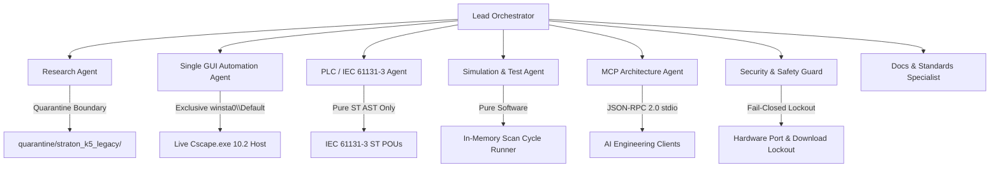

# Horner Cscape MCP Autonomous Agents Guide

## 1. Executive Multi-Agent Architecture

This project is developed, maintained, and verified through specialized autonomous subagents collaborating across defined operational boundaries. Each agent operates under strict engineering directives to ensure determinism, safety, fail-closed security, and native integration with **Horner APG Cscape 10.2 (Build 10.2.751.4)** and native **`.csp`** and **`.cpj`** Compound File Binary Format (CFBF) project containers.



---

## 2. Specialized Autonomous Agent Roles & Boundaries

### 1. Lead Orchestrator
- **Multi-Agent Coordination**: Coordinates specialized subagents and tracks checkpoint state in `artifacts/checkpoints/` and `.state/`.
- **Critical Path Management (Evidence-Gated Progression G0→G1→G2→G3/G4→G5)**: Enforces evidence-gated progression across all milestones. Strictly prohibits claiming G2+/G5 "done" or declaring premature victory. All gates are actively and continuously evaluated with verifiable deliverables:
  - **Gate G0**: Cscape 10.2 x86 PE binary (Build 10.2.751.4), DLL exports, and registry verified.
  - **Gate G1**: False successes H01–H13 dismantled (fake export/open/compile success, silent mocks, global Allow dialogs closed; honest PARTIAL classification enforced).
  - **Gate G2**: Live Cscape 10.2 visible GUI on `winsta0\Default` with `TankLevelClosedLoop.csp` and Project Navigator visible (dynamic active process resolution; no hardcoded PID/HWND).
  - **Gate G3**: Live GUI Error Check (`32826`) clean compile (0 errors, 0 warnings), download lockout (`32827`/`33149`).
  - **Gate G4**: Pure-software closed-loop plant simulation (`offline/DEV [TESTED_MOCK]`).
  - **Gate G5**: Evidence-gated final signoff & cryptographic audit with verifiable artifact digests per milestone.
- **Historical Checkpoint Invariant**: All legacy checkpoints (e.g. from prior Step 1–190 runs) are classified strictly as **historical records**. Old checkpoints cannot be used to declare or close G0–G5 gates; every gate closure requires active, verifiable deliverables, tests, and logs generated in the current execution run.
- **Acceptance Scope**: Dual-root workspace mirroring is maintained as an environment synchronization task, but is NOT an acceptance gate criterion for closing G gates or milestone progress.
- **Strict Invariant: NO Claim of G2+/G5 Done**: Progression is iterative and evidence-gated; declaring G2+/G5 as permanently completed or "100% finished" without explicit step-by-step verification is forbidden.
- **Report Discipline**: Strictly prohibits `FINAL_REPORT.md` spam or premature victory declarations. Summary reports must only be produced when formally mandated with complete evidence.
- **Execution Watchdog Enforcement**: Supervises all running agents and tool calls; enforces hard-kill termination on any process or tool running >10 minutes on the same step or command with no forward progress or deliverables.
- **Status Contract Enforcement**: Enforces the strict 4-state contract across all agents and tools: every result must strictly return `status: success | failed | blocked | inconclusive`. Prohibits subjective or invented statuses such as `VERIFIED` or `100%`.

### 2. Research Agent (Cscape APIs & Internals)
- **Binary & PE Forensics**: Investigates Cscape 10.2 binaries (`Cscape.exe` Build `10.2.751.4`, `W5EditST.dll`, `W5EditLD.dll`, `K5Cmp.dll`), MFC message structures, and Windows registry mappings.
- **ST→LD Language Conversion Audit**: Audited PE exports and Win32 menus to establish that Cscape 10.2 contains zero GUI menus, commands, or DLL exports for ST→LD conversion (`BLOCKED_NATIVE: DOCUMENT_ONLY`).
- **CFBF Storage Formats**: Analyzes native Compound File Binary Format (CFBF / OLE2) `.csp` and `.cpj` project containers and OCS memory models (`%R`, `%AI`, `%AQ`, `%I`, `%Q`, `%M`, `%SR`).
- **Straton K5 Isolation**: Enforces zero Copa-Data Straton K5 dependencies in active code paths. Guarantees that all legacy standalone Straton templates (`appli.k5p`, `appli.CPO`, `K5DBXS.INI`) remain strictly quarantined under `quarantine/straton_k5_legacy/`.

### 3. Single GUI Automation Agent (pywinauto & Win32 Boundary)
- **Single GUI Agent Boundary**: Strictly only **ONE** agent or watchdog process may drive live Cscape GUI handles on the interactive desktop (`winsta0\Default`). Multiple agents attempting to access or manipulate Cscape GUI handles simultaneously cause UI focus corruption, dialog deadlocks, and race conditions.
- **Keep Cscape VISIBLE**: Cscape must remain continuously visible on the interactive desktop (`winsta0\Default`) with `TankLevelClosedLoop.csp` and Project Navigator open.
- **Headless Execution for All Others**: All other agents, automated tests, and background jobs must run headlessly or perform non-intrusive read-only gate inspections.
- **Fail-Closed GUI State**: If Cscape is hidden, closed, minimized, or its main window handle (`HWND`) is unavailable on `winsta0\Default`, the agent immediately fails closed with `status: blocked` or `status: failed`. Generating synthetic or fake live success is strictly forbidden.
- **Dual-Backend Control**:
  - **`backend="win32"`**: Win32 messaging (`WM_COMMAND`), top menu traversal, accelerator dispatch, and Error Check compilation (`ID_PROGRAM_ERRORCHECK = 32826`).
  - **`backend="uia"`**: Windows UIAutomation 3.0 accessibility tree walking for modal dialogs and dockable panes.
- **Modal Dialog Suppression**: Auto-detects and suppresses splash screens, "Tip of the Day", and `#32770` dialogs.
- **Download Command Lockout**: Intercepts and blocks Win32 download command IDs:
  - `ID_PROGRAM_DOWNLOAD = 32827` (BLOCKED)
  - `ID_CONTROLLER_DOWNLOAD = 33149` (BLOCKED)

### 4. PLC/IEC Agent (IEC 61131-3 Structured Text Parser & Safety)
- **ST Parser Scope**: The IEC 61131-3 Structured Text parser is strictly ST-limited for `.st` POUs. Any ladder logic constructs introduced into ST source files are rejected with error code **`ERR_LADDER_FORBIDDEN`**. There is no global ban on non-ST assemblies within native `.csp`/`.cpj` containers (which hold hardware config, graphics, and system maps), but all `.st` POUs and the ST parsing pipeline remain strictly pure ST.
- **Forbidden Ladder Construct Interception in ST POUs**:
  - AST-level lexing and regex scanning detect and reject: ASCII contacts (`---[ ]---`, `---[/]---`), coils (`---( )---`, `---(S)---`, `---(R)---`), rung markers (`RUNG`, `END_RUNG`, `NETWORK`), and ladder instruction mnemonics (`XIC`, `XIO`, `OTE`, `OTL`, `OTU`).
  - Enforces zero disk mutation and immediate fail-closed rejection when ladder constructs are detected in ST POUs.
- **Fail-Closed Hardware Ban**: Physical communication port lockout and download command lockout are strictly maintained.
- **ST→LD "Change Language" Status: BLOCKED on Cscape 10.2**:
  - Explicitly documents that Horner Cscape 10.2 IDE lacks native ST-to-LD conversion menus, commands, or DLL exports.
  - Offline AST-based translation and ASCII diagram synthesis are verified via `STLadderInteropGuard` for offline analysis, but in-GUI language conversion is permanently blocked (`BLOCKED_NATIVE: DOCUMENT_ONLY`).
- **IEC 61131-3 Standard Conformance**:
  - Supports all standard IEC data types (`BOOL`, `SINT`, `INT`, `DINT`, `LINT`, `USINT`, `UINT`, `UDINT`, `ULINT`, `REAL`, `LREAL`, `TIME`, `DATE`, `TIME_OF_DAY`, `DATE_AND_TIME`, `STRING`).
  - Implements POUs (`PROGRAM`, `FUNCTION_BLOCK`, `FUNCTION`) and standard Function Blocks (`TON`, `TOF`, `TP`, `CTU`, `CTD`, `CTUD`).

### 5. Simulation & Verification Agent
- **Pure-Software Execution**: In-memory cyclic execution engine (`SimulationBackend.EMULATED`) without requiring physical PLC hardware or Straton runtime processes (`T5SIMUL`, `T5RTI`).
- **Horner OCS Register Mapping**: Tracks register states for `%R` (Holding/Analog Words), `%AI` (Analog Inputs), `%AQ` (Analog Outputs), `%I` (Digital Inputs), `%Q` (Digital Outputs), `%M` (Marker Bits), `%D` (Display Bits), `%K` (Keypad Bits), `%SR` (System Registers), and global network registers (`%IG`, `%QG`, `%AIG`, `%AQG`).
- **Deterministic Verification**: Evaluates timer states (`IN`, `PT`, `Q`, `ET`), counter states (`CU`, `CD`, `PV`, `CV`, `Q`), and executes closed-loop state machine assertion matrices.
- **No Closed-Loop Master Thrash**: Avoid thrashing or repetitive non-progress re-executions of `test_closed_loop_master`. Focus on targeted step-specific invariant suites.

### 6. MCP Architecture Agent
- **FastMCP Protocol Implementation**: Model Context Protocol (MCP) server over `stdio` transport conforming to JSON-RPC 2.0.
- **Core Automation Tools**:
  - `cscape_create_project`: Initializes native CFBF project container.
  - `cscape_add_st_pou`: Injects validated ST POU into project with transactional rollback on error.
  - `cscape_validate_st`: Performs strict pure-ST syntax check and rejects ladder logic (`ERR_LADDER_FORBIDDEN`).
  - `cscape_inspect_variables`: Enumerates tagged variables and Horner OCS register mappings.
  - `cscape_compile_project`: Triggers Error Check (`32826`) on live Cscape GUI gate or offline AST diagnostics.
  - `cscape_get_diagnostics`: Localizes compiler syntax and semantic diagnostic markers.
  - `cscape_simulate_pou`: Runs multi-cycle deterministic software simulation with register snapshots.
  - `cscape_export_project`: Exports project structures to structured interchange formats.
- **Status Contract Adherence**: All tool responses strictly format return payloads using `status: success | failed | blocked | inconclusive`.

### 7. Security & Safety Guard Agent
- **Hardware / PLC Download Ban (Fail-Closed Hardware Lockout Policy)**:
  - **Physical Port Lockout**: Blocks all physical communication ports: `COM1`–`COM256`, `\\.\COM*`, `/dev/tty*`, `CAN*`, `USB*`, `JTAG`, and hardware socket bridges. Throws `SecurityError`.
  - **Companion Flashing Utility Lockout**: Prohibits execution of controller flash and download binaries: `PGMUpdateUtility.exe`, `DfuSeCommand.exe`, `STMFlashLoader.exe`, `WinJTAG.exe`.
  - **CLI Switch Lockout**: Prohibits download and flash switches: `/d`, `/download`, `/flash`, `/burn`, `/write-flash`.
  - **Win32 Command Lockout**: Intercepts and blocks Win32 download command IDs (`ID_PROGRAM_DOWNLOAD = 32827`, `ID_CONTROLLER_DOWNLOAD = 33149`).
- **Comprehensive Test Suite**: Maintains and expands the fail-closed security test suite (`tests/test_security.py`).

### 8. Documentation & Standards Specialist (Agent 2)
- **Dual-Root Workspace Synchronization**: Maintains file synchronization between primary workspace (`C:\HornerAI\horner-cscape-mcp`) and user home (`C:\Users\ArmandoSilva`). Dual-root parity is an environment sync convenience and not an acceptance gate for milestone closure.
- **Documentation Standards**: Maintains technical accuracy across `README.md`, `AGENTS.md`, `CAPABILITY_MATRIX.md`, and dedicated `docs/*.md` guides.
- **Factual Rigor**: Prevents ungrounded victory claims, ensures documented platform boundaries (`BLOCKED_NATIVE`), and validates syntax across all markdown and code artifacts.

---

## 3. Strict Engineering Directives & Standards

### 3.1 Status Contract Specification
Every MCP tool result, test runner assertion, and subagent response must strictly adhere to the 4-value status enum:
```json
{
  "status": "success | failed | blocked | inconclusive",
  "error_code": "STRING_ENUM_OPTIONAL",
  "details": "Factual description of outcome",
  "data": {}
}
```
- **`success`**: All assertions passed deterministically, valid deliverables created, and verifiable evidence logged.
- **`failed`**: Execution failed due to syntax error (`ST_SYNTAX_ERROR`), ladder injection (`ERR_LADDER_FORBIDDEN`), simulation assertion mismatch, or compilation failure.
- **`blocked`**: Operation actively prevented by safety policies (hardware port access, download commands `32827`/`33149`, companion flash tools) or platform limitations (native ST→LD conversion blocked in Cscape 10.2).
- **`inconclusive`**: Preconditions unverified, environment unready, or outcome cannot be validated deterministically.
- **Strict Invariant**: Never invent or accept pseudo-statuses like `VERIFIED`, `100%`, `PERFECT`, or `ALL_TESTS_PASSING`.

### 3.2 Single GUI Agent Boundary (`winsta0\Default`)
- **Exclusive GUI Access**: Exactly ONE designated agent/watchdog process possesses authorization to drive live Cscape window handles (`HWND`) on the interactive Windows desktop (`winsta0\Default`).
- **Keep Cscape VISIBLE**: Cscape must remain open with `TankLevelClosedLoop.csp` and Project Navigator visible on `winsta0\Default`.
- **Headless Concurrency**: All other subagents, background jobs, test suites, and linting tools MUST execute headlessly or perform non-intrusive read-only queries.
- **Fail-Closed Live Checks**: If Cscape is closed, hidden, uninitialized, or unresponsive on the desktop, live GUI tools must fail closed immediately. Simulating live success or returning synthetic HWND confirmations without live window verification is strictly prohibited.

### 3.3 Straton K5 Quarantine & Isolation Policy
- **Quarantine Directory**: `quarantine/straton_k5_legacy/`
- **Zero Active Code Paths**: No active runtime module, MCP tool, compiler wrapper, or simulation engine may import or execute files from the quarantine directory.
- **Quarantined Artifacts**: Standalone Straton K5 files (`appli.k5p`, `appli.CPO`, `appli.lge`, `K5DBXS.INI`, `Default/appli.txt`, `*.k5p` zip archives) and legacy runtime targets (`T5RTI`, `T5SIMUL`) are permanently marked **`INVALID/QUARANTINED`**.
- Native Cscape workflows exclusively operate on Horner CFBF `.csp`/`.cpj` containers and direct Cscape Win32 automation.

### 3.4 ST-to-Ladder (ST→LD) Conversion Reality: BLOCKED_NATIVE
- **Horner Cscape 10.2 Architecture**: Cscape 10.2 maintains an architectural separation between its legacy Advanced Ladder solver and its IEC 61131-3 engine.
- **No Native Conversion**: Cscape 10.2 contains zero menu items, accelerator commands, OLE automation methods, or DLL exports to convert ST POUs into Advanced Ladder rungs (`BLOCKED_NATIVE: DOCUMENT_ONLY`).
- **Interoperability Guardrail (`STLadderInteropGuard`)**:
  - Offline parsing and AST decomposition can synthesize ASCII ladder representations and AST JSON models for engineering analysis.
  - In-GUI runtime conversion is permanently blocked; attempts to trigger GUI conversion will fail closed.
  - Any ladder logic constructs introduced into ST files are rejected with `ERR_LADDER_FORBIDDEN`.

### 3.5 Execution Watchdog & Process Supervision
- **10-Minute Timeout Watchdog**: Any tool, agent, or process running for more than 10 minutes on the same step or command without delivering tangible output or forward progress must be hard-killed immediately.
- **Process Teardown**: Zombie or orphaned processes (`Cscape.exe`, test processes, CLI wrappers) must be terminated recursively via `taskkill.exe /F /T /PID <pid>`.
- **Headless Process Creation**: Background processes must be launched with `CREATE_NO_WINDOW`, `STARTF_USESHOWWINDOW`, and `SW_HIDE` unless explicitly operating within the Single GUI Agent Boundary on `winsta0\Default`.

### 3.6 Critical Path & Milestone Discipline
- **Active Gate Progression**: Gates G0→G1→G2→G3/G4→G5 progression is continuously evidence-gated.
- **NO Claim G2+/G5 Done**: Never declare G2+/G5 done or 100% complete; each milestone step requires explicit on-disk evidence, logs, and checkpoints.
- **Evidence-Gated Integrity**: Progression across all gates is enforced through verifiable audit logs, proof artifacts, strict 4-state contracts, and cryptographic verification.
- **H01–H13 False-Success Matrix Closure**: Eliminate fake export/open/compile success, silent mocks, and global Allow dialogs.
- **No `FINAL_REPORT.md` Spam**: Strictly prohibit duplicate, speculative, or ungrounded summary markdown files. All progress is documented in structured audit logs, capability matrices, and verifiable checkpoints.
- **No Closed-Loop Master Thrash**: Prohibit non-progress cyclic churn or thrashing on legacy test suites.

---

## 4. Hardware Safety & Lockout Directives

All agents must strictly adhere to the following safety invariants without exception:

| Constraint Category | Restricted Entities | Enforcement Action |
| :--- | :--- | :--- |
| **Physical Serial / COM Ports** | `COM1` through `COM256`, `\\.\COM*`, `/dev/tty*` | Hard blocked; throws `SecurityError` |
| **Industrial Fieldbuses** | `CAN*`, `CsCAN`, `DeviceNet`, `Profibus` | Hard blocked; socket and adapter access prevented |
| **USB & Hardware Debuggers** | `USB*`, `JTAG`, `SWD`, hardware dongles | Hard blocked; low-level driver access blocked |
| **Flashing & Download Binaries** | `PGMUpdateUtility.exe`, `DfuSeCommand.exe`, `STMFlashLoader.exe`, `WinJTAG.exe` | Execution prohibited; monitored and killed |
| **Download CLI Switches** | `/d`, `/download`, `/flash`, `/burn`, `/write-flash` | Command invocation rejected |
| **Win32 Download Commands** | `ID_PROGRAM_DOWNLOAD` (`32827`), `ID_CONTROLLER_DOWNLOAD` (`33149`) | Windows message dispatch intercepted and blocked |
| **Legacy Ladder Infiltration in ST** | Rungs, contacts, coils (`---[ ]---`, `---( )---`, `NETWORK`, `RUNG`) in `.st` POUs | Source code rejected with `ERR_LADDER_FORBIDDEN` |
| **Workspace Boundaries** | Paths outside authorized project roots | Confined strictly to project artifacts directory |

---

## 5. Dual-Root Workspace Synchronization

To maintain developer convenience across environments, core configuration files, agent guides, test suites, and audit checkpoints are synchronized across:

1. **Primary Workspace**: `C:\HornerAI\horner-cscape-mcp\`
2. **User Environment**: `C:\Users\ArmandoSilva\`

Dual-root mirroring is an environment synchronization task and is NOT an acceptance gate criterion for closing G gates or milestone progress.
