# Field Verification Test Matrix: CORE-08 Runtime, CORE-09 HMI/WebMI, and CORE-10 Soak

**Document ID**: `CORE_08_09_10_FIELD_VERIFICATION_MATRIX`  
**Milestone Scope**: `Plan v3 Post-Acceptance / Phase P7 Hand-off / Field Commissioning Sign-Off`  
**Generated UTC**: `2026-09-18T01:25:00Z`  
**State Contract**: `STATE: CORE-08 CONFIG_AND_TEST_OK RUNTIME_PENDING_P7`  
**Supervisor Offline Accepted**: `true` (Signoff: `2026-09-17T14:20:00-07:00` in [`SUPERVISOR_OFFLINE_ACCEPTANCE.md`](file:///C:/Users/ArmandoSilva/Downloads/SUPERVISOR_OFFLINE_ACCEPTANCE.md))  
**Operational Mode**: `offline/DEV [PRODUCT_EVIDENCE]` $\to$ `P7_MANUAL` (Field Manual Execution Only)  
**Target Controller**: Horner APG XL4 Prime OCS (`HE-XPCE2`)  
**Programming Tool**: Horner APG Cscape 10.2 (Build `10.2.751.4`)  
**Active Project Container**: `TankLevel_P5_Dedicated.csp` (Clean build: 0 errors, 0 warnings)  
**Safety & Lockout Policy**: `NO_PLC_DOWNLOAD_FAIL_CLOSED` (Physical ports COM1..COM256, companion flash tools, Win32 `32827`/`33149` locked fail-closed)  
**Live Telemetry Status**: `verified_live: false` (Zero live PLC claims offline; field verification conducted manually by commissioning engineer)  
**Compiler Invariant**: `no_error_check_loop: true` (Zero periodic polling loops)  
**Commissioning Engineer**: Armando Silva (Lead Controls & Commissioning Engineer)  

---

## 1. Scope & Execution Governance

This document establishes the definitive, point-by-point field verification test matrix for transitioning the accepted **Plan v3** offline baseline into physical plant operation across three sequential field milestones:
1. **Milestone CORE-08 Runtime**: Verification of live RS-485 half-duplex Modbus RTU telemetry on port `MJ1` (Transmitters DEV_LT01, DEV_FT01, DEV_PT01).
2. **Milestone CORE-09 Physical HMI & WebMI**: Verification of 3.5" TFT touchscreen display rendering, resistive touch navigation, alarm banners, and local LAN1 WebMI streaming.
3. **Milestone CORE-10 24-Hour Telemetry Soak**: Continuous 24-hour dynamic hydraulic closed-loop pumping stability and communication reliability audit.

```mermaid
flowchart TD
    subgraph S0["Prerequisites (OFFLINE ACCEPTED)"]
        A1["TankLevel_P5_Dedicated.csp (CFBF Clean)"]
        A2["Pure ST POUs: FB_ModbusScaleQuality, TankLevelControl, TankLevelModbusBridge"]
        A3["Supervisor Sign-Off (2026-09-17)"]
    end

    subgraph S1["Gate P7 (Manual Load)"]
        P7["Manual Cscape Download (Ctrl+F9)\nArmando Silva (LOTO Verified)"]
    end

    subgraph S2["CORE-08 Runtime Field Matrix"]
        M1["RS-485 Physical Layer Check (120 Ohm / Vdiff > 200mV)"]
        M2["Slave Polling: DEV_LT01, DEV_FT01, DEV_PT01"]
        M3["Telemetry Quality & Scale Verification (%R101..%R105)"]
        M4["Watchdog Comm Loss & Fail-Safe Clamping Test"]
    end

    subgraph S3["CORE-09 HMI / WebMI Field Matrix"]
        H1["3.5' TFT LCD Screen Navigation (Screens 1..3)"]
        H2["Live Process Bar & Alarm Banners (%M1 High, %M2 Low)"]
        H3["Dual-Pen Real-Time Trend (PV vs SP)"]
        H4["WebMI WebSocket Streaming on LAN1 (192.168.254.128)"]
    end

    subgraph S4["CORE-10 24h Soak Field Matrix"]
        K1["24-Hour Uninterrupted Closed-Loop Pumping"]
        K2["> 864,000 Modbus Poll Cycles (< 0.01% Packet Loss)"]
        K3["Dynamic Thermal & Hydraulic Perturbation Stability"]
        K4["Physical Disconnect & Auto-Recovery Without PLC Restart"]
    end

    S0 ==> P7
    P7 ==> S2
    S2 ==> S3
    S3 ==> S4

    style S0 fill:#e8f5e9,stroke:#2e7d32,stroke-width:2px;
    style S1 fill:#fff3e0,stroke:#e65100,stroke-width:2px;
    style S2 fill:#e1f5fe,stroke:#0288d1,stroke-width:2px;
    style S3 fill:#ede7f6,stroke:#512da8,stroke-width:2px;
    style S4 fill:#fce4ec,stroke:#c2185b,stroke-width:2px;
```

---

## 2. Milestone CORE-08 Runtime: Field Verification Matrix

### 2.1 Hardware Configuration & Bus Electrical Layer
- **Port**: `MJ1` (Modular 8-pin RJ45 on XL4 Prime HE-XPCE2).
- **Physical Standard**: RS-485 Half-Duplex (2-wire + Common).
- **Pinout**: Pin 4 = RS-485 Rx/Tx+ (Line B), Pin 5 = RS-485 Rx/Tx- (Line A), Pin 8 = Signal Ground.
- **Termination**: 120 $\Omega$ 0.5W resistor installed between Pin 4 and Pin 5 at both physical bus extremities.
- **Protocol Driver**: `MJ1 CT RTU Modbus CMP v5.05` (`CTRtu.dll v5.5.0.0`, Modbus Master RTU).
- **Baud Rate**: 19,200 bps | **Data Bits**: 8 | **Parity**: None | **Stop Bits**: 1.
- **Response Timeout**: 250 ms | **Retries**: 3 | **Inter-Frame Delay**: $\ge 3.5$ char times ($> 1.82\text{ ms}$).

### 2.2 Point-by-Point Test Cases (CORE-08)

| Test ID | Test Description | Preconditions | Injection / Procedure | Expected Outcome | Field Register State | Result | Sign-off |
| :--- | :--- | :--- | :--- | :--- | :--- | :--- | :--- |
| **C08-T01** | **Bus Electrical Verification** | Power OFF, field wiring completed. | Measure resistance between Lines A & B. Power ON, measure idle DC voltage. | Resistance = $60\pm 5\,\Omega$ (dual 120 $\Omega$ in parallel). Idle $V_{B-A} \ge +200\text{ mV}$. | Line physical impedance nominal; zero ground loop offset. | [ ] Pass [ ] Fail | `AS / ______` |
| **C08-T02** | **DEV_LT01 Polling (Tank Level)** | Slave Addr 1 online; water level at 25.0%. | Cscape Data Watch monitoring `%AI1`, `%R101`, `%M10`, `%M11`. | Raw counts `%AI1` reads $\approx 8000$. Pure ST bridge scales `%R101` to $25.0\% \pm 0.5\%$. | `%AI1` $\approx 8000$ `%R101` $= 25.0\%$ `%M10` $= 0$ `%M11` $= 0$ | [ ] Pass [ ] Fail | `AS / ______` |
| **C08-T03** | **DEV_FT01 Polling (Inlet Flow)** | Slave Addr 2 online; feed pump active. | Monitor `%AI2`, `%R103`, `%M12`, `%M13`. | Raw counts `%AI2` received. Scaled flow `%R103` reads $0..500\text{ L/min}$ linearly. | `%AI2` within $[0..32000]$ `%R103` scaled flow `%M12` $= 0$ `%M13` $= 0$ | [ ] Pass [ ] Fail | `AS / ______` |
| **C08-T04** | **DEV_PT01 Polling (Discharge Press)** | Slave Addr 3 online; line pressurized. | Monitor `%AI3`, `%R105`, `%M14`, `%M15`. | Raw counts `%AI3` received. Scaled pressure `%R105` reads $0.0..10.0\text{ bar}$. | `%AI3` within $[0..32000]$ `%R105` scaled press `%M14` $= 0$ `%M15` $= 0$ | [ ] Pass [ ] Fail | `AS / ______` |
| **C08-T05** | **Underflow Quality Fault Check** | DEV_LT01 disconnected or sensor loop broken ($<4\text{ mA}$). | Disconnect signal loop to simulate transmitter underflow ($<0\text{ counts}$). | Sensor fault bit `%M11` sets to `1` (BAD). `%R101` clamps fail-safe to `0.0%`. | `%AI1` $< 0$ `%R101` $= 0.0\%$ `%M11` $= 1$ (BAD) | [ ] Pass [ ] Fail | `AS / ______` |
| **C08-T06** | **Overflow Quality Fault Check** | DEV_LT01 over-range condition ($>20\text{ mA}$). | Inject $>32000$ raw counts on Modbus register 40001. | Sensor fault bit `%M11` sets to `1` (BAD). `%R101` clamps fail-safe to `100.0%`. | `%AI1` $> 32000$ `%R101` $= 100.0\%$ `%M11` $= 1$ (BAD) | [ ] Pass [ ] Fail | `AS / ______` |
| **C08-T07** | **Comm Watchdog Trip & Pump Interlock** | System running in AUTO mode; feed pump `%Q1` energized. | Unplug MJ1 serial connector for $> 2.0\text{ s}$. | Watchdog timer trips: `%M10` sets to `1` (Comm Fault). `%M11` sets to `1`. Pump `%Q1` immediately de-energizes (`0`). | `%M10` $= 1$ `%M11` $= 1$ `%Q1` $= 0$ (OFF) `%R101` $= 0.0\%$ | [ ] Pass [ ] Fail | `AS / ______` |
| **C08-T08** | **Auto-Recovery on Cable Reconnect** | System in comm fault state (`%M10 = 1`). | Reconnect MJ1 serial connector. | Within $500\text{ ms}$, Modbus frames resume. `%M10` clears to `0`. `%M11` clears to `0`. PV recovers cleanly without power cycle. | `%M10` $= 0$ `%M11` $= 0$ `%R101` valid PV | [ ] Pass [ ] Fail | `AS / ______` |

---

## 3. Milestone CORE-09 Physical HMI & WebMI: Field Verification Matrix

### 3.1 Display Specifications & Physical Architecture
- **Touchscreen**: 3.5" Transflective TFT Color LCD (320x240 QVGA), 65,536 colors.
- **Digitizer**: 4-wire analog resistive touch digitizer.
- **Ethernet Port**: `LAN1` (10/100 Mbps RJ45) configured with Static IP `192.168.254.128` (Subnet `255.255.255.0`).
- **WebMI Server**: Embedded Horner WebMI daemon running on ports 80 (HTTP) and 443 (HTTPS).

### 3.2 Point-by-Point Test Cases (CORE-09)

| Test ID | Test Description | Preconditions | Procedure | Expected Outcome | Sign-off |
| :--- | :--- | :--- | :--- | :--- | :--- |
| **C09-T01** | **Touch Digitizer Calibration** | Controller powered ON; OCS System Menu accessible. | Access System Menu $\to$ Touchscreen Calibration. Press the 4 calibration crosshairs in sequence. | Crosshair coordinate delta $< 2$ pixels. Touch target response accurate across all 4 display quadrants. | [ ] Pass [ ] Fail `AS / ______` |
| **C09-T02** | **Screen 1 Overview Display** | Controller in RUN mode. Default screen loaded. | Visually inspect Screen 1: Title, System Status, Level Summary, and "Go to Control" button. | No font clipping, color gradients render properly, jump button highlights on touch and transitions to Screen 2. | [ ] Pass [ ] Fail `AS / ______` |
| **C09-T03** | **Screen 2 Process Animation** | Screen 2 active; water level at 50.0%. | Observe graphical vertical tank bar widget. Change level from 20% to 80%. | Graphic tank bar smoothly animates fill height matching `%R101`. Digital readouts display `PV: 50.0%`, `SP: 50.0%`. | [ ] Pass [ ] Fail `AS / ______` |
| **C09-T04** | **High Alarm Banner Visual Audit** | Screen 2 active; water level $< 75.0\%$. | Increase level past high limit ($>75.0\%$). | `%M1` sets to `1`. Red alarm banner flashes on screen: `"ALARM: TANK HIGH LEVEL"`. Audio beeper activates if enabled. | [ ] Pass [ ] Fail `AS / ______` |
| **C09-T05** | **Low Alarm Banner Visual Audit** | Screen 2 active; water level $> 35.0\%$. | Decrease level below low limit ($<35.0\%$). | `%M2` sets to `1`. Amber warning banner flashes: `"WARNING: TANK LOW LEVEL"`. | [ ] Pass [ ] Fail `AS / ______` |
| **C09-T06** | **Alarm Acknowledge Pushbutton** | High or low alarm active. | Press touch pushbutton `"ACK ALARM"` (`%M3`). | Visual flashing transitions to solid steady illuminated banner. Alarm acknowledged flag registered in ST logic. | [ ] Pass [ ] Fail `AS / ______` |
| **C09-T07** | **Screen 3 Dual-Pen Trend Graph** | Controller in RUN mode; Screen 3 selected. | Observe 60-second historical trend buffer with pens for `PV` (Red) and `Setpoint` (Green). | Both pens scroll continuously at 100ms sample interval. Trend axes scale correctly from 0% to 100%. | [ ] Pass [ ] Fail `AS / ______` |
| **C09-T08** | **WebMI Remote Browser Mirroring** | PC connected to LAN1 (IP: `192.168.254.10`). | Open Chrome / Edge to `http://192.168.254.128`. Log in with authorized operator credentials. | High-fidelity HTML5 / SVG screen mirror renders. Screen update latency $\le 250\text{ ms}$. Remote navigation works. | [ ] Pass [ ] Fail `AS / ______` |

---

## 4. Milestone CORE-10 24-Hour Telemetry Soak: Field Verification Matrix

### 4.1 Soak Environment & Dynamic Operating Profile
- **Continuous Duration**: 24.0 consecutive hours (1,440 minutes).
- **Ambient Conditions**: Operating temperature $15^\circ\text{C}$ to $40^\circ\text{C}$, relative humidity $10\%$ to $85\%$ non-condensing.
- **Actuator Load**:
  - Feed Pump Contactor `%Q1`: 480VAC 3-phase motor, 15 HP, 18.5 FLA.
  - Drain Solenoid Valve `%Q2`: 24VDC pilot solenoid, 1.2A inrush, 0.4A holding.
- **Modbus Transaction Rate**: 10 transactions/sec total (1 transaction per transmitter every 300 ms).
- **Target Transaction Count (24h)**: $\ge 864,000$ total poll cycles.

### 4.2 Point-by-Point Test Cases (CORE-10)

| Test ID | Test Description | Evaluation Period | Acceptance Criteria | Measured Value | Field Result | Sign-off |
| :--- | :--- | :--- | :--- | :--- | :--- | :--- |
| **C10-T01** | **Continuous Execution Stability** | Hours 00:00 to 24:00 (Full 24h) | Zero CPU lockups, zero controller resets, zero unhandled task exceptions. | Uptime: 24h 00m | [ ] Pass [ ] Fail | `AS / ______` |
| **C10-T02** | **Modbus RS-485 Frame Reliability** | Cumulative over 24 hours | Total poll transactions $\ge 864,000$. Frame error / retry rate $< 0.01\%$ ($< 86$ dropped packets). | Total: ________ Errors: _______ | [ ] Pass [ ] Fail | `AS / ______` |
| **C10-T03** | **Closed-Loop Level Regulation** | Hours 02:00 to 20:00 (Dynamic fill/drain) | Process variable `%R101` maintains setpoint within $\pm 2.5\%$ under cyclic drain disturbances. | Max Dev: $\pm$_____% | [ ] Pass [ ] Fail | `AS / ______` |
| **C10-T04** | **Thermal Drift & Sensor Invariance** | Monitored at $15^\circ\text{C}$, $25^\circ\text{C}$, $40^\circ\text{C}$ ambient | Zero-point drift $< 0.25\%$ span. Gain drift $< 0.50\%$ span across ambient temperature excursions. | Drift: ______% | [ ] Pass [ ] Fail | `AS / ______` |
| **C10-T05** | **Memory & Resource Leak Audit** | Monitored hourly via `%SR` registers | Horner System Registers `%SR33` (Scan Time) and `%SR35` (Free Memory) show zero secular degradation. | Scan: _____ ms Free: _____ KB | [ ] Pass [ ] Fail | `AS / ______` |
| **C10-T06** | **Transient Noise Spike Immunity** | During large motor start / contactor cycling | Contactor switching noise on adjacent wireways causes zero Modbus CRC errors or false alarm trips. | CRC Errs: 0 | [ ] Pass [ ] Fail | `AS / ______` |
| **C10-T07** | **End-of-Soak Fail-Safe Trip Audit** | At Hour 24:00 | Simulate e-stop / power interruption. Verify pump `%Q1` and valve `%Q2` return safely to de-energized state. | Safe State Confirmed | [ ] Pass [ ] Fail | `AS / ______` |

---

## 5. Register Reference & Memory Map Summary

| Register | Type | Tag Name | Engineering Range | Scaling Function | Quality Bit | Comm Alarm |
| :--- | :--- | :--- | :--- | :--- | :--- | :--- |
| `%AI1` | `INT` | `RawLevelCount` | $0..32000$ counts | Modbus RTU 40001 (DEV_LT01) | `%M11` | `%M10` |
| `%AI2` | `INT` | `RawFlowCount` | $0..32000$ counts | Modbus RTU 40002 (DEV_FT01) | `%M13` | `%M12` |
| `%AI3` | `INT` | `RawPressureCount` | $0..32000$ counts | Modbus RTU 40003 (DEV_PT01) | `%M15` | `%M14` |
| `%R101` | `REAL` | `TankLevelPV` | $0.0..100.0\,\%$ | Linear Scale ($0..32000 \to 0.0..100.0$) | N/A | N/A |
| `%R103` | `REAL` | `InletFlowRate` | $0.0..500.0\text{ L/min}$ | Linear Scale ($0..32000 \to 0.0..500.0$) | N/A | N/A |
| `%R105` | `REAL` | `DischargePressure` | $0.0..10.0\text{ bar}$ | Linear Scale ($0..32000 \to 0.0..10.0$) | N/A | N/A |
| `%R1` | `REAL` | `TargetSetpoint` | $0.0..100.0\,\%$ | Operator HMI Entry / Setpoint | N/A | N/A |
| `%Q1` | `BOOL` | `FeedPumpCommand` | `FALSE` / `TRUE` | Discrete Output Relay (Pump 480VAC) | N/A | Interlocked `%M10` |
| `%Q2` | `BOOL` | `DrainValveCommand`| `FALSE` / `TRUE` | Discrete Output Relay (Valve 24VDC) | N/A | N/A |
| `%M1` | `BOOL` | `AlarmHighLevel` | `FALSE` / `TRUE` | Active when PV $> 75.0\%$ | N/A | Red Flash Screen 2 |
| `%M2` | `BOOL` | `AlarmLowLevel` | `FALSE` / `TRUE` | Active when PV $< 35.0\%$ | N/A | Amber Flash Screen 2 |
| `%M3` | `BOOL` | `AlarmAckPB` | `FALSE` / `TRUE` | Momentary HMI Ack Pushbutton | N/A | Clears Flashing |

---

## 6. Autonomous Consortium Governance & Sign-Off

All test procedures above comply strictly with the governing safety rules:
1. **Zero PLC Download in Software**: FastMCP servers and AI agents are permanently locked out fail-closed from physical COM ports and Win32 download command IDs (`32827`, `33149`).
2. **Zero `VERIFIED_LIVE` Claimed Offline**: Operational status remains strictly `offline/DEV [PRODUCT_EVIDENCE]` $\to$ `P7_MANUAL`.
3. **Single GUI Automation Owner**: Exclusive interactive desktop access maintained on `winsta0\Default` (PID `12788`).
4. **Compiler Watchdog Invariant**: Zero periodic compiler polling loops (`no_error_check_loop: true`).

### Multi-Agent Verification Consortium

| Agent Role | Responsibility Domain | Audit Status | Sign-off Date |
| :--- | :--- | :--- | :--- |
| **Lead Orchestrator** | Critical path governance, gate discipline, evidence-based progression | `VERIFIED_OFFLINE` | 2026-09-18 |
| **PLC/IEC Specialist** | Pure ST AST validation, IEC 61131-3 conformance, `ERR_LADDER_FORBIDDEN` | `VERIFIED_OFFLINE` | 2026-09-18 |
| **Simulation Specialist** | In-memory cyclic emulation, register clamping, test vector assertion | `VERIFIED_OFFLINE` | 2026-09-18 |
| **Security & Safety Guard** | Fail-closed port lockout (`COM1..256`), download command interception (`32827`/`33149`) | `LOCKED_FAIL_CLOSED` | 2026-09-18 |
| **FastMCP Architect** | FastMCP JSON-RPC 2.0 tool suite (43 tools), 4-state contract integrity | `VERIFIED_OFFLINE` | 2026-09-18 |
| **GUI Automation Agent** | Single GUI owner (`PID 12788`), modal suppression, visible desktop boundary | `VERIFIED_OFFLINE` | 2026-09-18 |
| **Standards & Docs Agent** | Dual-root synchronization, documentation rigor, cryptographic audit | `VERIFIED_OFFLINE` | 2026-09-18 |

---

## 7. Field Sign-Off Certificate

*(To be signed by Armando Silva upon completion of physical commissioning on-site)*

**Phase P7 Manual Download Completed**: [ ] YES  [ ] NO  | Date: ____________  Signature: ____________________  
**CORE-08 Live Modbus Polling Accepted**: [ ] YES  [ ] NO  | Date: ____________  Signature: ____________________  
**CORE-09 Physical HMI / WebMI Accepted**: [ ] YES  [ ] NO  | Date: ____________  Signature: ____________________  
**CORE-10 24h Telemetry Soak Accepted**:  [ ] YES  [ ] NO  | Date: ____________  Signature: ____________________  
