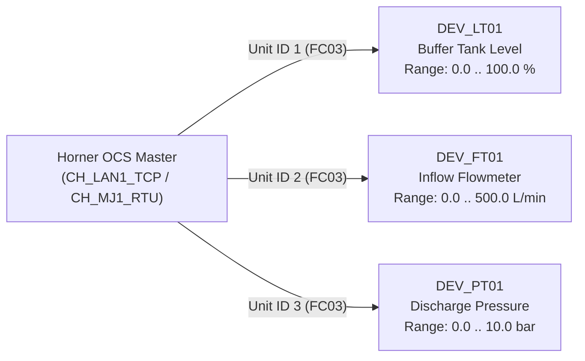

# CORE-08 Modbus Technical Conversion Specification & Implementation Example

## 1. Executive Technical Overview & Operational Scope

This engineering document provides the comprehensive technical conversion specification, wire-level protocol frame dissection, linear engineering scaling derivation, and IEC 61131-3 Structured Text control implementation for offline native Modbus communication within the Horner Cscape FastMCP ecosystem under **Plan v3 Milestone CORE-08**.

```mermaid
graph TD
    subgraph "Engineering & FastMCP Environment (Offline/DEV)"
        Client["FastMCP Client Session\n(JSON-RPC 2.0 stdio)"] --> Config["modbus_protocol_inventory.json\n(Channels, Devices, Scan List)"]
        Config --> TCPMaster["CH_LAN1_TCP\n(127.0.0.1:15502 Test / 502 Prod)"]
        Config --> RTUMaster["CH_MJ1_RTU (MJ1_RS485)\n(CT RTU Modbus CMP v 5.05)"]
        TCPMaster --> TestServer["[TEST_MODBUS_PV_PROVIDER]\n(127.0.0.1:15502 In-Memory)"]
        TestServer --> RegMap["Holding Registers\n40001 (0x0000): Level PV (17600 / 24000 counts)\n40002 (0x0001): Flow PV (16000 counts)\n40003 (0x0002): Pressure PV (16000 counts)"]
        RegMap --> TargetOCS["Target OCS Registers\n%AI1: TankLevelPV (0.0..100.0 %)\n%AI2: InflowRatePV (0.0..500.0 L/min)\n%AI3: DischargePressPV (0.0..10.0 bar)"]
        TargetOCS --> STLogic["TankLevelControl.st\n(IEC 61131-3 Control POU)"]
    end

    subgraph "Safety Lockout Guard (Fail-Closed)"
        Guard["SecurityGuard Fail-Closed Enforcement"] -.->|"Hard Block (SecurityError)"| PhysPorts["Physical COM1..COM256 / CAN / USB"]
        Guard -.->|"Hard Block (32827 / 33149)"| DLMsg["Win32 Download Command Messages"]
        Guard -.->|"Modbus Exception 0x01 (ILLEGAL_FUNCTION)"| WriteBlk["FC05 / FC06 / FC15 / FC16 Lockout"]
    end

    subgraph "Phase P7 Field Boundary"
        P7Eng["Commissioning Engineer\n(Manual Field Verification)"] -->|"PENDING_P7 (Strictly Deferred)"| LiveHardware["Physical Horner OCS XL4e / XL7 Prime"]
    end
```



### Operational Invariants & Provenance
- **Zero PLC Download**: No automated tool or process shall initiate downloads or flashing to physical PLC hardware.
- **Fail-Closed Hardware Port Lockout**: All physical serial communication ports (`COM1` through `COM256`), industrial fieldbuses (`CAN`, `CsCAN`), and hardware debugging dongles remain unconditionally blocked.
- **Offline Provenance**: `TESTED_MOCK [offline/DEV only]` — all telemetry is validated against in-memory labeled test servers and AST models.
- **Physical Runtime Status: `PENDING_P7`**: Live field commissioning is strictly deferred to Phase P7 manual commissioning engineer deployment. Zero claims of live physical sensor telemetry are made.
- **FastMCP 4-State Contract**: All status outputs deterministically return `status: success | failed | blocked | inconclusive`.

---

## 2. Communication Channel Configuration

Horner Cscape 10.2 natively configures communication channels for both high-speed Ethernet backbones and local RS-485 serial networks.

### 2.1 Channel Matrix

| Parameter | Ethernet LAN1 Channel (`CH_LAN1_TCP`) | Serial MJ1 Channel (`CH_MJ1_RTU`) |
| :--- | :--- | :--- |
| **Channel ID** | `CH_LAN1_TCP` | `CH_MJ1_RTU` |
| **Channel Description** | Ethernet LAN1 Modbus TCP Client / Master | Serial MJ1 Modbus RTU Master |
| **Transport Layer** | `MODBUS_TCP` (IEEE 802.3 over IPv4) | `MODBUS_RTU` (EIA/TIA-485-A 2-Wire Differential) |
| **Protocol Framing** | Modbus TCP with 7-byte MBAP Header | Modbus RTU with CRC-16 Framing |
| **Operating Role** | `CLIENT_MASTER_READ_ONLY` | `CLIENT_MASTER_READ_ONLY` |
| **Physical Interface** | RJ45 10/100 Mbps Base-TX | `MJ1_RS485` (Horner 8-pin Modular RJ45 Jack) |
| **Driver Module** | Integrated Cscape TCP/IP Stack | `CT RTU Modbus CMP  v 5.05` |
| **Network Endpoints** | `127.0.0.1:15502` (Offline Test Server)<br>`192.168.1.50:502` (Production Target) | Baud: `19200`, Data: `8`, Parity: `None`, Stop: `1` (`8-N-1`) |
| **Timing Parameters** | Connect Timeout: `1000 ms`<br>Response Timeout: `1000 ms`<br>Inter-frame delay: `3.5 ms` | Turnaround Delay: `10 ms`<br>Silent Interval ($t_{3.5}$): `2.0 ms` (38.5 bit-times @ 19200 bps)<br>Response Timeout: `1000 ms` |
| **Concurrency** | 4 Concurrent TCP Sockets | Single half-duplex token line |
| **Fail-Safe Mode** | Fail-closed read-only master | Fail-closed read-only master |

### 2.2 Serial MJ1 Driver Module Context
In Horner OCS controllers (e.g. XL4, XL7, X5), serial port `MJ1` utilizes the downloadable protocol module **`CT RTU Modbus CMP  v 5.05`**. This module implements the native Cscape Modbus RTU Master/Slave communication protocol (CMP). The configuration is stored within the Compound File Binary Format (`.csp`/`.cpj`) project container and managed headlessly via the FastMCP JSON sidecar representation.

---

## 3. Field Device Inventory & Topology

Three primary field instruments provide process telemetry to the Horner OCS controller:



### 3.1 Device Specifications Table

| Device ID | Device Name | Unit ID | Sensor Type | Physical Range | OCS Target Register | Poll Interval | Timeout | Retries | Fail-Safe Behavior |
| :--- | :--- | :--- | :--- | :--- | :--- | :--- | :--- | :--- | :--- |
| **`DEV_LT01`** | Buffer Tank Level Transmitter | `1` | Hydrostatic Submersible / 4–20 mA | `0.0 .. 100.0 %` | `%AI1` | `100 ms` | `1000 ms` | `3` | `CLAMP_TO_FAIL_SAFE` (`0.0 %`) |
| **`DEV_FT01`** | Inflow Coriolis Flowmeter | `2` | Electromagnetic / Pulse-Modulated | `0.0 .. 500.0 L/min` | `%AI2` | `200 ms` | `1000 ms` | `3` | `CLAMP_TO_FAIL_SAFE` (`0.0 L/min`) |
| **`DEV_PT01`** | Discharge Pressure Transmitter | `3` | Piezoresistive Diaphragm / 4–20 mA | `0.0 .. 10.0 bar` | `%AI3` | `200 ms` | `1000 ms` | `3` | `CLAMP_TO_FAIL_SAFE` (`0.0 bar`) |

---

## 4. Master Scan List & OCS Register Mapping

Modbus register addressing uses standard Modicon 1-based indexing in user documentation and 0-based relative word offsets over the communication wire.

### 4.1 Master Scan List Table

| Transaction ID | Target Device | Unit ID | Modbus Function Code | Modicon Address | 0-Based Wire Offset | Register Count | Horner Target | Target Variable | Engineering Unit | Alarm Flag | Stale Flag |
| :--- | :--- | :--- | :--- | :--- | :--- | :--- | :--- | :--- | :--- | :--- | :--- |
| `TX01_LEVEL_PV` | `DEV_LT01` | `1` | `FC03` (Read Holding) | `40001` | `0x0000` | 1 Word (16-bit) | `%AI1` | `TankLevelPV` | `%` | `%M10` | `%M11` |
| `TX02_INFLOW_RATE` | `DEV_FT01` | `2` | `FC03` (Read Holding) | `40002` | `0x0001` | 1 Word (16-bit) | `%AI2` | `InflowRatePV` | `L/min` | `%M12` | `%M13` |
| `TX03_DISCHARGE_PRESS`| `DEV_PT01` | `3` | `FC03` (Read Holding) | `40003` | `0x0002` | 1 Word (16-bit) | `%AI3` | `DischargePressPV`| `bar` | `%M14` | `%M15` |

### 4.2 Address Conversion Invariant
- **Modicon Notation (`40001` - `49999`)**: Represents Holding Registers accessed via `FC03` (Read) or `FC06`/`FC16` (Write).
- **Wire Offset Equation**:
  $$\text{Wire Offset} = \text{Modicon Address} - 40001$$
  - Modicon `40001` $\rightarrow$ Wire Offset `0x0000` (Decimal `0`)
  - Modicon `40002` $\rightarrow$ Wire Offset `0x0001` (Decimal `1`)
  - Modicon `40003` $\rightarrow$ Wire Offset `0x0002` (Decimal `2`)

---

## 5. Mathematical Linear Scaling Transfer Equations

Horner OCS analog inputs (`%AI`) and unipolar industrial analog modules convert standard 4–20 mA or 0–10 VDC electrical signals into an internal **15-bit resolution integer count ranging from 0 to 32000 counts**:
- `0 counts` = Electrical 4.00 mA / 0.00 VDC ($0.0\%$ input span)
- `32000 counts` = Electrical 20.00 mA / 10.00 VDC ($100.0\%$ input span)

### 5.1 General Scaling Transfer Function

$$\text{Scaled PV} = \left[ \frac{\text{Raw ADC Count} - \text{Raw}_{\text{min}}}{\text{Raw}_{\text{max}} - \text{Raw}_{\text{min}}} \right] \times (\text{EU}_{\text{max}} - \text{EU}_{\text{min}}) + \text{EU}_{\text{min}}$$

Given $\text{Raw}_{\text{min}} = 0$ and $\text{Raw}_{\text{max}} = 32000$:

$$\text{Scaled PV} = \left( \frac{\text{Raw ADC Count}}{32000.0} \right) \times (\text{EU}_{\text{max}} - \text{EU}_{\text{min}}) + \text{EU}_{\text{min}}$$

### 5.2 Device Scaling Derivations & Numerical Examples

#### 1. Buffer Tank Level (`DEV_LT01` $\rightarrow$ `%AI1` $\rightarrow$ `TankLevelPV`)
- **Range**: $\text{EU}_{\text{min}} = 0.0\,\%$, $\text{EU}_{\text{max}} = 100.0\,\%$
- **Transfer Equation**:
  $$\text{Level}_{\%} = \frac{\text{Raw}_{\%AI1}}{32000.0} \times 100.0 = \frac{\text{Raw}_{\%AI1}}{320.0}$$
- **Verification Point A (Nominal Operating Level: 17600 counts)**:
  $$\text{Level}_{\%} = \frac{17600}{32000.0} \times 100.0 = 0.5500 \times 100.0 = \mathbf{55.0\,\%}$$
- **Verification Point B (High Alert Operating Level: 24000 counts)**:
  $$\text{Level}_{\%} = \frac{24000}{32000.0} \times 100.0 = 0.7500 \times 100.0 = \mathbf{75.0\,\%}$$

#### 2. Inflow Coriolis Flowmeter (`DEV_FT01` $\rightarrow$ `%AI2` $\rightarrow$ `InflowRatePV`)
- **Range**: $\text{EU}_{\text{min}} = 0.0\,\text{L/min}$, $\text{EU}_{\text{max}} = 500.0\,\text{L/min}$
- **Transfer Equation**:
  $$\text{Flow}_{\text{L/min}} = \frac{\text{Raw}_{\%AI2}}{32000.0} \times 500.0 = \frac{\text{Raw}_{\%AI2}}{64.0}$$
- **Verification Point (Midscale Rate: 16000 counts)**:
  $$\text{Flow}_{\text{L/min}} = \frac{16000}{32000.0} \times 500.0 = 0.5000 \times 500.0 = \mathbf{250.0\,\text{L/min}}$$

#### 3. Discharge Pressure Transmitter (`DEV_PT01` $\rightarrow$ `%AI3` $\rightarrow$ `DischargePressPV`)
- **Range**: $\text{EU}_{\text{min}} = 0.0\,\text{bar}$, $\text{EU}_{\text{max}} = 10.0\,\text{bar}$
- **Transfer Equation**:
  $$\text{Pressure}_{\text{bar}} = \frac{\text{Raw}_{\%AI3}}{32000.0} \times 10.0 = \frac{\text{Raw}_{\%AI3}}{3200.0}$$
- **Verification Point (Operating Pressure: 16000 counts)**:
  $$\text{Pressure}_{\text{bar}} = \frac{16000}{32000.0} \times 10.0 = 0.5000 \times 10.0 = \mathbf{5.0\,\text{bar}}$$

---

## 6. Exact Protocol Wire Frame Hex Dissections

### 6.1 Modbus TCP Wire Frames (`CH_LAN1_TCP`)

Modbus TCP packets encapsulate the Protocol Data Unit (PDU) inside a 7-byte Modbus Application Protocol (MBAP) header.

#### Query Frame: FC03 Read 1 Holding Register at Address 40001 (Wire Offset 0)

```
+------------------------- MBAP Header (7 Bytes) -------------------------+---------- PDU (5 Bytes) ----------+
|  Tx ID (2B)  | Proto ID (2B) | Length (2B) | Unit ID (1B) |  FC (1B)  |  Start Offset (2B) | Quantity (2B) |
|    00 01     |     00 00     |    00 06    |      01      |    03     |       00 00        |     00 01     |
+--------------+---------------+-------------+--------------+-----------+--------------------+---------------+
```

- **Byte Breakdown Table**:
  | Byte Index | Field Name | Hex Value | Decimal / Meaning |
  | :--- | :--- | :--- | :--- |
  | `0x00` – `0x01` | Transaction Identifier | `00 01` | `1` (Unique sequence counter generated by client) |
  | `0x02` – `0x03` | Protocol Identifier | `00 00` | `0` (Modbus Protocol = 0x0000) |
  | `0x04` – `0x05` | Length Field | `00 06` | `6` bytes follow (Unit ID + PDU: 1 + 1 + 2 + 2 = 6) |
  | `0x06` | Unit Identifier | `01` | `1` (`DEV_LT01` Buffer Tank Level Transmitter) |
  | `0x07` | Function Code | `03` | `3` (`Read Holding Registers`) |
  | `0x08` – `0x09` | Starting Address | `00 00` | `0` (Wire offset 0x0000 corresponding to Modicon 40001) |
  | `0x0A` – `0x0B` | Quantity of Registers | `00 01` | `1` (Requesting 1 word = 16 bits) |

- **Complete Hex Stream (12 bytes)**:
  ```hex
  00 01 00 00 00 06 01 03 00 00 00 01
  ```

---

#### Telemetry Response Frame A: Value = 17600 counts (55.0 %)

```
+------------------------- MBAP Header (7 Bytes) -------------------------+------- PDU (5 Bytes) -------+
|  Tx ID (2B)  | Proto ID (2B) | Length (2B) | Unit ID (1B) |  FC (1B)  | Byte Count (1B) | Data (2B)   |
|    00 01     |     00 00     |    00 05    |      01      |    03     |       02        |   44 C0     |
+--------------+---------------+-------------+--------------+-----------+-----------------+-------------+
```

- **Byte Breakdown Table**:
  | Byte Index | Field Name | Hex Value | Decimal / Meaning |
  | :--- | :--- | :--- | :--- |
  | `0x00` – `0x01` | Transaction Identifier | `00 01` | `1` (Echoed from client query) |
  | `0x02` – `0x03` | Protocol Identifier | `00 00` | `0` (Modbus Protocol) |
  | `0x04` – `0x05` | Length Field | `00 05` | `5` bytes follow (Unit ID + FC + ByteCount + Data: 1+1+1+2 = 5) |
  | `0x06` | Unit Identifier | `01` | `1` (`DEV_LT01`) |
  | `0x07` | Function Code | `03` | `3` (`Read Holding Registers`) |
  | `0x08` | Byte Count | `02` | `2` data bytes follow (1 register * 2 bytes/reg) |
  | `0x09` – `0x0A` | Register 0 Data | `44 C0` | `0x44C0` = Decimal `17600` counts ($\rightarrow \mathbf{55.0\,\%}$) |

- **Complete Hex Stream (12 bytes)**:
  ```hex
  00 01 00 00 00 05 01 03 02 44 C0
  ```

---

#### Telemetry Response Frame B: Value = 24000 counts (75.0 %)

```
+------------------------- MBAP Header (7 Bytes) -------------------------+------- PDU (5 Bytes) -------+
|  Tx ID (2B)  | Proto ID (2B) | Length (2B) | Unit ID (1B) |  FC (1B)  | Byte Count (1B) | Data (2B)   |
|    00 01     |     00 00     |    00 05    |      01      |    03     |       02        |   5D C0     |
+--------------+---------------+-------------+--------------+-----------+-----------------+-------------+
```

- **Byte Breakdown Table**:
  | Byte Index | Field Name | Hex Value | Decimal / Meaning |
  | :--- | :--- | :--- | :--- |
  | `0x00` – `0x01` | Transaction Identifier | `00 01` | `1` (Echoed from client query) |
  | `0x02` – `0x03` | Protocol Identifier | `00 00` | `0` (Modbus Protocol) |
  | `0x04` – `0x05` | Length Field | `00 05` | `5` bytes follow (1+1+1+2 = 5) |
  | `0x06` | Unit Identifier | `01` | `1` (`DEV_LT01`) |
  | `0x07` | Function Code | `03` | `3` (`Read Holding Registers`) |
  | `0x08` | Byte Count | `02` | `2` data bytes follow |
  | `0x09` – `0x0A` | Register 0 Data | `5D C0` | `0x5DC0` = Decimal `24000` counts ($\rightarrow \mathbf{75.0\,\%}$) |

- **Complete Hex Stream (12 bytes)**:
  ```hex
  00 01 00 00 00 05 01 03 02 5D C0
  ```

---

### 6.2 Modbus RTU Wire Frames (`CH_MJ1_RTU`)

Modbus RTU omits the MBAP header and terminates frames with a 16-bit cyclic redundancy check (CRC-16 Modbus, polynomial `0xA001`, initial value `0xFFFF`, least-significant byte first).

#### Serial RTU Query Frame (DEV_LT01, FC03, Offset 0, Qty 1):
```
+---------------+-----------+--------------------+---------------+------------------+
| Unit ID (1B)  |  FC (1B)  |  Start Offset (2B) | Quantity (2B) |   CRC-16 (2B)    |
|      01       |    03     |       00 00        |     00 01     |      84 0A       |
+---------------+-----------+--------------------+---------------+------------------+
```
- **Complete RTU Query Hex (8 bytes)**: `01 03 00 00 00 01 84 0A`

#### Serial RTU Telemetry Response Frame (17600 counts / 0x44C0):
```
+---------------+-----------+-----------------+-------------+------------------+
| Unit ID (1B)  |  FC (1B)  | Byte Count (1B) |  Data (2B)  |   CRC-16 (2B)    |
|      01       |    03     |       02        |    44 C0    |      B2 FC       |
+---------------+-----------+-----------------+-------------+------------------+
```
- **Complete RTU Response Hex (7 bytes)**: `01 03 02 44 C0 B2 FC`

---

## 7. Structured Text (IEC 61131-3) Control Logic Implementation

The following Structured Text control POU demonstrates complete analog telemetry acquisition into `%AI1`, linear scaling, heartbeat watchdog verification, quality bit assignment (`%M10`, `%M11`), and fail-safe clamping to `0.0 %`.

### 7.1 POU Source Code (`TankLevelModbusAcquisition.st`)

```pascal
PROGRAM TankLevelModbusAcquisition
VAR
    (* Direct Horner OCS Register Mappings *)
    RawAnalogInput      AT %AI1  : UINT;   (* 0..32000 counts from Modbus Channel *)
    CommFailureAlarm    AT %M10  : BOOL;   (* Communication Failure Trip Alarm *)
    TankLevelPV_Stale   AT %M11  : BOOL;   (* Data Quality Stale / Timeout Flag *)
    CommWatchdogReg     AT %R100 : UINT;   (* Incremented by Modbus Telemetry Rx *)
    LastWatchdogReg     AT %R101 : UINT;   (* Retained watchdog value for delta audit *)

    (* Process Engineering Variables *)
    TankLevelPV                  : REAL;   (* Scaled Engineering Value: 0.0 .. 100.0 % *)
    RawAdcReal                   : REAL;   (* Intermediate conversion float *)
    
    (* Watchdog Heartbeat Supervision *)
    WatchdogTimer                : TON;    (* IEC 61131-3 Standard On-Delay Timer *)
    HeartbeatValid               : BOOL;   (* High when communication is live *)
    WatchdogTimeout              : TIME := T#2s; (* Trip threshold *)
END_VAR

(* ========================================================================= *)
(* STEP 1: COMMUNICATION WATCHDOG & HEARTBEAT INTEGRITY AUDIT               *)
(* ========================================================================= *)
(* Check if the Modbus telemetry cycle updated the watchdog register *)
IF CommWatchdogReg <> LastWatchdogReg THEN
    LastWatchdogReg  := CommWatchdogReg;
    HeartbeatValid   := TRUE;
    CommFailureAlarm := FALSE;   (* De-assert %M10 *)
    TankLevelPV_Stale:= FALSE;   (* De-assert %M11 *)
ELSE
    HeartbeatValid   := FALSE;
END_IF;

(* Continuous non-advancement timer (triggers if no delta within 2.0 seconds) *)
WatchdogTimer(
    IN := NOT HeartbeatValid,
    PT := WatchdogTimeout
);

IF WatchdogTimer.Q THEN
    CommFailureAlarm  := TRUE;   (* Assert %M10 Comm Loss Alarm *)
    TankLevelPV_Stale := TRUE;   (* Assert %M11 Stale Quality Bit *)
END_IF;

(* ========================================================================= *)
(* STEP 2: TELEMETRY ACQUISITION, LINEAR SCALING & FAIL-SAFE CLAMP          *)
(* ========================================================================= *)
IF NOT CommFailureAlarm THEN
    (* Convert 16-bit UINT raw counts (0..32000) to standard REAL *)
    RawAdcReal := WORD_TO_REAL(UINT_TO_WORD(RawAnalogInput));

    (* Apply Linear Transfer Equation: (Counts / 32000.0) * 100.0 *)
    TankLevelPV := (RawAdcReal * 100.0) / 32000.0;

    (* Enforce physical upper/lower bounds protection *)
    TankLevelPV := LIMIT(0.0, TankLevelPV, 100.0);
ELSE
    (* FAIL-SAFE ACTION: Communication lost -> Clamp PV to 0.0% *)
    TankLevelPV := 0.0;
END_IF;

END_PROGRAM
```

---

## 8. Fail-Closed Write Lockout & Security Specification

The Modbus PV Provider operates under the strict `CLIENT_MASTER_READ_ONLY` role. Any remote or local attempt to dispatch write commands is intercepted and rejected fail-closed to prevent tampering with industrial control loops.

### 8.1 Forbidden Modbus Function Codes

| Function Code | Modbus Operation | Security Action | Modbus Exception Code | Exception Name |
| :--- | :--- | :--- | :--- | :--- |
| **`FC05` (`0x05`)** | Write Single Coil | **REJECTED_FAIL_CLOSED** | `0x01` | `ILLEGAL_FUNCTION` |
| **`FC06` (`0x06`)** | Write Single Holding Register | **REJECTED_FAIL_CLOSED** | `0x01` | `ILLEGAL_FUNCTION` |
| **`FC15` (`0x0F`)** | Write Multiple Coils | **REJECTED_FAIL_CLOSED** | `0x01` | `ILLEGAL_FUNCTION` |
| **`FC16` (`0x10`)** | Write Multiple Holding Registers| **REJECTED_FAIL_CLOSED** | `0x01` | `ILLEGAL_FUNCTION` |

### 8.2 Protocol Exception Wire Frame Breakdown

When an unauthorized write request is intercepted, the Modbus server generates a standard Modbus Exception Frame with the high-order bit of the function code set (`FC | 0x80`):

#### Client Unauthorized Query (Attempting FC06 Write to 40001 with value 24000 / 0x5DC0):
```
+------------------------- MBAP Header (7 Bytes) -------------------------+---------- PDU (5 Bytes) ----------+
|  Tx ID (2B)  | Proto ID (2B) | Length (2B) | Unit ID (1B) |  FC (1B)  | Register Addr (2B) | Write Val (2B)|
|    00 02     |     00 00     |    00 06    |      01      |    06     |       00 00        |     5D C0     |
+--------------+---------------+-------------+--------------+-----------+--------------------+---------------+
```
- Query Hex: `00 02 00 00 00 06 01 06 00 00 5D C0`

#### Server Fail-Closed Exception Response:
```
+------------------------- MBAP Header (7 Bytes) -------------------------+------- PDU (2 Bytes) -------+
|  Tx ID (2B)  | Proto ID (2B) | Length (2B) | Unit ID (1B) |  FC (1B)  |    Exception Code (1B)      |
|    00 02     |     00 00     |    00 03    |      01      |    86     |             01              |
+--------------+---------------+-------------+--------------+-----------+-----------------------------+
```
- **Byte Breakdown**:
  - `Tx ID`: `00 02` (Echoed)
  - `Proto ID`: `00 00`
  - `Length`: `00 03` (Unit ID + Error FC + Exception Code = 3 bytes)
  - `Unit ID`: `01`
  - `Error FC`: `86` (`0x06 | 0x80 = 0x86` indicates error on FC06)
  - `Exception Code`: `01` (`0x01` = `ILLEGAL_FUNCTION`)
- **Complete Exception Hex (9 bytes)**:
  ```hex
  00 02 00 00 00 03 01 86 01
  ```

---

## 9. Telemetry Quality State Matrix

The telemetry processing pipeline continuously audits signal integrity, freshness, and bounds:

| Quality State | Entry Condition | Watchdog Timer Status | Target PV Value | Comm Alarm (`%M10`) | Stale Flag (`%M11`) | Recovery Trigger |
| :--- | :--- | :--- | :--- | :--- | :--- | :--- |
| **`GOOD`** | Valid response received within expected poll rate ($< 100\text{ ms}$) and raw counts within $[0 .. 32000]$. | Active, Heartbeat delta verified | Scaled Linear EU (`0.0 .. 100.0 %`) | `FALSE` | `FALSE` | Continuous normal polling |
| **`TRANSIENT`** | Single packet drop or latency ($100\text{ ms} < t < 1000\text{ ms}$); retry counter active ($1 .. 3$). | Running ($< 2.0\text{ s}$) | Last Valid Value buffered (No bump) | `FALSE` | `FALSE` | Immediate on next valid response packet |
| **`STALE` / `TIMEOUT`** | No valid response packet received within $2.0\text{ s}$ timeout window. | **EXPIRED** ($t \ge 2.0\text{ s}$) | **Clamped to Fail-Safe: `0.0 %`** | **`TRUE`** | **`TRUE`** | Watchdog delta advancement (`CommWatchdogReg <> LastWatchdogReg`) |
| **`OUT_OF_RANGE`** | Raw ADC counts exceed standard span ($> 32000$ or $< 0$ counts). | Active, Heartbeat delta verified | Clamped to bounds (`100.0 %` max or `0.0 %` min) | `FALSE` | `FALSE` | Signal returns within normal $[0 .. 32000]$ count span |

---

## 10. Offline Verification Provenance & Traceability

```
+---------------------------------------------------------------------------------------------------+
| VERIFICATION PROVENANCE DECLARATION                                                              |
| Mode:                    TESTED_MOCK [offline/DEV only]                                          |
| Hardware Connection:     Zero PLC Download Enforced (Download Command IDs 32827/33149 Blocked)   |
| Serial COM Ports:        BLOCKED_FAIL_CLOSED (COM1-COM256)                                       |
| Physical Runtime Status: PENDING_P7 (Strictly deferred to Phase P7 Manual Commissioning)          |
| FastMCP Contract:        Deterministic 4-state response (success | failed | blocked | inconclusive)|
+---------------------------------------------------------------------------------------------------+
```

### 10.1 Automated Verification Suite

All conversion models, protocol framing, scaling math, and security lockouts are tested via the automated Python test suite:

1. **Schema & Configuration Integrity**:
   - Test: `tests/test_core08_modbus_inventory.py::test_core08_deep_inventory_structure`
   - Validates JSON schema adherence, channel parameters, device mappings, and scan list entries.
2. **Persistence & Container Serialization**:
   - Test: `tests/test_core08_modbus_inventory.py::test_core08_deep_inventory_persistence_and_reread`
   - Verifies lossless serialization and deserialization across Cscape project container boundaries.
3. **Protocol Wire Frame & Scaling Accuracy**:
   - Test: `tests/test_core08_modbus_inventory.py::test_core08_labeled_test_server_multi_register_protocol`
   - Verifies exact hex byte assembly, socket parsing on `127.0.0.1:15502`, and linear scaling outputs ($17600 \rightarrow 55.0\%$).
4. **Fail-Closed Write Lockout**:
   - Test: `tests/test_core08_modbus_inventory.py::test_core08_write_lockout_fail_closed`
   - Verifies rejection of `FC06`/`FC16` with Modbus Exception Code `0x01` (`ILLEGAL_FUNCTION`).
5. **Quality & Fail-Safe Invariants**:
   - Test: `tests/test_core08_modbus_inventory.py::test_core08_quality_and_fail_closed_declarations`
   - Verifies clamp behavior, alarm assertion on timeout, and fail-safe fallback values.
