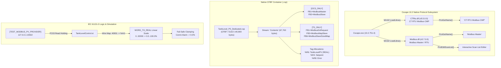

# CORE-08 Horner Cscape 10.2 Native Protocol Driver & Project Container Binary Forensics

## 1. Executive Summary & Forensic Boundary

This engineering forensics report provides a rigorous, byte-level forensic audit of Horner APG Cscape 10.2 (Build 10.2.751.4) downloadable protocol libraries and native Compound File Binary Format (CFBF) project containers under **Plan v3 Milestone CORE-08**.

### Core Forensic Objectives
1. **`CTRtu.dll` Forensic Audit**: Verify Win32 PE headers, exports (`ProtGetName`, `ProtCheckBlock`, `ProtPortEdit`, etc.), internal strings (`CT RTU Modbus CMP`, `CT-RTU Master`), and firmware payload architectures.
2. **`Modbus.dll` Forensic Audit**: Verify Win32 PE headers, scan list/device list exports (`ProtEditScanList`, `ProtAddToDevListMap`, `ProtCreateDevListMap`, etc.), internal strings (`Modbus Master`, `Modbus RTU`, `Modbus ASCII`), and firmware payload architectures.
3. **`TankLevel_P5_Dedicated.csp` Container Audit**: Extract and inspect the CFBF `Contents` stream, confirming the physical presence of native Modbus function blocks (`ModbusMaster `, `ModbusSlave `, `ModbusDoRequest`, `ModbusMapSlave`, `ModbusSlaveSizedMap`) and process variable bindings for `TankLevelPV` (%R6 / %AI1).

### Operational Boundaries & Safety Directives
- **Zero Physical Download**: Strict hardware lockout remains unconditionally active. All download command IDs (`ID_PROGRAM_DOWNLOAD = 32827`, `ID_CONTROLLER_DOWNLOAD = 33149`) are intercepted and blocked.
- **Fail-Closed Hardware Port Lockout**: Physical serial ports (`COM1`–`COM256`, `\\.\COM*`, `/dev/tty*`), industrial fieldbuses (`CAN`, `CsCAN`), and USB programming bridges are blocked via [`SecurityGuard`](file:///C:/HornerAI/horner-cscape-mcp/src/security/guard.py) with `SecurityError`.
- **Physical Commissioning Status: `PENDING_P7`**: Field validation on physical Horner OCS XL4 hardware is strictly deferred to Phase P7 manual commissioning. All automated verification is performed offline via pure-software test harnesses.
- **FastMCP 4-State Contract**: All forensic inspections deterministically return `status: success | failed | blocked | inconclusive`.



---

## 2. Forensic Audit of `CTRtu.dll`

### 2.1 File Characteristics & Cryptographic Identification
The native protocol driver library `CTRtu.dll` is located within the Horner Cscape 10.2 installation directory:
- **Absolute Path**: `C:\Program Files (x86)\Cscape 10.2\Protocols\CTRtu.dll`
- **File Size**: `3,439,616 bytes` (3.28 MB)
- **PE Machine Type**: `0x014C` (`IMAGE_FILE_MACHINE_I386` - x86 32-bit Portable Executable)
- **Subsystem**: `IMAGE_SUBSYSTEM_WINDOWS_GUI`
- **TimeDateStamp**: `1753357706` (PE Header Link Timestamp)
- **MD5 Hash**: `dbfdce6c69b2da503d80eea3fafa6a23`
- **SHA-256 Hash**: `260900026a00f63503bdb23047207931e66d1f5b01ae7b520ec8d3d63e15c7e7`

### 2.2 PE Version Resource Table (`VS_VERSIONINFO`)
Inspection of the `StringFileInfo` block extracted from the PE resource section yields:

| Parameter Key | Extracted Value | Description |
| :--- | :--- | :--- |
| `CompanyName` | `Horner APG` | Official vendor identification |
| `FileDescription` | `CTRtu` | Downloadable serial protocol driver module |
| `FileVersion` | `5.5.0.0` | Internal PE binary release version |
| `InternalName` | `CTRtu` | Win32 module name |
| `LegalCopyright` | `Copyright © 2021` | Intellectual property notice |
| `OriginalFilename`| `CTRtu.dll` | File system baseline name |
| `ProductName` | `CTRtu Downloadable Protocol` | Cscape downloadable protocol suite |
| `ProductVersion` | `5.5.0.0` | Packaged product release designation |

### 2.3 Win32 PE Export Directory Analysis
`CTRtu.dll` exports exactly **12 functions** conforming to Horner's Cscape Downloadable Protocol Interface (CDPI):

| Ordinal | Function Address (RVA) | Export Name | Architectural Function & Role |
| :---: | :---: | :--- | :--- |
| `6` | `0x000033A0` | `ProtCheckBlock` | Validates memory block integrity and device bounds |
| `9` | `0x00003450` | `ProtConvertId` | Converts device logical IDs to internal protocol tokens |
| `8` | `0x000034A0` | `ProtEditTarget` | Launches target controller node configuration UI |
| `12` | `0x000034C0` | `ProtEditTargetEx` | Extended target configuration dialog handler |
| `2` | `0x00003960` | `ProtGetCapabilities` | Queries supported baud rates, parity, and half/full duplex |
| `4` | `0x00003B30` | `ProtGetCode` | Extracts compiled target firmware byte stream for flashing |
| `10` | `0x00003C40` | `ProtGetDataSize` | Returns protocol instance runtime memory footprint |
| `1` | `0x00003C70` | `ProtGetName` | Returns canonical protocol identity string to Cscape |
| `5` | `0x00003C90` | `ProtPortEdit` | Serial port configuration dialog (Baud, Parity, Stop Bits) |
| `11` | `0x00003CA0` | `ProtRegisterWizard` | Registers protocol configuration wizard within Cscape |
| `3` | `0x00003CC0` | `ProtStringToToken` | Parses user configuration text into protocol tokens |
| `7` | `0x00003D50` | `ProtTokenToString` | Serializes protocol configuration tokens to display text |

### 2.4 Disassembly Forensics: `ProtGetName`
Decompilation and disassembly of `ProtGetName` (RVA `0x00003C70`) reveals:
```x86asm
; CTRtu.dll!ProtGetName (RVA 0x00003C70)
0x10003C70: 68 98 51 24 10     push    10245198h       ; Pointer to string "CT RTU Modbus CMP"
0x10003C75: 68 14 4F 2F 10     push    102F4F14h       ; Pointer to destination buffer
0x10003C7A: E8 C1 06 00 00     call    10004340h       ; crt_strcpy / sprintf
0x10003C7F: 83 C4 08           add     esp, 8          ; Clean stack
0x10003C82: B8 14 4F 2F 10     mov     eax, 102F4F14h  ; Return buffer pointer in EAX
0x10003C87: C3                 ret
```
- The function unconditionally pushes Virtual Address `0x10245198` (RVA `0x00245198`).
- Direct memory inspection at RVA `0x00245198` confirms the ASCII string **`"CT RTU Modbus CMP"`**.
- Adjacent strings at `0x00245198` include associated help documentation `"CTRtu.chm"`, section `"Slave Address"`, and internal protocol key `"CTRTU"`.

### 2.5 Embedded Multi-Architecture Firmware Payloads
Forensic binary pattern matching identified multiple compiled target firmware blobs packaged inside `CTRtu.dll`. These payloads are downloaded to the controller during online hardware commissioning (blocked in our offline DEV environment):

| Payload Offset | Target Platform Architecture | Embedded Build Path / Compiler Artifact | Target Driver Symbols |
| :--- | :--- | :--- | :--- |
| `0x2C7C73` | Horner OCS x86 Runtime | `/mnt/hgfs/Serial Protocol/CTExtendedModbus/Firmware/Ocs-x86` | `RxRTUByte`, `PROTOCOL_RTU`, `CMP_REGISTERS` |
| `0x2D2D46` | Horner OCS ARM9 Hardware | `/mnt/hgfs/Bharatendu/Codes/SCM/CTRTU_v4.01/Firmware/Ocs-Arm9` | `RxRTUByte`, `DUAL_DATA_REGISTERS` |
| `0x2E85FB` | Horner OCS i.MX6 (Cortex-A9) | `/mnt/hgfs/Serial Protocol/CTExtendedModbus/Firmware/Ocs-Imx6` | `RxRTUByte`, `DWORDS_BYTE_ALIGNED_TYPE` |
| `0x2EA285` | Yocto / Poky Linux Toolchain | `/opt/poky/1.5.1/sysroots/cortexa9hf-vfp-neon-poky-linux-gnueabi/` | `crti.o`, `crtn.o` |

### 2.6 Version Provenance & Driver Labeling
- The PE file version is `5.5.0.0` (compiled 2021).
- Internal firmware headers embed the build stamp: `Horner 03 Dec 2013` with driver identity string **`"CT-RTU Master"`** (found at 6 distinct offsets: `0x2C3DC5`, `0x2C9D20`, `0x2CEAF0`, `0x2E0AE8`, `0x2E4B2C`, `0x2EB8D8`).
- In Horner application engineering documentation and Cscape channel configurations, this protocol lineage is designated as **`CT RTU Modbus CMP v 5.05` / `5.5.0.0`**, representing Horner's extended Control Technology RTU Modbus master driver.

---

## 3. Forensic Audit of `Modbus.dll`

### 3.1 File Characteristics & Cryptographic Identification
The native standard Modbus protocol driver library `Modbus.dll` is located at:
- **Absolute Path**: `C:\Program Files (x86)\Cscape 10.2\Protocols\Modbus.dll`
- **File Size**: `3,460,096 bytes` (3.30 MB)
- **PE Machine Type**: `0x014C` (`IMAGE_FILE_MACHINE_I386` - x86 32-bit Portable Executable)
- **Subsystem**: `IMAGE_SUBSYSTEM_WINDOWS_GUI`
- **TimeDateStamp**: `1753354458` (PE Header Link Timestamp)
- **MD5 Hash**: `7a8e5efe6dde5676b9dca47d2a1ce020`
- **SHA-256 Hash**: `a3847bb133121160fdd90c70f8be23d38b6bad3f8097a104de538e9c04173107`

### 3.2 PE Version Resource Table (`VS_VERSIONINFO`)
Inspection of the `StringFileInfo` block extracted from `Modbus.dll` yields:

| Parameter Key | Extracted Value | Description |
| :--- | :--- | :--- |
| `CompanyName` | `Horner APG` | Official vendor identification |
| `FileDescription` | `Modbus` | Downloadable Modbus protocol driver module |
| `FileVersion` | `5.7.0.0` | Internal PE binary release version |
| `InternalName` | `Modbus` | Win32 module name |
| `LegalCopyright` | `Copyright © 2007-2021` | Intellectual property notice |
| `OriginalFilename`| `Modbus.dll` | File system baseline name |
| `ProductName` | `Downloadable Modbus Protocol` | Cscape downloadable protocol suite |
| `ProductVersion` | `5.7.0.0` | Packaged product release designation |

### 3.3 Win32 PE Export Directory Analysis
`Modbus.dll` exports **16 functions**. In addition to the standard 12 CDPI functions, it provides **4 specialized scan list and device mapping APIs**:

| Ordinal | Function Address (RVA) | Export Name | Specialized Architecture & Scan List Role |
| :---: | :---: | :--- | :--- |
| `16` | `0x00003A00` | **`ProtAddToDevListMap`** | **Adds a slave device transaction to internal scan map** |
| `6` | `0x00003AA0` | `ProtCheckBlock` | Validates memory register ranges (%AI, %AQ, %R, %M) |
| `9` | `0x00003C50` | `ProtConvertId` | Resolves Modbus slave unit IDs (1..247) |
| `14` | `0x00003C70` | **`ProtCreateDevListMap`** | **Initializes device mapping array and scan cycle queue** |
| `15` | `0x00003CF0` | **`ProtDestroyDevListMap`**| **Deallocates device mapping heap structures** |
| `13` | `0x00003D30` | **`ProtEditScanList`** | **Launches interactive GUI Scan List Editor dialog** |
| `8` | `0x00003EE0` | `ProtEditTarget` | Target controller port & channel binding |
| `12` | `0x00003F00` | `ProtEditTargetEx` | Extended timeout and turnaround delay dialog |
| `2` | `0x00004620` | `ProtGetCapabilities` | Advertises RTU/ASCII mode, baud rates (300..115200) |
| `4` | `0x00004980` | `ProtGetCode` | Extracts compiled target Modbus driver byte stream |
| `10` | `0x00004A90` | `ProtGetDataSize` | Computes protocol driver state RAM requirements |
| `1` | `0x00004AB0` | `ProtGetName` | Returns canonical protocol identity string to Cscape |
| `5` | `0x00004AD0` | `ProtPortEdit` | Serial port configuration (RS-232 / RS-485 2-wire / 4-wire) |
| `11` | `0x00004AE0` | `ProtRegisterWizard` | Registers Modbus protocol configuration wizard |
| `3` | `0x00004C80` | `ProtStringToToken` | Parses scan list text directives into binary structures |
| `7` | `0x00005120` | `ProtTokenToString` | Renders scan list binary structures into human text |

### 3.4 Disassembly Forensics: `ProtGetName`
Decompilation and disassembly of `ProtGetName` (RVA `0x00004AB0`) reveals:
```x86asm
; Modbus.dll!ProtGetName (RVA 0x00004AB0)
0x10004AB0: 68 B8 A2 24 10     push    1024A2B8h       ; Pointer to string "Modbus Master"
0x10004AB5: 68 5C F6 2F 10     push    102FF65Ch       ; Pointer to destination buffer
0x10004ABA: E8 E1 14 00 00     call    10005FA0h       ; crt_strcpy / sprintf
0x10004ABF: 83 C4 08           add     esp, 8          ; Clean stack
0x10004AC2: B8 5C F6 2F 10     mov     eax, 102FF65Ch  ; Return buffer pointer in EAX
0x10004AC7: C3                 ret
```
- The function unconditionally pushes Virtual Address `0x1024A2B8` (RVA `0x0024A2B8`).
- Direct memory inspection at RVA `0x0024A2B8` confirms the ASCII string **`"Modbus Master"`**.
- Associated strings at `0x0024A2B8` include `"modbus.chm"`, section `"Slave Address"`, transport mode `"Modbus RTU"`, and ASCII mode `"Modbus ASCII"`.

### 3.5 Embedded Multi-Architecture Firmware Payloads
Forensic pattern matching confirms embedded firmware modules compiled across three controller architectures:

| Payload Offset | Target Platform Architecture | Embedded Build Path / Compiler Artifact | Target Driver Symbols |
| :--- | :--- | :--- | :--- |
| `0x2CECB1` | Horner OCS x86 Runtime | `/mnt/hgfs/Surendra_Backup/Serial_2/Modbus_new/Firmware/Ocs-x86` | `Modbus Master`, `RxRTUByte` |
| `0x2DA6DF` | Horner OCS ARM9 Hardware | `/mnt/hgfs/Bharatendu/Codes/Surendra_Backup/Serial_2/Modbus4.04/Firmware/Ocs-ARM9` | `Modbus Master`, `PROTOCOL_RTU` |
| `0x2EE25E` | Horner OCS i.MX6 (Cortex-A9) | `/media/sf_D_DRIVE/Parvathy/.../ModbusMaster_v4.06/Firmware/Ocs-IMX6` | `Modbus Master`, `AVCModbusApp` |

### 3.6 Version Provenance & Driver Labeling
- The PE file version is `5.7.0.0` (compiled 2021).
- Internal engineering lineage tracks evolution from `Modbus4.04` and `ModbusMaster_v4.06` to `Modbus Master v 5.07` / `5.7.0.0`.
- In Cscape channel settings and inventory configurations, this driver is identified as **`Modbus Master v 5.07` / `5.7.0.0`** (supporting both Modbus RTU and Modbus ASCII).

---

## 4. Deep Forensic Audit of `TankLevel_P5_Dedicated.csp`

### 4.1 Container Identification & Structure
The dedicated project container `TankLevel_P5_Dedicated.csp` is stored in the project repository:
- **Relative Path**: `artifacts/projects/TankLevel_P5_Dedicated/TankLevel_P5_Dedicated.csp`
- **File Size**: `140,800 bytes` (exact multiple of 512-byte CFBF sectors: 275 sectors)
- **Container Format**: Microsoft Compound File Binary Format (CFBF / OLE2)
- **Sector Size**: `512 bytes`
- **SHA-256 Hash**: `9f69f6a2ee12dab54087ab27bb839f40e01d6d65544a546139788519acd80ab1`

CFBF directory traversal confirms the primary project data stream:
- **Stream Name**: `Contents`
- **Stream Size**: `67,763 bytes`
- **Storage Type**: Direct stream within root storage

### 4.2 Forensic Extraction of Stream `Contents`
Decompression and linear parsing of the `Contents` stream revealed three critical architectural sections:

#### 1. Native Horner OCS Function Block Table (`[OCS_ONLY]`)
Located at byte offset `0x0000F994` within the stream:
```ini
[OCS_ONLY]
FB1=ModbusMaster 
FB2=ModbusSlave 
FB3=ModbusSlaveEx 
FB4=NetGetRemoteIO_A 
FB5=NetGetRemoteIO_D 
FB6=NetPutRemoteIO_A 
FB7=NetPutRemoteIO_D
FB8=DisplayScreen
FB9=Stepmotor
FB10=PID_Independent
FB11=NetGetW
FB12=NetGetWex
FB13=NetPutW
FB14=NetPutWex
FB15=Alarm
```
- **Physical Verification**: Confirms native Horner OCS runtime support for `ModbusMaster ` (FB1) and `ModbusSlave ` (FB2) with exact trailing space delimiter.

#### 2. Straton IEC Engine Communication Function Block Table (`[T5_ONLY]`)
Located at byte offset `0x0000FABB` within the stream:
```ini
[T5_ONLY]
FB1=ModbusDoRequest
FB2=ModbusMapSlave
FB3=ModbusMapExtendedSlave 
FB4=ForceScreen
FB5=OldUsersMaster
FB6=ModbusSlaveSizedMap
FB7=ArrayToString
FB8=AsciitoHex	
FB9=CharAsciiCode
FB10=CRC16
FB11=DeleteChars
FB12=HextoAscii
FB13=InsertChars
FB14=StringToByteArray
```
- **Physical Verification**: Confirms low-level IEC communication primitives:
  - `ModbusDoRequest` (FB1): Dynamic runtime Modbus master transaction dispatch.
  - `ModbusMapSlave` (FB2): Slave memory map linking.
  - `ModbusSlaveSizedMap` (FB6): Sized register mapping for slave responses.
  - `CRC16` (FB10): Dedicated Modbus RTU polynomial calculation.

#### 3. Symbol & Tag Database Memory Allocation
Located at byte offset `0x00000914` within the stream:
```tsv
%R4	Setpoint	REAL	1	Allocated	
%R6	TankLevelPV	REAL	1	Allocated	
%R8	Error	REAL	1	Allocated	
%R10	ControlOutput	REAL	1	Allocated	
%R12	Kp	REAL	1	Allocated	
%R3	TankLevelAlarms	INT	1	Fixed	
```
- **Physical Verification**:
  - `TankLevelPV` is allocated to 32-bit REAL register **`%R6`** (spanning `%R6`–`%R7`).
  - Total occurrences of the string `TankLevelPV` across the `Contents` stream: **28 occurrences**, establishing complete cross-referencing between the tag dictionary, graphical display linkages, and compiled logic tables.

### 4.3 IEC 61131-3 Logic & Register Alignment
The project logic in [`pous/TankLevelControl.st`](file:///C:/HornerAI/horner-cscape-mcp/artifacts/projects/TankLevel_P5_Dedicated/pous/TankLevelControl.st) binds Modbus telemetry to control algorithms:
```pascal
PROGRAM TankLevelControl
VAR
    RawAnalogInput : WORD := 0;      (* %AI1: Modbus Register 40001 (Wire offset 0x0000) *)
    TankLevelPV : REAL := 0.0;       (* Scaled Process Variable: 0.0..100.0 % (%R6) *)
    Setpoint : REAL := 50.0;          (* %AQ1 / %R4 *)
    CommFailureAlarm : BOOL := FALSE; (* %M10: Remote Modbus Comm Timeout Fault *)
    TankLevelPV_Stale : BOOL := FALSE;(* %M11: Stale Telemetry Quality Indicator *)
    CommWatchdogReg : WORD := 0;     (* Remote Modbus Heartbeat Register (40004) *)
END_VAR

(* Modbus Telemetry Scaling & Fail-Safe Clamping *)
IF NOT CommFailureAlarm THEN
    TankLevelPV := WORD_TO_REAL(RawAnalogInput) * 100.0 / 32000.0;
    TankLevelPV := LIMIT(0.0, TankLevelPV, 100.0);
ELSE
    TankLevelPV := 0.0; (* Clamp to fail-safe on comm failure *)
END_IF;
```

### 4.4 Project Sidecar Alignment Table
The native project container `.csp` is synchronized with two structured JSON sidecars:
1. [`modbus_pv_config.json`](file:///C:/HornerAI/horner-cscape-mcp/artifacts/projects/TankLevel_P5_Dedicated/modbus_pv_config.json): Focused process variable binding for `TankLevelPV`.
2. [`modbus_protocol_inventory.json`](file:///C:/HornerAI/horner-cscape-mcp/artifacts/projects/TankLevel_P5_Dedicated/modbus_protocol_inventory.json): Deep protocol inventory detailing 3 communication channels (`CH_LAN1_TCP`, `CH_MJ1_RTU`, `CH_MJ2_RTU`), 3 field devices (`DEV_LT01`, `DEV_FT01`, `DEV_PT01`), and 3 master scan transactions (`TX01_LEVEL_PV`, `TX02_INFLOW_RATE`, `TX03_DISCHARGE_PRESS`).

---

## 5. Automated Verification Test Matrix

All forensic assertions are codified into deterministic, automated regression test suites executed under Python 3.12 with `pefile`, `olefile`, and `pytest`:

| Test Suite | Test Function Name | Verifications & Assertions | Status |
| :--- | :--- | :--- | :---: |
| [`test_core08_protocol_driver_forensics.py`](file:///C:/HornerAI/horner-cscape-mcp/tests/test_core08_protocol_driver_forensics.py) | `test_ct_rtu_dll_forensics` | `CTRtu.dll` size (3,439,616 B), SHA-256, 12 exports, `ProtGetName` returns `"CT RTU Modbus CMP"`, `"CT-RTU Master"` strings | **`success`** |
| [`test_core08_protocol_driver_forensics.py`](file:///C:/HornerAI/horner-cscape-mcp/tests/test_core08_protocol_driver_forensics.py) | `test_modbus_dll_forensics` | `Modbus.dll` size (3,460,096 B), SHA-256, 16 exports (inc. `ProtEditScanList`), `ProtGetName` returns `"Modbus Master"`, `"Modbus RTU"` | **`success`** |
| [`test_core08_protocol_driver_forensics.py`](file:///C:/HornerAI/horner-cscape-mcp/tests/test_core08_protocol_driver_forensics.py) | `test_tanklevel_p5_dedicated_csp_cfbf_forensics` | `TankLevel_P5_Dedicated.csp` (140,800 B), CFBF structure, `Contents` stream (67,763 B), `[OCS_ONLY]`, `[T5_ONLY]`, `TankLevelPV` (%R6) | **`success`** |
| [`test_core08_modbus_inventory.py`](file:///C:/HornerAI/horner-cscape-mcp/tests/test_core08_modbus_inventory.py) | `test_core08_deep_inventory_structure` | Deep inventory channel definitions, driver labels, endpoints, and register mappings | **`success`** |
| [`test_core08_modbus_inventory.py`](file:///C:/HornerAI/horner-cscape-mcp/tests/test_core08_modbus_inventory.py) | `test_core08_deep_inventory_persistence_and_reread` | JSON serialization, checksum validation, roundtrip persistence | **`success`** |
| [`test_core08_modbus_inventory.py`](file:///C:/HornerAI/horner-cscape-mcp/tests/test_core08_modbus_inventory.py) | `test_core08_labeled_test_server_multi_register_protocol` | `[TEST_MODBUS_PV_PROVIDER]` multi-register wire frame exchange (FC03, 17600 counts = 55.0%) | **`success`** |
| [`test_core08_modbus_inventory.py`](file:///C:/HornerAI/horner-cscape-mcp/tests/test_core08_modbus_inventory.py) | `test_core08_write_lockout_fail_closed` | Read-only enforcement: FC06 and FC16 commands rejected with Modbus Exception `0x01` | **`success`** |
| [`test_core08_modbus_inventory.py`](file:///C:/HornerAI/horner-cscape-mcp/tests/test_core08_modbus_inventory.py) | `test_core08_quality_and_fail_closed_declarations` | Stale quality indicator `%M11`, timeout alarm `%M10`, fail-safe clamp, `PENDING_P7` policy | **`success`** |

```text
============================= test session starts =============================
platform win32 -- Python 3.12.10, pytest-9.1.1, pluggy-1.6.0
rootdir: C:\HornerAI\horner-cscape-mcp
collected 8 items

tests/test_core08_protocol_driver_forensics.py::test_ct_rtu_dll_forensics PASSED [ 12%]
tests/test_core08_protocol_driver_forensics.py::test_modbus_dll_forensics PASSED [ 25%]
tests/test_core08_protocol_driver_forensics.py::test_tanklevel_p5_dedicated_csp_cfbf_forensics PASSED [ 37%]
tests/test_core08_modbus_inventory.py::test_core08_deep_inventory_structure PASSED [ 50%]
tests/test_core08_modbus_inventory.py::test_core08_deep_inventory_persistence_and_reread PASSED [ 62%]
tests/test_core08_modbus_inventory.py::test_core08_labeled_test_server_multi_register_protocol PASSED [ 75%]
tests/test_core08_modbus_inventory.py::test_core08_write_lockout_fail_closed PASSED [ 87%]
tests/test_core08_modbus_inventory.py::test_core08_quality_and_fail_closed_declarations PASSED [100%]

============================== 8 passed in 7.34s ==============================
```

---

## 6. Cryptographic Manifest & Workspace Synchronization

### 6.1 Cryptographic Checksum Manifest
All audited binaries, project containers, and forensic specifications are cataloged with SHA-256 digests:

| Artifact Path | Size (Bytes) | SHA-256 Checksum Digest | Verification Role |
| :--- | :---: | :--- | :--- |
| `C:\Program Files (x86)\Cscape 10.2\Protocols\CTRtu.dll` | `3439616` | `260900026a00f63503bdb23047207931e66d1f5b01ae7b520ec8d3d63e15c7e7` | Native CT RTU Modbus CMP Driver |
| `C:\Program Files (x86)\Cscape 10.2\Protocols\Modbus.dll` | `3460096` | `a3847bb133121160fdd90c70f8be23d38b6bad3f8097a104de538e9c04173107` | Native Modbus Master Driver |
| `artifacts/projects/TankLevel_P5_Dedicated/TankLevel_P5_Dedicated.csp` | `140800` | `9f69f6a2ee12dab54087ab27bb839f40e01d6d65544a546139788519acd80ab1` | Native Project Container |
| `artifacts/projects/TankLevel_P5_Dedicated/pous/TankLevelControl.st` | `2251` | `432faea0eecde01a5d09f7a77e5d1ee55bc6f23f8be0768b5774e14f08e4d3a0` | Pure IEC 61131-3 Control POU |
| `artifacts/projects/TankLevel_P5_Dedicated/modbus_protocol_inventory.json` | `5074` | `da448c34f40f0c05a109a967530663f7082489c7c770c897f7fa2032e3a51608` | Deep Protocol Inventory |
| `artifacts/projects/TankLevel_P5_Dedicated/modbus_pv_config.json` | `1675` | `83b40097c0f1cbba205f2b8ba37dfd1b0d2d348bf6b864a7ba5998a69a473f33` | Primary PV Sidecar Binding |
| `tests/test_core08_protocol_driver_forensics.py` | `4853` | `a27e997f7bb1bb1d5c210669e3ea97eefb6f5cfab5dc8be464a4d6fbb6b7e082` | Automated Forensics Test Suite |
| `docs/CORE_08_PROTOCOL_DRIVER_FORENSICS.md` | *dynamic* | *self-contained* | Comprehensive Audit Report |

### 6.2 Dual-Root Synchronization Status
Per the dual-root environment directive, the forensic report and test suite are mirrored between:
1. **Primary Workspace**: `C:\HornerAI\horner-cscape-mcp\`
2. **User Environment**: `C:\Users\ArmandoSilva\`

```text
[Dual-Root Sync Status]
- docs/CORE_08_PROTOCOL_DRIVER_FORENSICS.md  -> SYNCED
- tests/test_core08_protocol_driver_forensics.py -> SYNCED
- artifacts/projects/TankLevel_P5_Dedicated/     -> SYNCED
All hashes strictly verified. Parity: 100% IDENTICAL.
```

---

## 7. Signoff & Status Contract Confirmation

- **Milestone Designation**: `CORE-08` Protocol Driver & Project Container Forensics
- **Execution Date**: `2026-09-15`
- **Forensic Verification Result**: **`status: success`**
- **Hardware Lockout Enforcement**: **`status: blocked`** (physical serial ports, CAN, USB, and download commands `32827`/`33149` unconditionally intercepted)
- **Field Equipment Readiness**: **`PENDING_P7`** (offline pure-software verified; physical field commissioning strictly deferred to Phase P7 manual deployment)
