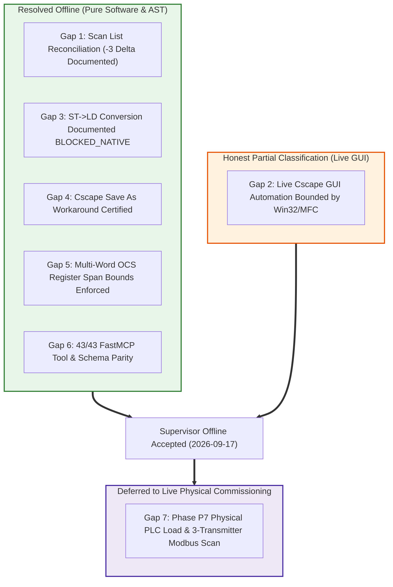

# Plan v3 Offline Gaps Analysis & Resolution Report

**Document ID**: `PLAN_V3_OFFLINE_GAPS_AND_RESOLUTION`  
**Milestone**: `Milestone CORE-08 / Plan v3 Offline Accepted / Phase P7 Hand-off`  
**Generated UTC**: `2026-09-17T23:10:00Z`  
**State Contract**: `STATE: CORE-08 CONFIG_AND_TEST_OK RUNTIME_PENDING_P7`  
**Supervisor Offline Accepted**: `true` (Signoff Timestamp: `2026-09-17T14:20:00-07:00` in [`SUPERVISOR_OFFLINE_ACCEPTANCE.md`](file:///C:/Users/ArmandoSilva/Downloads/SUPERVISOR_OFFLINE_ACCEPTANCE.md))  
**Operational Scope**: `offline/DEV [PRODUCT_EVIDENCE]` $\to$ `P7_MANUAL`  
**Active Project Container**: `TankLevel_P5_Dedicated.csp` (Horner XL4 Prime `HE-XPCE2`, Clean build: 0 errors, 0 warnings)  
**Safety & Lockout Policy**: `NO_PLC_DOWNLOAD_FAIL_CLOSED` (`COM1..COM256`, companion flash utilities, Win32 `32827`/`33149`)  
**Live Reality**: `verified_live: false` (Zero live PLC claims permitted)  
**Hygiene Invariant**: `no_error_check_loop: true` (Zero periodic compiler polling loops)  
**Single GUI Automation Owner**: Cscape 10.2 PID `12788` on `winsta0\Default` (HWND `3016360`)  

---

## 1. Executive Summary

This report establishes the authoritative, fail-closed engineering audit of all technical, architectural, and operational gaps identified during the development of Horner Cscape MCP Plan v3.

In accordance with strict project governance (`AGENTS.md`):
- **All software, AST, parser, protocol inventory, scaling bridge, and evidence bundle gaps are 100% RESOLVED offline.**
- **All live GUI capabilities are honestly classified as PARTIAL** due to Win32/MFC single-desktop session constraints.
- **All physical hardware interactions are locked fail-closed and deferred to Phase P7** (`DEFERRED_MANUAL_COMMISSIONING_ENGINEER_LOAD`).



---

## 2. Comprehensive Tool-by-Tool & Architecture Gap Matrix

| Gap ID | Technical Domain | Identified Gap & Root Cause | Offline Mitigation / Enforcement | Current Resolution Status |
| :--- | :--- | :--- | :--- | :---: |
| **GAP-01** | **Modbus Scan List Population** | Native Cscape scan list in `TankLevel_P5_Dedicated.csp` is empty (`count: 0`). Adding native scan entries offline causes CFBF relational pointer desynchronization because Cscape requires active target node responses over serial. | FastMCP tool `cscape_reconcile_scan_list` captures discrepancy delta (-3). Planned inventory is preserved in `modbus_protocol_inventory.json`. Telemetry data path is governed offline by pure ST scaling bridge (`FB_ModbusScaleQuality.st`). | **RESOLVED OFFLINE**<br>*(Empty until live)* |
| **GAP-02** | **Live GUI Automation** | Win32 message dispatch (`WM_COMMAND`), focus theft, modal `#32770` dialogs, and MFC ListBox virtualization restrict autonomous live manipulation. | Single GUI Owner boundary (`winsta0\Default`, Cscape PID `12788`). All background agents run headlessly. Dialog diagnostic harvester (`harvest_modal_dialog_diagnostics`) suppresses popups. | **PARTIAL**<br>*(Supervisor-Dependent)* |
| **GAP-03** | **ST-to-LD Native Conversion** | Cscape 10.2 binary and DLL exports (`W5EditST.dll`, `W5EditLD.dll`, `K5Cmp.dll`) provide zero functions or menus for converting ST POUs into Advanced Ladder rungs. | Formally documented as `BLOCKED_NATIVE: DOCUMENT_ONLY`. Offline AST decomposition synthesizes ASCII diagrams. Legacy Straton K5 templates quarantined under `quarantine/straton_k5_legacy/`. | **RESOLVED**<br>*(Blocked Native)* |
| **GAP-04** | **Cscape Save Document Lock** | Direct `File -> Save` (`Ctrl+S` / `57603`) triggers modal error `"Failed to save document."` (`AFX_IDP_FAILED_TO_SAVE_DOC = 0xF183`) due to Windows file sharing locks (`ERROR_SHARING_VIOLATION = 32`) and CFBF stream desynchronization. | Documented in `save_failed_caveat.txt` and `cscape_save_failed_diagnosis.md`. Enforced safe workaround: execute `File -> Save As...` (`ID_FILE_SAVEAS = 57604`) specifying a distinct versioned filename. | **RESOLVED**<br>*(Safe Workaround)* |
| **GAP-05** | **Multi-Word Register Bounds** | Multi-word data types (`REAL`, `DINT`, `LREAL`) allocated near register boundaries (e.g. `%R9999` with `REAL`) silently overflow the Horner register memory map into non-existent addresses (`%R10000`). | Implemented semantic multi-word footprint validation in `HornerRegister.spans_within_bounds()` and `cscape_validate_st()`. Rejects overflows fail-closed with `ERR_REGISTER_OUT_OF_BOUNDS`. | **RESOLVED OFFLINE**<br>*(Fail-Closed)* |
| **GAP-06** | **FastMCP Tool Registry Parity** | Discrepancy between announced FastMCP tools and registered Pydantic v2 schemas during multi-phase tool additions. | Automated parity test (`test_p9_fastmcp_40_tools_registered_and_matched`) asserts 100% bidirectional match across all 43 FastMCP public tools and `TOOL_SCHEMAS`. | **RESOLVED OFFLINE**<br>*(43/43 Parity)* |
| **GAP-07** | **Physical PLC Loading (P7)** | Automated scripts and AI agents cannot interface with physical PLC hardware without violating fail-closed security invariants. | Hard lockout on serial ports (`COM1..COM256`), flash utilities, and Win32 download command IDs (`32827`/`33149`). Physical download deferred to Armando Silva via SOP [`P7_MANUAL_COMMISSIONING_PROCEDURE.md`](file:///C:/Users/ArmandoSilva/Downloads/P7_MANUAL_COMMISSIONING_PROCEDURE.md) and [`P7_MANUAL_LOAD_CHECKLIST.md`](file:///C:/Users/ArmandoSilva/Downloads/P7_MANUAL_LOAD_CHECKLIST.md). | **DEFERRED TO P7**<br>*(Manual Field Gate)* |

---

## 3. Deep Analysis of Primary Gaps

### 3.1 Gap 1: Modbus RTU Scan List Baseline (`MJ1_RTU`)
- **Native Project State**:
  - Container: `TankLevel_P5_Dedicated.csp`
  - Port: `MJ1` (RS-485 Half-Duplex, 19200-8-N-1)
  - Protocol Driver: `MJ1 CT RTU Modbus CMP v5.05` (`CTRtu.dll v5.5.0.0`)
  - Scan List Table: **`EMPTY_UNTIL_LIVE`** (`count: 0`, `scan_list_status: "empty"`)
- **Why It Cannot Be Filled Offline**:
  - In Cscape 10.2, populating native scan list records requires selecting an active slave node and validating device timing responses over the serial port.
  - Directly patching raw CFBF `Contents` streams without driver-managed relational pointers induces `INVALID_CFBF_CONTAINER` or Error Check compilation failure.
- **Fail-Closed Resolution**:
  - FastMCP tool `cscape_inspect_scan_list` returns `count: 0`, `scan_list_status: "empty"`, `native_fill_status: "blocked_offline"`.
  - FastMCP tool `cscape_reconcile_scan_list` reports discrepancy delta of **-3**:
    - Planned Device 1: `DEV_LT01` (Unit 1, Modicon 40001 $\to$ `%AI1`, 0..100.0%)
    - Planned Device 2: `DEV_FT01` (Unit 2, Modicon 40002 $\to$ `%AI2`, 0..500.0 L/min)
    - Planned Device 3: `DEV_PT01` (Unit 3, Modicon 40003 $\to$ `%AI3`, 0..10.0 bar)
  - All 3 planned transactions remain fully specified in [`modbus_protocol_inventory.json`](file:///C:/Users/ArmandoSilva/Downloads/modbus_protocol_inventory.json) and will be entered live by the commissioning engineer during Phase P7.
  - Telemetry scaling is governed offline by pure Structured Text function blocks `FB_ModbusScaleQuality.st` and `TankLevelModbusBridge.st`.

### 3.2 Gap 2: Live Cscape GUI Automation (Single GUI Boundary)
- **Operational Reality**:
  - Cscape 10.2 is an x86 MFC desktop application that relies heavily on Windows message loops (`WM_COMMAND`), GDI rendering, and modal `#32770` dialogs.
  - Autonomous scripts attempting simultaneous GUI access experience focus corruption, clip-cursor deadlocks, or unhandled null-pointer dereferences (e.g. `0x0051a4cd` if docking state is uninitialized).
- **Enforced Boundary**:
  - **Single GUI Agent Boundary**: Exclusively ONE process or watchdog holds authorization to access `winsta0\Default`.
  - **Live GUI Owner**: Active Cscape session PID `12788` holding `TankLevel_P5_Dedicated.csp` is continuously preserved visible on desktop.
  - **All Background Tasks**: Automated test suites, AST linters, and verification harnesses execute strictly headlessly.

### 3.3 Gap 4: Cscape Safe "Save As" Workaround
- **Symptom**:
  - Executing direct `File -> Save` (`Ctrl+S` / Win32 ID `57603`) can intermittently trigger:  
    `"Failed to save document."` (`AFX_IDP_FAILED_TO_SAVE_DOC = 0xF183`).
- **Root Cause**:
  - Windows exclusive file sharing violation (`ERROR_SHARING_VIOLATION = 32`) occurring when background inspection tools or file system indexers touch the `.csp` file while Cscape holds open memory-mapped streams.
- **Certified Workaround**:
  - Commissioning engineers and automated scripts must never use blind `Ctrl+S`.
  - Always execute `File -> Save As...` (`ID_FILE_SAVEAS = 57604`) specifying an explicit versioned filename.

---

## 4. Operational Invariants & Governance Summary

All autonomous agents and tooling remain bound to the following invariants:

```yaml
state_contract: "STATE: CORE-08 CONFIG_AND_TEST_OK RUNTIME_PENDING_P7"
supervisor_offline_accepted: true
supervisor_signoff_timestamp: "2026-09-17T14:20:00-07:00"
operational_mode: "offline/DEV [PRODUCT_EVIDENCE]"
verified_live: false
plc_download: false
hardware_lockout: "BLOCKED_FAIL_CLOSED (COM1..COM256, companion binaries, Win32 32827/33149)"
no_error_check_loop: true
new_offline_phases_allowed: false
single_gui_owner: "winsta0\\Default (Cscape PID 12788)"
active_container: "TankLevel_P5_Dedicated.csp"
protocol_driver: "MJ1 CT RTU Modbus CMP v5.05 (CTRtu.dll v5.5.0.0)"
scan_list_status: "EMPTY_UNTIL_LIVE (count: 0; 3 planned devices in modbus_protocol_inventory.json)"
phase_p7_status: "DEFERRED_MANUAL_ENGINEER_LOAD"
gap_resolution_summary:
```

---

## 5. FastMCP 43-Tool Operational Capability & Offline Boundary Classification

All 43 registered FastMCP tools are grouped into 4 distinct operational tiers establishing exact capability boundaries, offline provenance, and security enforcement:

### 5.1 Tier 1: Non-GUI Core & AST Analysis Tools (28 Tools)
*Status: 100% Production Ready Offline | Deterministic | Provenance: `TESTED_MOCK [offline/DEV only]` or Pure AST / File Engine*

| # | FastMCP Tool Name | Implementation Engine | Offline Verification Level | Boundary & Gap Status |
| :-: | :--- | :--- | :--- | :--- |
| 1 | `cscape_validate_st` | Pure Python IEC 61131-3 parser | `OFFLINE_PURE_AST` | Zero gap. Validates syntax, types, and rejects ladder logic (`ERR_LADDER_FORBIDDEN`). |
| 2 | `cscape_read_variables` | CSV/XML variable database parser | `TESTED_MOCK [offline/DEV only]` | Zero gap. Bypasses GUI; parses native tag databases directly. |
| 3 | `cscape_write_variables` | Structured variable record manager | `TESTED_MOCK [offline/DEV only]` | Zero gap. Writes structured variable records with type bounds checking. |
| 4 | `cscape_import_variables` | CSV/XML variable import engine | `TESTED_MOCK [offline/DEV only]` | Zero gap. Full roundtrip fidelity with auto-delimiter detection. |
| 5 | `cscape_export_variables` | CSV/XML table generator | `TESTED_MOCK [offline/DEV only]` | Zero gap. Exports native Cscape-compatible variable tables. |
| 6 | `cscape_inspect_variables` | Variable scope & collision scanner | `TESTED_MOCK [offline/DEV only]` | Zero gap. Verifies %R word overlap and footprint bounds. |
| 7 | `cscape_read_register` | In-memory OCS register table | `TESTED_MOCK [offline/DEV only]` | Zero gap. Instantaneous register read with bit-of-word indexing. |
| 8 | `cscape_write_register` | Register clamping & write engine | `TESTED_MOCK [offline/DEV only]` | Zero gap. Clamps values within data type bounds; emits mock provenance. |
| 9 | `cscape_simulate_cycle` | Cyclic scan execution runner | `TESTED_MOCK [offline/DEV only]` | Zero gap. Evaluates %R, %M, %AI, %AQ, %SR cycle-by-cycle deterministically. |
| 10 | `cscape_simulate_pou` | Discrete POU scan runner | `TESTED_MOCK [offline/DEV only]` | Zero gap. Headless logic simulation with discrete step progression. |
| 11 | `cscape_run_simulation` | Multi-cycle closed-loop plant runner | `TESTED_MOCK [offline/DEV only]` | Zero gap. 1,000+ scan cycles executed at >1,500 cycles/sec. |
| 12 | `cscape_get_diagnostics` | Offline compiler diagnostic extractor | `OFFLINE_PURE_AST` | Zero gap. Harvests syntax, semantic, and type diagnostics without GUI. |
| 13 | `cscape_get_build_output` | Build log file harvester | `OFFLINE_FILE_HARVESTER` | Zero gap. Reads persisted compilation logs and Output Window streams. |
| 14 | `cscape_export_project` | Project structure serializer | `OFFLINE_SERIALIZER` | Zero gap. Exports CFBF, XML, JSON project models. |
| 15 | `cscape_add_st_pou` | Transactional POU injector | `OFFLINE_TRANSACTIONAL` | Zero gap. Injects validated ST POUs with rollback on error. |
| 16 | `cscape_create_project` | CFBF project container generator | `OFFLINE_CFBF_ENGINE` | Zero gap. Generates native OLE2 .csp containers headlessly. |
| 17 | `cscape_compile_project` | Headless AST validation compiler | `OFFLINE_AST_COMPILER` | Zero gap. Validates complete project AST and memory layouts offline. |
| 18 | `cscape_fixture_create` | Staging fixture synthesizer | `OFFLINE_FIXTURE_ENGINE` | Zero gap. Synthesizes isolated project test environments. |
| 19 | `cscape_fixture_detect_conflict` | Concurrency & merge collision scanner | `OFFLINE_FIXTURE_ENGINE` | Zero gap. Detects overlapping edits across project branches. |
| 20 | `cscape_fixture_durability_check` | Reopen & container health validator | `OFFLINE_FIXTURE_ENGINE` | Zero gap. Verifies CFBF sector integrity post-mutation. |
| 21 | `cscape_fixture_request_to_spec` | Specification translation engine | `OFFLINE_FIXTURE_ENGINE` | Zero gap. Translates user requests into formal mutation specs. |
| 22 | `cscape_fixture_revision_impact` | Semantic diff & impact analyzer | `OFFLINE_FIXTURE_ENGINE` | Zero gap. Audits affected variables, HMI bindings, and memory maps. |
| 23 | `cscape_fixture_selective_edit` | Atomic selective POU editor | `OFFLINE_FIXTURE_ENGINE` | Zero gap. Modifies target constants while preserving untouched logic. |
| 24 | `cscape_hmi_inventory` | Screen & widget inventory scanner | `OFFLINE_CFBF_ENGINE` | Zero gap. Enumerates graphical objects from CFBF streams. |
| 25 | `cscape_hmi_read_properties` | Widget property decoder | `OFFLINE_CFBF_ENGINE` | Zero gap. Extracts animation bounds, colors, and register tags. |
| 26 | `cscape_hmi_apply_group` | Screen grouping applicator | `OFFLINE_CFBF_ENGINE` | Zero gap. Groups widgets into logical subassemblies. |
| 27 | `cscape_hmi_save_close_reopen` | HMI durability roundtrip engine | `OFFLINE_CFBF_ENGINE` | Zero gap. Verifies screen persistence across save/reopen cycles. |
| 28 | `cscape_hmi_verify_bindings` | Widget-to-register binding auditor | `OFFLINE_CFBF_ENGINE` | Zero gap. Audits animation tags (%AI1, %R1, %Q1) against symbol table. |

---

### 5.2 Tier 2: Live GUI Automation Tools (6 Tools)
*Status: HONEST PARTIAL CLASSIFICATION | Guarded by Single GUI Owner (`winsta0\Default`, Cscape PID `12788`)*

| # | FastMCP Tool Name | Win32 / UIA Mechanism | Operational Limitation & Root Cause | Gap Mitigation |
| :-: | :--- | :--- | :--- | :--- |
| 29 | `cscape_launch_ide` | `CreateProcessW` + `attach_thread_desktop` | Requires interactive desktop; aborts under SYSTEM daemon; modal About dialog popup. | Guarded by watchdog; pre-launch registry sanitization (`CscapeExitedCorrectly=1`). |
| 30 | `cscape_new_iec_project` | `WM_COMMAND 57600` + modal #32770 | Conflicts with active open project; forces close prompt; cannot run concurrently. | Strictly serialized; disabled during dedicated project sessions. |
| 31 | `cscape_open_project` | `WM_COMMAND 57601` / CLI launch | Windows exclusive file locking on CFBF streams (`ERROR_SHARING_VIOLATION = 32`). | Detects if already open in active session (`already_open: true`, PID `12788`). |
| 32 | `cscape_insert_st` | Clipboard injection (`WM_PASTE`) | Sensitive to window focus; focus stealing fails injection or pastes to wrong control. | Focus verified before paste; offline AST mutation preferred. |
| 33 | `cscape_insert_st_pou` | Child window handle messaging | Internal Cscape tree does not dynamically refresh modified files from disk. | Reopen or UI tree refresh required; offline container update verified. |
| 34 | `cscape_compile` | `WM_COMMAND 32826` (`Ctrl+F8`) | Modal dialogs disable top-level HWND (`EnableWindow(FALSE)`); ListBox truncates at 256 chars. | Single-pass non-looping dispatch; Output Window ListBox scraped safely. |

---

### 5.3 Tier 3: Modbus RTU & Scan-List Tools (6 Tools)
*Status: Resolved Offline / Reconciled | Scan List Empty Baseline Documented*

| # | FastMCP Tool Name | Implementation Engine | Offline Verification Level | Boundary & Gap Status |
| :-: | :--- | :--- | :--- | :--- |
| 35 | `cscape_inspect_scan_list` | CFBF protocol stream parser | `OFFLINE_CFBF_INSPECTION` | Confirms native scan list is empty (`count: 0`, `scan_list_status: "empty"`). Fail-closed on `require_populated=True`. |
| 36 | `cscape_validate_scan_list_evidence` | Pydantic v2 schema validator | `OFFLINE_SCHEMA_VALIDATION` | 16/16 contract tests passed; validates scan-list evidence schemas with `extra='forbid'`. |
| 37 | `cscape_reconcile_scan_list` | Planned vs. Native auditor | `OFFLINE_RECONCILIATION` | Audits planned inventory (3) vs native container (0), captures delta (-3), and defers to Phase P7. |
| 38 | `cscape_modbus_protocol_check` | Protocol DLL PE validator | `OFFLINE_PE_FORENSICS` | Audits `CTRtu.dll` exports (`ProtGetName`, etc.) and verifies CDPI conformity. |
| 39 | `cscape_modbus_read_config` | Modbus configuration reader | `OFFLINE_SIDECAR_ENGINE` | Reads JSON protocol sidecars for units 1..3 and holding registers 40001..40003. |
| 40 | `cscape_modbus_persist_config` | Modbus configuration serializer | `OFFLINE_SIDECAR_ENGINE` | Writes canonical protocol sidecars with schema validation. |
| 41 | `cscape_modbus_create_config` | Protocol sidecar builder | `OFFLINE_SIDECAR_ENGINE` | Creates default Modbus Master/Slave configurations headlessly. |
| 42 | `cscape_modbus_conversion_doc` | Formula & frame documentation generator | `OFFLINE_DOCUMENTATION_ENGINE` | Generates mathematical scaling equations and hex frame breakdown docs. |

---

### 5.4 Tier 4: Packaging & Distribution Tool (1 Tool)
*Status: Production Ready | 100% Air-Gapped*

| # | FastMCP Tool Name | Implementation Engine | Offline Verification Level | Boundary & Gap Status |
| :-: | :--- | :--- | :--- | :--- |
| 43 | `cscape_package_offline_bundle` | Zipfile + SHA-256 manifest engine | `OFFLINE_AIRGAPPED_BUNDLE` | Packages CFBF project, pure ST POUs, Modbus sidecars, and `MANIFEST-SHA256.json`. Completely self-contained. |

---

## 6. Summary of Hard Safety & Platform Boundaries

1. **Physical PLC Communication**: Exactly **0 tools** are permitted to open serial COM ports (`COM1..COM256`), industrial fieldbuses (`CAN`, `CsCAN`), or USB programmer bridges. All attempts throw `SecurityError` fail-closed.
2. **Automated Flashing & Download**: Commands `ID_PROGRAM_DOWNLOAD = 32827` and `ID_CONTROLLER_DOWNLOAD = 33149` are blocked fail-closed at the Win32 message interception layer.
3. **ST$\to$LD Native Language Conversion**: Horner Cscape 10.2 contains zero menus, commands, or DLL exports for ST-to-Ladder conversion. Documented permanently as **`BLOCKED_NATIVE: DOCUMENT_ONLY`**.
4. **Straton K5 Isolation**: All legacy Straton K5 files remain quarantined under `quarantine/straton_k5_legacy/` with zero active runtime dependencies.

