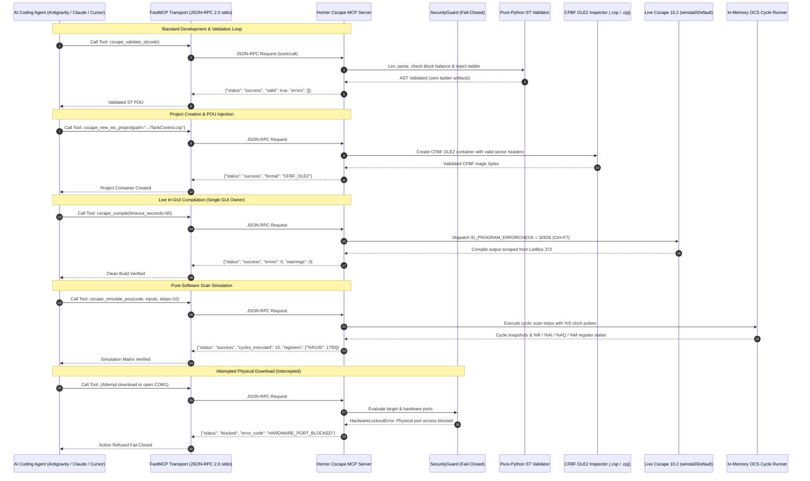

# Horner Cscape 10.2 Model Context Protocol (MCP) Server

[](https://www.python.org/)
[-0078D6.svg)](https://www.microsoft.com/windows)
[-E95420.svg)](https://hornerautomation.com/)
[](docs/mcp_server_reference.md)
[](docs/iec61131_st_guide.md)
[-teal.svg)](docs/cscape_internals.md)
[](docs/safety_and_security.md)
[](docs/HOW_TO_TEST_MCP.md)
[](docs/mcp_server_reference.md)
[](LICENSE)

An industrial-grade Model Context Protocol (MCP) server delivering programmatic engineering integration between AI pair programming assistants (Antigravity, Claude Desktop, Cursor, and custom MCP clients) and **Horner APG Cscape 10.2 (Build 10.2.751.4)**. 

The server bridges modern generative AI with industrial Programmable Logic Controllers (PLCs) by combining Win32 messaging and Windows UIAutomation, native Compound File Binary Format (CFBF `.csp`/`.cpj`) parsing, pure-Python IEC 61131-3 Structured Text validation, and deterministic scan-cycle simulation—enabling autonomous logic generation, static analysis, in-GUI Error Check compilation, and rigorous regression testing before any logic reaches physical hardware.

---

## Operational Governance & Safety Directives

> [!CAUTION]
> **FAIL-CLOSED HARDWARE LOCKOUT POLICY ACTIVE (`plc_download: false`)**
> All physical communication channels (`COM1`–`COM256`, `\\.\COM*`, `/dev/tty*`, `CAN*`, `USB*`, `JTAG`) and companion flashing binaries (`PGMUpdateUtility.exe`, `DfuSeCommand.exe`, `STMFlashLoader.exe`, `WinJTAG.exe`) are strictly blocked fail-closed by [`SecurityGuard`](src/security/guard.py). Attempting physical port access raises `SecurityError`.
> 
> Win32 menu commands for controller download (`ID_PROGRAM_DOWNLOAD = 32827`, `ID_CONTROLLER_DOWNLOAD = 33149`) are intercepted and locked out. AI agents and automated test suites **NEVER** flash physical hardware automatically.

> [!IMPORTANT]
> **Deterministic Offline Engineering (`verified_live: false`)**
> 100% of automated validations reported in this repository reflect deterministic offline software simulation, CFBF container forensics, and live GUI Error Check compilation on the interactive desktop. Physical controller deployment is strictly deferred to **Phase P7 manual loading** by authorized field engineers ([`docs/HOW_TO_TEST_PHYSICAL_PLC.md`](docs/HOW_TO_TEST_PHYSICAL_PLC.md)).

- **Single GUI Owner Boundary (`winsta0\Default`)**: Live Cscape 10.2 window handles (`HWND`) are driven exclusively by one dedicated supervisor process to prevent focus corruption and dialog deadlocks. All other tasks run headlessly.
- **Pure IEC 61131-3 ST Enforcement**: All `.st` POUs are strictly validated against standard Structured Text grammar. Legacy Advanced Ladder constructs (`---[ ]---`, `---( )---`, `RUNG`, `NETWORK`) are rejected immediately with error code `ERR_LADDER_FORBIDDEN`.
- **ST-to-Ladder Native Conversion Status (`BLOCKED_NATIVE: DOCUMENT_ONLY`)**: Horner Cscape 10.2 maintains an architectural boundary separating its Advanced Ladder solver from its IEC 61131-3 engine. There are zero menu items, accelerator commands, or DLL exports for ST-to-Ladder conversion in Cscape 10.2 ([`docs/st_to_ld_conversion_blocked.md`](docs/st_to_ld_conversion_blocked.md)).
- **Straton K5 Quarantine**: Standalone Copa-Data Straton K5 templates (`appli.k5p`, `appli.CPO`, `K5DBXS.INI`) and runtime targets (`T5RTI`, `T5SIMUL`) are permanently quarantined under `quarantine/straton_k5_legacy/` with zero active runtime dependencies.
- **Strict 4-State Return Contract**: Every MCP tool result adheres to the 4-value status specification: `status: success | failed | blocked | inconclusive`. Invented statuses like `VERIFIED` or `100%` are strictly prohibited.

---

## System Architecture



---

## Architectural Highlights: The Core Pillars

### 1. Production Win32 & UIAutomation Cscape 10.2 Control
- Programmatically drives the production 32-bit MFC executable (`Cscape.exe`, Build `10.2.751.4`).
- Dispatches Win32 menu commands and accelerators (`WM_COMMAND`, `ID_PROGRAM_ERRORCHECK = 32826` / `Ctrl+F7`).
- Scrapes output logs from the Cscape MFC message pane (`ListBox ID 372` / `Frame 45011`) for real-time error localization.
- Detects and automatically dismisses modal `#32770` dialogs (splash screens, "Tip of the Day", Save As prompts).

### 2. Native Compound File Binary Format (CFBF / OLE2) Engine
- Deep byte-level inspection, stream extraction, and container synthesis for native Horner **`.csp`** and **`.cpj`** files.
- Preserves OLE2 sector allocation tables (`SAT`), directory entries, and relational pointers without inducing binary corruption.

### 3. Pure-Python IEC 61131-3 AST Lexer, Parser & Ladder Guard
- Strict standard IEC 61131-3 Structured Text lexer and parser supporting standard data types (`BOOL`, `INT`, `DINT`, `REAL`, `TIME`, `STRING`, etc.) and standard Function Blocks (`TON`, `TOF`, `TP`, `CTU`, `CTD`, `CTUD`).
- **Strict Anti-Ladder Interoperability Guard (`STLadderInteropGuard`)**: Rejects ASCII ladder coils (`---( )---`), contacts (`---[ ]---`), rung markers (`RUNG`, `NETWORK`), and ladder mnemonics (`XIC`, `XIO`, `OTE`) with `ERR_LADDER_FORBIDDEN` and zero disk mutation.

### 4. Pure-Software Horner OCS Scan-Cycle Simulation
- Deterministic in-memory cyclic execution engine (`SimulationBackend.EMULATED`) tracking Horner OCS memory spaces:
  - **`%R`**: Analog registers & words
  - **`%AI` / `%AQ`**: Analog inputs and outputs
  - **`%I` / `%Q`**: Digital inputs and outputs
  - **`%M` / `%T`**: Internal marker bits and temporary relays
  - **`%S` / `%SR`**: System bits and system registers (%S1 first scan, %S7 10ms pulse, %S8 100ms pulse, %S9 1000ms pulse)
- Multi-cycle stepping with state snapshots, fault-injection matrices, and quality status tracking without physical hardware.

### 5. Straton K5 Quarantine & Isolation Policy
- Legacy standalone Copa-Data Straton K5 templates (`appli.k5p`, `appli.CPO`, `K5DBXS.INI`) and runtime engines (`T5RTI`, `T5SIMUL`) are permanently quarantined under `quarantine/straton_k5_legacy/`.
- Active runtime code paths maintain **zero** imports, references, or dependencies on the quarantine boundary.

---

## FastMCP 43-Tool Capability Reference

The FastMCP server exposes **43 registered tools** over JSON-RPC 2.0 stdio, partitioned into 7 functional domains:

### 1. Core Native Cscape 10.2 Automation (12 Tools)
| Tool Name | Parameters | Description | Status |
| :--- | :--- | :--- | :--- |
| `cscape_launch_ide` | `timeout_seconds` | Launches `Cscape.exe` on `winsta0\Default`, dismisses splash dialogs, sets IEC mode. | Live / Honest Partial |
| `cscape_new_iec_project` | `project_path`, `project_name` | Provisions an authentic native `.csp`/`.cpj` container configured for IEC 61131-3 ST. | Production Offline |
| `cscape_open_project` | `project_path` | Validates CFBF magic bytes and opens project in Cscape 10.2. | Live / Honest Partial |
| `cscape_insert_st` | `pou_name`, `st_code`, `pou_type` | Injects validated ST source into active Cscape editor via clipboard/Win32. | Live / Honest Partial |
| `cscape_insert_st_pou` | `project_path`, `pou_name`, `code` | Transactional POU injection with rollback on failure. | Production Offline |
| `cscape_compile` | `timeout_seconds` | Dispatches Error Check (`ID_PROGRAM_ERRORCHECK = 32826` / `Ctrl+F7`) to live Cscape. | Live / Honest Partial |
| `cscape_get_build_output` | *(none)* | Scrapes Cscape MFC output listbox for diagnostics, line numbers, and error codes. | Live / Honest Partial |
| `cscape_read_variables` | `file_path`, `merge_strategy` | Reads variables from CSV/XML (`variables.csv`/`.xml`) with register limit checks. | Production Offline |
| `cscape_write_variables` | `output_path`, `variables` | Writes Horner OCS variables to CSV/XML with bit-of-word indexing and overlap validation. | Production Offline |
| `cscape_import_variables` | `file_path`, `merge_strategy` | Alias for `cscape_read_variables`. | Production Offline |
| `cscape_export_variables` | `output_path`, `variables` | Alias for `cscape_write_variables`. | Production Offline |
| `cscape_run_simulation` | `steps`, `inputs` | Stepping simulation with %S system clock flags (%S1, %S7, %S8, %S9). | Production Offline |

### 2. Offline AST & Project Management (8 Tools)
| Tool Name | Parameters | Description | Status |
| :--- | :--- | :--- | :--- |
| `cscape_validate_st` | `code` | AST lexing, parsing, block closure verification, and ladder rejection. | Production Offline |
| `cscape_create_project` | `name`, `description` | Initializes an offline project workspace structure with manifest. | Production Offline |
| `cscape_add_st_pou` | `project_name`, `pou_name`, `code` | Validates and injects an IEC 61131-3 Structured Text POU into project. | Production Offline |
| `cscape_inspect_variables`| `project_name` | Categorizes variables across project POUs and global scopes. | Production Offline |
| `cscape_compile_project`| `project_name`, `clean_build` | Headless compilation pass, memory estimation, and error diagnostics. | Production Offline |
| `cscape_get_diagnostics`| `project_name` | Retrieves compilation diagnostics, warnings, and project health indicators. | Production Offline |
| `cscape_simulate_pou` | `code`, `inputs`, `steps` | Pure-software multi-cycle simulation of ST logic with snapshot logs. | Production Offline |
| `cscape_export_project` | `project_name`, `output_format` | Packages project into structured JSON, XML, or ST archives. | Production Offline |

### 3. In-Memory Simulation & Register Access (3 Tools)
| Tool Name | Parameters | Description | Status |
| :--- | :--- | :--- | :--- |
| `cscape_simulate_cycle` | `cycle_count`, `inputs` | Advances in-memory OCS scan cycles with custom register overrides. | Production Offline |
| `cscape_read_register` | `register_address` | Reads current value and type metadata for an OCS register (%R, %AI, %AQ, %I, %Q, %M). | Production Offline |
| `cscape_write_register`| `register_address`, `value` | Writes value to in-memory register with boundary and type validation. | Production Offline |

### 4. Native HMI Screen Management — Phase P3 (5 Tools)
| Tool Name | Parameters | Description | Status |
| :--- | :--- | :--- | :--- |
| `cscape_hmi_inventory` | `project_path` | Scans CFBF container for configured HMI screens, widgets, and dynamic elements. | Production Offline |
| `cscape_hmi_apply_group`| `project_path`, `group_config` | Applies batch widget group configuration to native HMI screen definitions. | Production Offline |
| `cscape_hmi_read_properties`| `project_path`, `screen_id` | Extracts graphical and dynamic binding properties for a given HMI screen. | Production Offline |
| `cscape_hmi_verify_bindings`| `project_path`, `bindings` | Verifies that HMI screen elements map correctly to allocated OCS registers. | Production Offline |
| `cscape_hmi_save_close_reopen`| `project_path` | Performs container roundtrip verification ensuring zero HMI stream corruption. | Production Offline |

### 5. Fixture Evolution Suite — Phase P4 (6 Tools)
| Tool Name | Parameters | Description | Status |
| :--- | :--- | :--- | :--- |
| `cscape_fixture_request_to_spec`| `request_text` | Generates a deterministic fixture specification from engineering requirements. | Production Offline |
| `cscape_fixture_create` | `spec_config` | Synthesizes a new test fixture with predefined register tables and ST harness. | Production Offline |
| `cscape_fixture_selective_edit`| `fixture_id`, `modifications` | Applies surgical edits to specific POU or register blocks in an existing fixture. | Production Offline |
| `cscape_fixture_revision_impact`| `fixture_id`, `proposed_diff` | Computes dependency and downstream impact analysis for proposed logic changes. | Production Offline |
| `cscape_fixture_durability_check`| `fixture_id`, `cycles` | Evaluates fixture durability under extended cycle counts (up to 100,000 cycles). | Production Offline |
| `cscape_fixture_detect_conflict`| `fixture_id_a`, `fixture_id_b` | Detects overlapping register allocations or conflicting variable definitions. | Production Offline |

### 6. Modbus PV Provider & Scan List — Phase P5 & Tier 3 (8 Tools)
| Tool Name | Parameters | Description | Status |
| :--- | :--- | :--- | :--- |
| `cscape_modbus_create_config` | `config_spec` | Creates Modbus RTU/TCP master/slave scaling bridge configuration. | Production Offline |
| `cscape_modbus_persist_config`| `config_data`, `file_path` | Persists Modbus mapping specifications with SHA-256 validation. | Production Offline |
| `cscape_modbus_read_config` | `file_path` | Reads and validates stored Modbus PV provider configurations. | Production Offline |
| `cscape_modbus_protocol_check`| `config_path` | Validates baud rate, parity, stop bits, slave IDs, and register address limits. | Production Offline |
| `cscape_modbus_conversion_doc`| `output_path` | Generates engineering walkthroughs for Modbus register scaling. | Production Offline |
| `cscape_validate_scan_list_evidence`| `evidence_path` | Validates air-gapped cryptographic proofs for Modbus scan list records. | Production Offline |
| `cscape_inspect_scan_list` | `project_path`, `require_populated` | Inspects native CFBF scan list stream (fail-closed if populated offline). | Fail-Closed Safe |
| `cscape_reconcile_scan_list` | `project_path`, `inventory_path` | Reconciles planned slave inventory against native container with discrepancy logs. | Production Offline |

> [!NOTE]
> **Fail-Closed Scan List Inspection (`cscape_inspect_scan_list`)**
> In Cscape 10.2, adding native Modbus scan list records offline causes relational stream desynchronization because Cscape requires active target node serial responses. The tool honors this platform constraint:
> - **Default baseline inspection (`require_populated=False`)**: Confirms native table is empty (`count: 0`, `scan_list_status: "empty"`).
> - **Fail-closed validation (`require_populated=True`)**: Returns `status: "blocked"`, `error_code: "SCAN_LIST_EMPTY_OFFLINE"` to prevent invalid state progression.
> - **Offline Reconciliation (`cscape_reconcile_scan_list`)**: Reconciles planned slave inventory against native container, capturing discrepancy delta with status `DISCREPANCY_EXPLAINED_OFFLINE_LOCKOUT`.

### 7. Air-Gapped Packaging & Distribution — Tier 4 (1 Tool)
| Tool Name | Parameters | Description | Status |
| :--- | :--- | :--- | :--- |
| `cscape_package_offline_bundle`| `bundle_name`, `target_dir` | Assembles air-gapped release archive with SHA-256 cryptographic manifests. | Production Offline |

---

## MCP Resources & AI Engineering Prompts

### Registered MCP Resources
Clients can query static and dynamic project resources via standard MCP resource URIs:

| Resource URI | Description |
| :--- | :--- |
| `cscape://projects` | Lists all active and archived projects in the local workspace. |
| `cscape://project/{name}/state` | Real-time state of the specified project (POUs, variables, targets). |
| `cscape://project/{name}/diagnostics` | Compilation history, syntax check logs, and memory estimates. |
| `cscape://templates` | Catalog of built-in production Structured Text templates. |
| `cscape://template/{name}` | Structured Text source code for a specific template (e.g. `motor_starter`, `pid_loop`). |
| `cscape://safety/status` | Current hardware lockout state, blocked ports, and prohibited commands. |

### Specialized AI Engineering Prompts
The server pre-configures prompt templates to guide AI assistants during industrial logic synthesis:

1. **`generate_iec_st_controller`**: Guides the agent to generate compliant, verified IEC 61131-3 Structured Text for a user-described industrial process (e.g., tank level control, duplex pump station, conveyor sorter).
2. **`refactor_ladder_to_st`**: Assists in translating legacy ladder logic rungs into modern, deterministic Structured Text with equivalent safety interlocks.
3. **`debug_st_diagnostics`**: Analyzes compiler error logs or simulation traces to pinpoint syntax errors, unclosed blocks, or type mismatches.
4. **`simulate_st_logic`**: Formulates a test bench matrix of input vectors across time steps to verify edge cases and alarm thresholds.

---

## Installation & Quick Start

### 1. Prerequisites
- **Operating System**: Windows 10 or Windows 11 (64-bit).
- **Python**: Python 3.10, 3.11, or 3.12 (64-bit).
- **Horner Cscape**: Horner APG Cscape 10.2 (Build 10.2.751.4) installed (optional for offline AST/simulation modes; required for live GUI Error Check gate).

### 2. Environment Setup
```powershell
# Clone repository
git clone https://github.com/your-org/horner-cscape-mcp.git C:\HornerAI\horner-cscape-mcp
cd C:\HornerAI\horner-cscape-mcp

# Create and activate virtual environment
python -m venv .venv
.\.venv\Scripts\Activate.ps1

# Install package in editable development mode
pip install -e .
```

### 3. Launching the FastMCP Server
```powershell
# Run the FastMCP server over stdio transport
& ".\.venv\Scripts\python.exe" "scripts\run_mcp_server.py"

# Inspect server version
& ".\.venv\Scripts\python.exe" "scripts\run_mcp_server.py" --version
```

### 4. Running the Offline Test Suite
```powershell
# Execute full security lockout and offline unit test suite (227+ tests)
& ".\.venv\Scripts\python.exe" -m pytest tests/test_security.py -v

# Run complete pytest test suite
& ".\.venv\Scripts\pytest.exe" -q
```
*All tests execute in pure-software offline mode without requiring live PLC hardware.*

---

## MCP Client Configuration Guide

Connect the Horner Cscape MCP Server to your preferred AI engineering environment using standard FastMCP `stdio` transport.

### 1. Claude Desktop (`claude_desktop_config.json`)
Location: `%APPDATA%\Claude\claude_desktop_config.json`
```json
{
  "mcpServers": {
    "horner-cscape": {
      "command": "C:\\HornerAI\\horner-cscape-mcp\\.venv\\Scripts\\python.exe",
      "args": [
        "C:\\HornerAI\\horner-cscape-mcp\\scripts\\run_mcp_server.py"
      ],
      "env": {
        "PYTHONUNBUFFERED": "1",
        "CSCAPE_BIN_PATH": "C:\\Program Files (x86)\\Horner APG\\Cscape\\Cscape.exe"
      }
    }
  }
}
```

### 2. Google Antigravity / Gemini CLI (`settings.json`)
Location: Workspace `.gemini/settings.json` or global user configuration:
```json
{
  "mcpServers": {
    "cscape": {
      "command": "C:/HornerAI/horner-cscape-mcp/.venv/Scripts/python.exe",
      "args": [
        "C:/HornerAI/horner-cscape-mcp/scripts/run_mcp_server.py"
      ],
      "env": {
        "PYTHONUNBUFFERED": "1"
      }
    }
  }
}
```

### 3. Cursor & VS Code MCP Extension (`mcp.json`)
Location: `.cursor/mcp.json` or `.vscode/mcp.json`
```json
{
  "mcpServers": {
    "horner-cscape": {
      "command": "C:\\HornerAI\\horner-cscape-mcp\\.venv\\Scripts\\python.exe",
      "args": [
        "C:\\HornerAI\\horner-cscape-mcp\\scripts\\run_mcp_server.py"
      ],
      "env": {
        "PYTHONUNBUFFERED": "1"
      }
    }
  }
}
```

---

## Physical Hardware Commissioning (Phase P7 Manual)

Physical controller flashing is strictly deferred to manual execution by authorized commissioning engineers. Automated scripts, FastMCP servers, and AI agents are permanently locked out fail-closed from physical communication ports.

To commission on physical hardware:
1. Review the step-by-step Standard Operating Procedure: [`docs/HOW_TO_TEST_PHYSICAL_PLC.md`](docs/HOW_TO_TEST_PHYSICAL_PLC.md) and [`docs/P7_MANUAL_COMMISSIONING_PROCEDURE.md`](docs/P7_MANUAL_COMMISSIONING_PROCEDURE.md).
2. Execute the bilingual pre-download safety checklist: [`docs/P7_MANUAL_LOAD_CHECKLIST.md`](docs/P7_MANUAL_LOAD_CHECKLIST.md).
3. Connect programming cable (USB Mini-B or MJ1 RS-232/RS-485 serial) and manually execute `Controller -> Download` (`Ctrl+F9`) within Cscape 10.2.

---

## Key Documentation & References

| Document | Purpose & Scope | Location |
| :--- | :--- | :--- |
| **MCP Server Reference** | Comprehensive FastMCP API specification, tools, resources, and schemas | [`docs/mcp_server_reference.md`](docs/mcp_server_reference.md) |
| **How to Test MCP** | Complete guide for local FastMCP testing and tool verification | [`docs/HOW_TO_TEST_MCP.md`](docs/HOW_TO_TEST_MCP.md) |
| **Safety & Security Spec** | Fail-closed hardware ban, blocked ports, and download command lockout | [`docs/safety_and_security.md`](docs/safety_and_security.md) |
| **IEC 61131-3 ST Guide** | Syntax guide for pure Structured Text POUs and standard Function Blocks | [`docs/iec61131_st_guide.md`](docs/iec61131_st_guide.md) |
| **Cscape Automation Arch** | Win32 messaging, UIAutomation 3.0, and single GUI owner boundary | [`docs/cscape_automation_architecture.md`](docs/cscape_automation_architecture.md) |
| **Cscape Internals (CFBF)** | OLE2 Compound File Binary Format inspection and stream structures | [`docs/cscape_internals.md`](docs/cscape_internals.md) |
| **Simulation API Guide** | Deterministic in-memory scan-cycle simulation and OCS register models | [`docs/cscape_simulation_api.md`](docs/cscape_simulation_api.md) |
| **ST vs Ladder Reality** | Documentation of architectural boundary and `BLOCKED_NATIVE` conversion | [`docs/st_to_ld_conversion_blocked.md`](docs/st_to_ld_conversion_blocked.md) |
| **Scan List Evidence Guide**| Guide for Modbus scan list offline inspection and reconciliation | [`docs/SCAN_LIST_EVIDENCE_VALIDATION_GUIDE.md`](docs/SCAN_LIST_EVIDENCE_VALIDATION_GUIDE.md) |
| **Modbus Scaling FB Bridge**| Modbus RTU/TCP telemetry scaling and IEC Function Block integration | [`docs/OFFLINE_MODBUS_REGISTER_SCALING_IEC_FB_BRIDGE.md`](docs/OFFLINE_MODBUS_REGISTER_SCALING_IEC_FB_BRIDGE.md) |
| **Physical Commissioning** | Standard operating procedure for manual Phase P7 controller loading | [`docs/HOW_TO_TEST_PHYSICAL_PLC.md`](docs/HOW_TO_TEST_PHYSICAL_PLC.md) |
| **P7 Safety Checklist** | Bilingual pre-download checklist for physical controller commissioning | [`docs/P7_MANUAL_LOAD_CHECKLIST.md`](docs/P7_MANUAL_LOAD_CHECKLIST.md) |
| **Supervisor Offline Acceptance** | Formal sign-off on Plan v3 offline deliverables and verification | [`docs/SUPERVISOR_OFFLINE_ACCEPTANCE.md`](docs/SUPERVISOR_OFFLINE_ACCEPTANCE.md) |
| **Master Handoff Index** | Master distribution catalog of cataloged project deliverables | [`docs/HANDOFF_INDEX.md`](docs/HANDOFF_INDEX.md) |
| **Runtime Gaps & Roadmap** | Technical roadmap for CORE-08 live runtime, CORE-09 HMI, and CORE-10 soak | [`docs/CORE_08_09_10_RUNTIME_GAPS_AND_ROADMAP.md`](docs/CORE_08_09_10_RUNTIME_GAPS_AND_ROADMAP.md) |
| **Field Test Matrix** | 23-test vector point-by-point field commissioning matrix | [`docs/CORE_08_09_10_FIELD_VERIFICATION_MATRIX.md`](docs/CORE_08_09_10_FIELD_VERIFICATION_MATRIX.md) |
| **Save Failed Diagnosis** | Forensic root cause analysis and safe Save As workaround for Cscape 10.2 | [`docs/cscape_save_failed_diagnosis.md`](docs/cscape_save_failed_diagnosis.md) |
| **Bilingual Progress Summary** | Comprehensive EN/ES technical progress and handoff summary | [`docs/AVANCE_2026-09-17.md`](docs/AVANCE_2026-09-17.md) |
| **Capability Matrix** | 4-tier honest capability matrix and platform boundaries | [`CAPABILITY_MATRIX.md`](CAPABILITY_MATRIX.md) |
| **Multi-Agent Guide** | Autonomous agent roles, boundaries, and execution directives | [`AGENTS.md`](AGENTS.md) |

---

## Contributing & Development

Contributions are welcome! Please ensure:
1. All changes adhere to the **Pure IEC 61131-3 Structured Text** invariant (`ERR_LADDER_FORBIDDEN`).
2. No hardware communication ports (`COM*`, `CAN*`, `USB*`, `JTAG`) are unblocked.
3. Every new tool or function adheres strictly to the 4-state status contract: `status: success | failed | blocked | inconclusive`.
4. All unit and integration tests pass via `pytest`.

See [`CONTRIBUTING.md`](CONTRIBUTING.md) for full guidelines.

---

## License

This project is licensed under the MIT License — see the [`LICENSE`](LICENSE) file for details.
