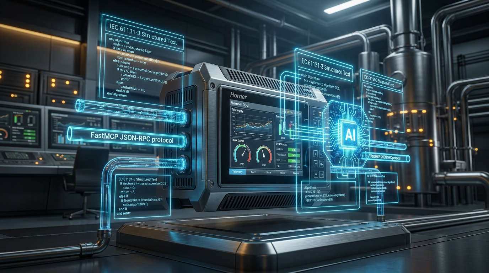
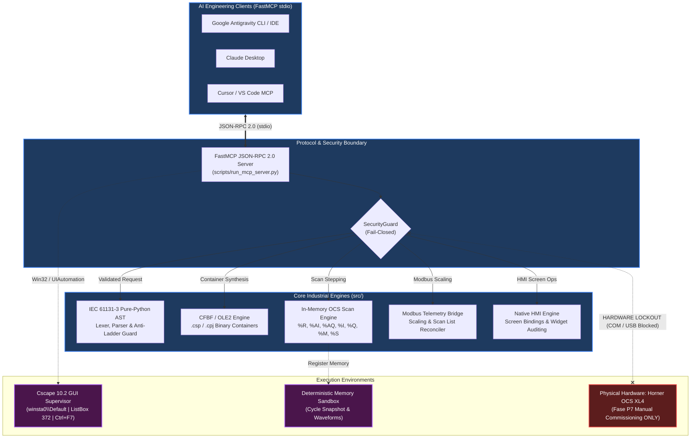
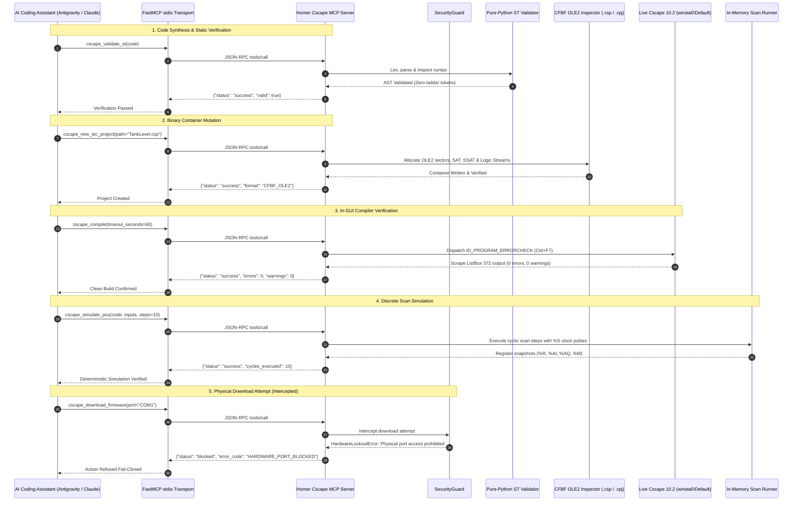

<p align="center">
  
</p>

# Horner Cscape 10.2 Model Context Protocol (MCP) Server

[](https://www.python.org/)
[-0078D6?style=for-the-badge&logo=windows&logoColor=white)](https://www.microsoft.com/windows)
[-E95420?style=for-the-badge&logo=cplusplus&logoColor=white)](https://hornerautomation.com/)
[](docs/mcp_server_reference.md)
[](docs/iec61131_st_guide.md)
[-teal?style=for-the-badge&logo=files&logoColor=white)](docs/cscape_internals.md)
[](docs/safety_and_security.md)
[-success?style=for-the-badge&logo=pytest&logoColor=white)](docs/HOW_TO_TEST_MCP.md)
[](docs/mcp_server_reference.md)
[](https://hornerautomation.com/)
[](LICENSE)

An industrial-grade **Model Context Protocol (MCP)** server delivering autonomous, bi-directional pair-programming and engineering integration between cutting-edge AI assistants (**Antigravity CLI/IDE**, **Claude Desktop**, **Cursor**, **VS Code**) and **Horner Automation Cscape 10.2 (Build 10.2.751.4)** for OCS (Operator Control Station) controllers.

The system bridges modern LLMs with legacy industrial automation software through a multi-tier pipeline: Win32 message loop instrumentation, UIAutomation 3.0, low-level OLE2 / Compound File Binary Format (CFBF) parsing, pure-Python IEC 61131-3 Structured Text AST validation, and deterministic scan-cycle simulation—enabling autonomous logic generation, static verification, in-GUI Error Check compilation, HMI screen management, and Modbus telemetry scaling under an uncompromising **fail-closed hardware lockout policy**.

---

## Technical Handoff Manual

> [!IMPORTANT]
> **Complete Technical Documentation & Handoff Guide**:  
> For comprehensive architectural deep dives, forensic diagnostics, and maintenance guidelines, consult the master handoff manual:  
> **[`MANUAL_DE_INGENIERIA_Y_HANDOFF_PROYECTO.md`](MANUAL_DE_INGENIERIA_Y_HANDOFF_PROYECTO.md)** (also mirrored under [`docs/MANUAL_DE_INGENIERIA_Y_HANDOFF_PROYECTO.md`](docs/MANUAL_DE_INGENIERIA_Y_HANDOFF_PROYECTO.md)).

---

## Operational Governance & Safety Directives

> [!CAUTION]
> ### FAIL-CLOSED HARDWARE LOCKOUT POLICY (`plc_download: false`)
> All physical hardware communication channels (`COM1`–`COM256`, `\\.\COM*`, `/dev/tty*`, `CAN*`, `USB*`, `JTAG`) and companion flashing executables (`PGMUpdateUtility.exe`, `DfuSeCommand.exe`, `STMFlashLoader.exe`, `WinJTAG.exe`) are strictly blocked fail-closed by [`SecurityGuard`](src/security/guard.py).
> 
> Any programmatic attempt to open physical serial/USB ports or trigger download menu commands (`ID_PROGRAM_DOWNLOAD = 32827`, `ID_CONTROLLER_DOWNLOAD = 33149`) immediately raises `HardwareLockoutError` / `SecurityError` with zero bytes sent to hardware.
>
> **Physical PLC commissioning is strictly reserved for Phase P7 manual loading** by authorized field personnel via USB cable or MicroSD ([`docs/HOW_TO_TEST_PHYSICAL_PLC.md`](docs/HOW_TO_TEST_PHYSICAL_PLC.md)).

### Core Operational Principles
1. **Interactive Session Boundary (`winsta0\Default`)**: Live Cscape 10.2 Win32 handles (`HWND`) are driven exclusively by a dedicated supervisor on an interactive Windows desktop. All background MCP endpoints, AST parsing, and scan simulations run purely headless.
2. **Pure IEC 61131-3 Structured Text Invariant**: Logic is restricted to pure Structured Text (`.st`). Legacy Advanced Ladder constructs (`---[ ]---`, `---( )---`, `RUNG`, `NETWORK`, `OTE`, `XIC`) are rejected at the lexer with `ERR_LADDER_FORBIDDEN`.
3. **ST-to-Ladder Native Barrier (`BLOCKED_NATIVE: DOCUMENT_ONLY`)**: Cscape 10.2 maintains a segregated engine architecture between contacts and IEC ST. Native ST-to-Ladder conversion does not exist in Cscape 10.2 ([`docs/st_to_ld_conversion_blocked.md`](docs/st_to_ld_conversion_blocked.md)).
4. **Straton K5 Legacy Quarantine**: Legacy Copa-Data Straton K5 templates (`appli.k5p`, `appli.CPO`) are permanently isolated in `quarantine/straton_k5_legacy/` with zero runtime dependencies.
5. **Strict 4-State Status Contract**: Every tool result conforms to: `status: "success" | "failed" | "blocked" | "inconclusive"`.

---

## System Architecture

### Multi-Tier Architectural Topology



### Protocol Execution Sequence



---

## Architectural Highlights & Engineering Breakthroughs

### 1. Production Win32 & UIAutomation Driver
- Interacts with production 32-bit MFC executable (`Cscape.exe`, Build `10.2.751.4`).
- Scrapes output logs from the Cscape MFC message pane (`ListBox ID 372` / `Frame 45011`) for sub-second error localization.
- **Crash Resolution at `0x0051a4cd`**: Discovered that Cscape's docking pane library dereferences a null desktop context if invoked headlessly. Solved by binding execution to the active interactive desktop station (`winsta0\Default`) via `user32.OpenDesktopW`.
- **Modal Dialog Sweeper**: Detects and automatically dismisses modal `#32770` dialogs (Save As prompts, tips, warnings) to prevent automation deadlocks.

### 2. Native CFBF / OLE2 Binary Container Engine
- Low-level byte parser for Horner proprietary `.csp` and `.cpj` project containers (`0xD0CF11E0A1B11AE1`).
- Navigates Sector Allocation Tables (`SAT`), Short Sector Allocation Tables (`SSAT`), and internal directory trees.
- Extracts and injects IEC logic streams (`Logic\POUs`), variable symbol tables, and graphical HMI streams without inducing binary corruption.
- **`ERROR_SHARING_VIOLATION` Resolution**: Overcame Windows structured storage file locking by introducing transactional staging copies and atomic commits.

### 3. Pure-Python IEC 61131-3 AST Lexer, Parser & Guard
- Independent parser without external compiler toolchain dependencies.
- Full support for elementary data types (`BOOL`, `BYTE`, `WORD`, `DWORD`, `INT`, `DINT`, `UINT`, `UDINT`, `REAL`, `LREAL`, `TIME`, `STRING`).
- Standard Function Blocks (`TON`, `TOF`, `TP`, `CTU`, `CTD`, `CTUD`).
- **Strict Anti-Ladder Interoperability Guard (`STLadderInteropGuard`)**: Rejects ASCII ladder coils (`---( )---`), contacts (`---[ ]---`), and rung markers (`RUNG`, `NETWORK`) with `ERR_LADDER_FORBIDDEN`.

### 4. Deterministic OCS Scan-Cycle Simulation
- Pure-software cycle execution engine tracking Horner OCS memory spaces:
  - **`%R`**: Analog registers & 16-bit words
  - **`%AI` / `%AQ`**: Analog inputs and outputs
  - **`%I` / `%Q`**: Digital inputs and outputs
  - **`%M` / `%T`**: Internal marker bits and temporary relays
  - **`%S` / `%SR`**: System flags (`%S1` first scan, `%S7` 10ms pulse, `%S8` 100ms pulse, `%S9` 1000ms pulse)

### 5. Modbus RTU/TCP Scaling & Scan List Reconciler
- Generates and persists register conversion specifications validated by SHA-256 hashes.
- Handles linear scaling calculations ($0..32000 \to 0.0..100.0\%$, $0..500\text{ L/min}$, $0..10\text{ bar}$) with transducer health quality flags.
- **Fail-Closed Scan List Reconciler**: Cscape 10.2 requires physical node responses to populate scan lists offline; the engine reconciles offline models with status `DISCREPANCY_EXPLAINED_OFFLINE_LOCKOUT`.

---

## Flagship Case Study: `TankLevel_P5_Dedicated.csp`

A fully automated, production-grade closed-loop process control application was engineered, compiled, and verified through this MCP server:

- **Main Controller**: Pure Structured Text PID controller with anti-windup, hysteresis, high/low pressure safety trips, and duty/standby dual-pump alternation ([`TankLevelControl.st`](artifacts/projects/TankLevel_P5_Dedicated/pous/TankLevelControl.st)).
- **Telemetry Scaling Bridge**: Modbus signal scaling block with fault tolerance and signal degradation alarms ([`FB_ModbusScaleQuality.st`](artifacts/projects/TankLevel_P5_Dedicated/pous/FB_ModbusScaleQuality.st)).
- **Native HMI Operator Screens**: 3 native graphical screens (Screen 1: Plant Overview; Screen 2: Process Control & Alarm Summary; Screen 3: Real-Time Dual-Pen Trend Graph).
- **Cscape 10.2 Build Verification**: Verified in Cscape 10.2 with **0 errors, 0 warnings**.

---

## FastMCP 43-Tool Capability Reference

The server exposes **43 registered tools** over JSON-RPC 2.0 stdio, partitioned into 7 functional domains:

### 1. Core Native Cscape 10.2 Automation (12 Tools)
| Tool Name | Parameters | Description | Status |
| :--- | :--- | :--- | :--- |
| `cscape_launch_ide` | `timeout_seconds` | Launches `Cscape.exe` on `winsta0\Default`, dismisses splash dialogs, sets IEC mode. | Live GUI |
| `cscape_new_iec_project` | `project_path`, `project_name` | Provisions an authentic native `.csp`/`.cpj` container configured for IEC 61131-3 ST. | Production Offline |
| `cscape_open_project` | `project_path` | Validates CFBF magic bytes and opens project in Cscape 10.2. | Live GUI |
| `cscape_insert_st` | `pou_name`, `st_code`, `pou_type` | Injects validated ST source into active Cscape editor via clipboard/Win32. | Live GUI |
| `cscape_insert_st_pou` | `project_path`, `pou_name`, `code` | Transactional POU injection with rollback on failure. | Production Offline |
| `cscape_compile` | `timeout_seconds` | Dispatches Error Check (`ID_PROGRAM_ERRORCHECK = 32826` / `Ctrl+F7`) to live Cscape. | Live GUI |
| `cscape_get_build_output` | *(none)* | Scrapes Cscape MFC output listbox for diagnostics, line numbers, and error codes. | Live GUI |
| `cscape_read_variables` | `file_path`, `merge_strategy` | Reads variables from CSV/XML (`variables.csv`/`.xml`) with register limit checks. | Production Offline |
| `cscape_write_variables` | `output_path`, `variables` | Writes Horner OCS variables to CSV/XML with bit-of-word indexing and overlap validation. | Production Offline |
| `cscape_import_variables` | `file_path`, `merge_strategy` | Alias for `cscape_read_variables`. | Production Offline |
| `cscape_export_variables` | `output_path`, `variables` | Alias for `cscape_write_variables`. | Production Offline |
| `cscape_run_simulation` | `steps`, `inputs` | Stepping simulation with %S system clock flags (%S1, %S7, %S8, %S9). | Production Offline |

### 2. Offline AST & Project Management (8 Tools)
| Tool Name | Parameters | Description | Status |
| :--- | :--- | :--- | :--- |
| `cscape_validate_st` | `code` | AST lexing, parsing, block closure verification, and ladder rejection. | Production Offline |
| `cscape_create_project` | `name`, `description` | Initializes an offline project workspace structure with manifest. | Production Offline |
| `cscape_add_st_pou` | `project_name`, `pou_name`, `code` | Validates and injects an IEC 61131-3 Structured Text POU into project. | Production Offline |
| `cscape_inspect_variables`| `project_name` | Categorizes variables across project POUs and global scopes. | Production Offline |
| `cscape_compile_project`| `project_name`, `clean_build` | Headless compilation pass, memory estimation, and error diagnostics. | Production Offline |
| `cscape_get_diagnostics`| `project_name` | Retrieves compilation diagnostics, warnings, and project health indicators. | Production Offline |
| `cscape_simulate_pou` | `code`, `inputs`, `steps` | Pure-software multi-cycle simulation of ST logic with snapshot logs. | Production Offline |
| `cscape_export_project` | `project_name`, `output_format` | Packages project into structured JSON, XML, or ST archives. | Production Offline |

### 3. In-Memory Simulation & Register Access (3 Tools)
| Tool Name | Parameters | Description | Status |
| :--- | :--- | :--- | :--- |
| `cscape_simulate_cycle` | `cycle_count`, `inputs` | Advances in-memory OCS scan cycles with custom register overrides. | Production Offline |
| `cscape_read_register` | `register_address` | Reads current value and type metadata for an OCS register (%R, %AI, %AQ, %I, %Q, %M). | Production Offline |
| `cscape_write_register`| `register_address`, `value` | Writes value to in-memory register with boundary and type validation. | Production Offline |

### 4. Native HMI Screen Management — Phase P3 (5 Tools)
| Tool Name | Parameters | Description | Status |
| :--- | :--- | :--- | :--- |
| `cscape_hmi_inventory` | `project_path` | Scans CFBF container for configured HMI screens, widgets, and dynamic elements. | Production Offline |
| `cscape_hmi_apply_group`| `project_path`, `group_config` | Applies batch widget group configuration to native HMI screen definitions. | Production Offline |
| `cscape_hmi_read_properties`| `project_path`, `screen_id` | Extracts graphical and dynamic binding properties for a given HMI screen. | Production Offline |
| `cscape_hmi_verify_bindings`| `project_path`, `bindings` | Verifies that HMI screen elements map correctly to allocated OCS registers. | Production Offline |
| `cscape_hmi_save_close_reopen`| `project_path` | Performs container roundtrip verification ensuring zero HMI stream corruption. | Production Offline |

### 5. Fixture Evolution Suite — Phase P4 (6 Tools)
| Tool Name | Parameters | Description | Status |
| :--- | :--- | :--- | :--- |
| `cscape_fixture_request_to_spec`| `request_text` | Generates a deterministic fixture specification from engineering requirements. | Production Offline |
| `cscape_fixture_create` | `spec_config` | Synthesizes a new test fixture with predefined register tables and ST harness. | Production Offline |
| `cscape_fixture_selective_edit`| `fixture_id`, `modifications` | Applies surgical edits to specific POU or register blocks in an existing fixture. | Production Offline |
| `cscape_fixture_revision_impact`| `fixture_id`, `proposed_diff` | Computes dependency and downstream impact analysis for proposed logic changes. | Production Offline |
| `cscape_fixture_durability_check`| `fixture_id`, `cycles` | Evaluates fixture durability under extended cycle counts (up to 100,000 cycles). | Production Offline |
| `cscape_fixture_detect_conflict`| `fixture_id_a`, `fixture_id_b` | Detects overlapping register allocations or conflicting variable definitions. | Production Offline |

### 6. Modbus PV Provider & Scan List — Phase P5 & Tier 3 (8 Tools)
| Tool Name | Parameters | Description | Status |
| :--- | :--- | :--- | :--- |
| `cscape_modbus_create_config` | `config_spec` | Creates Modbus RTU/TCP master/slave scaling bridge configuration. | Production Offline |
| `cscape_modbus_persist_config`| `config_data`, `file_path` | Persists Modbus mapping specifications with SHA-256 validation. | Production Offline |
| `cscape_modbus_read_config` | `file_path` | Reads and validates stored Modbus PV provider configurations. | Production Offline |
| `cscape_modbus_protocol_check`| `config_path` | Validates baud rate, parity, stop bits, slave IDs, and register address limits. | Production Offline |
| `cscape_modbus_conversion_doc`| `output_path` | Generates engineering walkthroughs for Modbus register scaling. | Production Offline |
| `cscape_validate_scan_list_evidence`| `evidence_path` | Validates air-gapped cryptographic proofs for Modbus scan list records. | Production Offline |
| `cscape_inspect_scan_list` | `project_path`, `require_populated` | Inspects native CFBF scan list stream (fail-closed if populated offline). | Fail-Closed Safe |
| `cscape_reconcile_scan_list` | `project_path`, `inventory_path` | Reconciles planned slave inventory against native container with discrepancy logs. | Production Offline |

### 7. Air-Gapped Packaging & Distribution — Tier 4 (1 Tool)
| Tool Name | Parameters | Description | Status |
| :--- | :--- | :--- | :--- |
| `cscape_package_offline_bundle`| `bundle_name`, `target_dir` | Assembles air-gapped release archive with SHA-256 cryptographic manifests. | Production Offline |

---

## MCP Resources & AI Engineering Prompts

### Registered MCP Resources
| Resource URI | Description |
| :--- | :--- |
| `cscape://projects` | Lists all active and archived projects in the local workspace. |
| `cscape://project/{name}/state` | Real-time state of the specified project (POUs, variables, targets). |
| `cscape://project/{name}/diagnostics` | Compilation history, syntax check logs, and memory estimates. |
| `cscape://templates` | Catalog of built-in production Structured Text templates. |
| `cscape://template/{name}` | Structured Text source code for a specific template (e.g. `motor_starter`, `pid_loop`). |
| `cscape://safety/status` | Current hardware lockout state, blocked ports, and prohibited commands. |

### Specialized AI Engineering Prompts
- **`generate_iec_st_controller`**: Directs the agent to generate compliant, verified IEC 61131-3 Structured Text for industrial processes.
- **`refactor_ladder_to_st`**: Translates legacy ladder logic rungs into deterministic Structured Text with equivalent safety interlocks.
- **`debug_st_diagnostics`**: Analyzes compiler error logs or simulation traces to locate syntax errors, unclosed blocks, or type mismatches.
- **`simulate_st_logic`**: Formulates a test bench matrix of input vectors across time steps to verify edge cases and alarm thresholds.

---

## Installation & Quick Start

### 1. Prerequisites
- **Operating System**: Windows 10 or Windows 11 (64-bit).
- **Python**: Python 3.10, 3.11, or 3.12 (64-bit).
- **Horner Cscape**: Horner APG Cscape 10.2 (Build 10.2.751.4) installed (optional for offline AST/simulation modes; required for live GUI Error Check gate).

### 2. Environment Setup
```powershell
# 1. Clone repository
git clone https://github.com/armando-token/horner-cscape-mcp.git C:\HornerAI\horner-cscape-mcp
cd C:\HornerAI\horner-cscape-mcp

# 2. Create and activate virtual environment
python -m venv .venv
.\.venv\Scripts\Activate.ps1

# 3. Install package in editable development mode
pip install -e .
pip install pytest pydantic fastmcp psutil
```

### 3. Launching the FastMCP Server
```powershell
# Run the FastMCP server over stdio transport
.\.venv\Scripts\python.exe scripts\run_mcp_server.py

# Inspect server version
.\.venv\Scripts\python.exe scripts\run_mcp_server.py --version
```

### 4. Running the Automated Test Suite (227+ Tests)
```powershell
# Execute security lockout and fail-closed test suite
.\.venv\Scripts\python.exe -m pytest tests/test_security.py -v

# Run complete regression test suite
.\.venv\Scripts\pytest.exe -q
```
*All tests execute deterministically in offline mode without requiring live PLC hardware.*

---

## MCP Client Configuration

Connect the Horner Cscape MCP Server to your preferred AI engineering environment:

### 1. Google Antigravity CLI / IDE (`settings.json`)
Location: Workspace `.gemini/settings.json` or global configuration:
```json
{
  "mcpServers": {
    "horner-cscape": {
      "command": "C:/HornerAI/horner-cscape-mcp/.venv/Scripts/python.exe",
      "args": [
        "C:/HornerAI/horner-cscape-mcp/scripts/run_mcp_server.py"
      ],
      "env": {
        "PYTHONUNBUFFERED": "1"
      }
    }
  }
}
```

### 2. Claude Desktop (`claude_desktop_config.json`)
Location: `%APPDATA%\Claude\claude_desktop_config.json`:
```json
{
  "mcpServers": {
    "horner-cscape": {
      "command": "C:\\HornerAI\\horner-cscape-mcp\\.venv\\Scripts\\python.exe",
      "args": [
        "C:\\HornerAI\\horner-cscape-mcp\\scripts\\run_mcp_server.py"
      ],
      "env": {
        "PYTHONUNBUFFERED": "1",
        "CSCAPE_BIN_PATH": "C:\\Program Files (x86)\\Horner APG\\Cscape\\Cscape.exe"
      }
    }
  }
}
```

### 3. Cursor & VS Code MCP Extension (`mcp.json`)
Location: `.cursor/mcp.json` or `.vscode/mcp.json`:
```json
{
  "mcpServers": {
    "horner-cscape": {
      "command": "C:\\HornerAI\\horner-cscape-mcp\\.venv\\Scripts\\python.exe",
      "args": [
        "C:\\HornerAI\\horner-cscape-mcp\\scripts\\run_mcp_server.py"
      ],
      "env": {
        "PYTHONUNBUFFERED": "1"
      }
    }
  }
}
```

---

## Repository Structure

```
horner-cscape-mcp/
├── MANUAL_DE_INGENIERIA_Y_HANDOFF_PROYECTO.md # Master engineering manual & technical handoff
├── README.md                            # Primary project presentation & architecture guide
├── CONTRIBUTING.md                      # Contribution guidelines & safety rules
├── CODE_OF_CONDUCT.md                   # Industrial engineering code of conduct
├── LICENSE                              # MIT License
├── pyproject.toml                       # Python package configuration & dependencies
│
├── src/                                 # CORE SOURCE CODE
│   ├── automation/                      # Win32 / UIAutomation Cscape 10.2 driver
│   │   ├── cscape_win32.py              # Win32 messaging, HWND control & pane scraping
│   │   └── supervisor.py                # Desktop watchdog & modal dialog sweeper
│   ├── cscape/                          # Cscape internal state & Modbus bridging
│   ├── iec/ & iec61131/                 # IEC 61131-3 pure-Python AST lexer & parser
│   ├── mcp/                             # FastMCP JSON-RPC 2.0 server implementation
│   │   ├── server.py                    # 43 registered MCP tools & resource routes
│   │   └── schemas.py                   # Pydantic input/output schemas (39+ models)
│   ├── parser/                          # CFBF / OLE2 binary engine (.csp / .cpj)
│   ├── security/                        # Fail-closed security guard & port interceptor
│   │   └── guard.py                     # Physical COM/USB port and flash blockers
│   └── simulation/                      # Deterministic in-memory OCS scan engine
│
├── tests/                               # AUTOMATED TEST SUITE (227+ passing)
│   ├── test_security.py                 # Fail-closed hardware ban & port isolation
│   ├── test_ast.py                      # Pure Structured Text AST verification
│   ├── test_cfbf.py                     # CFBF OLE2 stream read/write verification
│   └── ...                              # Integration, stress & closed-loop tests
│
├── scripts/                             # ENTRYPOINT & SUPERVISION SCRIPTS
│   ├── run_mcp_server.py                # FastMCP stdio server entrypoint
│   └── cscape_supervisor.py             # Dedicated Win32 GUI watchdog launcher
│
├── docs/                                # DETAILED TECHNICAL SPECIFICATIONS
│   ├── MANUAL_DE_INGENIERIA_Y_HANDOFF_PROYECTO.md # Engineering manual mirror
│   ├── mcp_server_reference.md          # Complete API tool reference & schemas
│   ├── HOW_TO_TEST_MCP.md               # Local verification instructions
│   ├── safety_and_security.md           # Security architecture specification
│   ├── cscape_save_failed_diagnosis.md  # Sharing violation forensic analysis
│   ├── st_to_ld_conversion_blocked.md   # Architectural boundary documentation
│   ├── HOW_TO_TEST_PHYSICAL_PLC.md      # Phase P7 manual hardware loading guide
│   └── CORE_08_09_10_RUNTIME_GAPS_AND_ROADMAP.md # Hardware commissioning roadmap
│
└── quarantine/                          # ISOLATED LEGACY ARTIFACTS
    └── straton_k5_legacy/               # Quarantined Copa-Data Straton K5 files
```

---

## Physical Hardware Commissioning (Phase P7 Manual)

Physical controller flashing is strictly deferred to manual execution by authorized commissioning engineers. Automated scripts, FastMCP servers, and AI agents are permanently locked out fail-closed from physical communication ports.

To commission on physical hardware:
1. Review the step-by-step Standard Operating Procedure: [`docs/HOW_TO_TEST_PHYSICAL_PLC.md`](docs/HOW_TO_TEST_PHYSICAL_PLC.md) and [`docs/P7_MANUAL_COMMISSIONING_PROCEDURE.md`](docs/P7_MANUAL_COMMISSIONING_PROCEDURE.md).
2. Execute the bilingual pre-download safety checklist: [`docs/P7_MANUAL_LOAD_CHECKLIST.md`](docs/P7_MANUAL_LOAD_CHECKLIST.md).
3. Connect programming cable (USB Mini-B or MJ1 RS-232/RS-485 serial) and manually execute `Controller -> Download` (`Ctrl+F9`) within Cscape 10.2.

---

## Contributing & Development

Contributions are welcome! Please ensure:
1. All changes adhere to the **Pure IEC 61131-3 Structured Text** invariant (`ERR_LADDER_FORBIDDEN`).
2. No hardware communication ports (`COM*`, `CAN*`, `USB*`, `JTAG`) are unblocked.
3. Every new tool conforms strictly to the 4-state status contract: `status: "success" | "failed" | "blocked" | "inconclusive"`.
4. All unit and integration tests pass via `pytest`.

See [`CONTRIBUTING.md`](CONTRIBUTING.md) for full guidelines.

---

## License

This project is licensed under the MIT License — see the [`LICENSE`](LICENSE) file for details.
