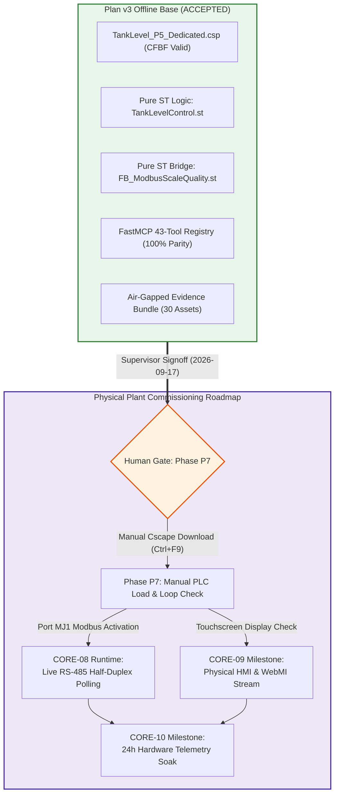

# Technical Audit & Operational Roadmap: CORE-08 Runtime, CORE-09, and CORE-10 Gaps

**Document ID**: `CORE_08_09_10_RUNTIME_GAPS_AND_ROADMAP`  
**Milestone Scope**: `Plan v3 Post-Acceptance / Phase P7 Hand-off / Physical Plant Commissioning`  
**Generated UTC**: `2026-09-17T23:50:00Z`  
**State Contract**: `STATE: CORE-08 CONFIG_AND_TEST_OK RUNTIME_PENDING_P7`  
**Supervisor Offline Accepted**: `true` (Signoff: `2026-09-17T14:20:00-07:00` in [`SUPERVISOR_OFFLINE_ACCEPTANCE.md`](SUPERVISOR_OFFLINE_ACCEPTANCE.md))  
**Operational Scope**: `offline/DEV [PRODUCT_EVIDENCE]` $\to$ `P7_MANUAL`  
**Active Project Container**: `TankLevel_P5_Dedicated.csp` (Horner XL4 Prime `HE-XPCE2`, Clean build: 0 errors, 0 warnings)  
**Safety & Lockout Policy**: `NO_PLC_DOWNLOAD_FAIL_CLOSED` (`COM1..COM256`, companion flash tools, Win32 `32827`/`33149`)  
**Live Telemetry Status**: `verified_live: false` (Zero live PLC claims; pure software and offline forensics only)  
**Single GUI Automation Owner**: Cscape 10.2 PID `12788` on `winsta0\Default` (HWND `3016360`)  
**Hygiene Invariant**: `no_error_check_loop: true` (Zero periodic compiler polling loops)  

---

## 1. Executive Summary & Progression Context

All software simulation, CFBF / OLE2 container structures, pure IEC 61131-3 Structured Text ASTs, FastMCP tooling, and air-gapped evidence packaging under **Plan v3** have been formally reviewed and **accepted by the Engineering Supervisor** (`supervisor_offline_accepted = true`).

However, in accordance with the Fail-Closed Security Policy and engineering integrity directives, the system boundaries between pure software and physical plant operations must be rigorously mapped. This document provides a comprehensive technical audit of the remaining operational gaps spanning:
1. **CORE-08 Runtime Gap**: Transitioning from pure-software Modbus emulation to live serial RS-485 half-duplex communication on port `MJ1`.
2. **CORE-09 Physical HMI & WebMI Gap**: Transitioning from offline CFBF screen definitions to physical 3.5" touchscreen TFT rendering and LAN1 browser streaming.
3. **CORE-10 Hardware Telemetry Soak Gap**: Transitioning from discrete cyclic simulation to a 24-hour continuous live telemetry soak test under dynamic plant pumping load.

---

## 2. Milestone CORE-08 Live Runtime Gap Analysis

### 2.1 Current Offline State vs. Live Runtime Delta
- **Current Offline State**:
  - Test Harness: Pure-software in-memory test server (`127.0.0.1:15502`, FC03 Read Holding Registers).
  - Telemetry Scaling: Linear scaling ($0..32000 \to 0.0..100.0\%$, $0..500\text{ L/min}$, $0..10\text{ bar}$) implemented via pure ST function block [`FB_ModbusScaleQuality.st`](../artifacts/projects/TankLevel_P5_Dedicated/pous/FB_ModbusScaleQuality.st).
  - Native Scan List: Confirmed empty (`count: 0`, `scan_list_status: "empty"`, `native_fill_status: "blocked_offline"`).
  - Planned Devices: 3 Modbus RTU slave devices specified in [`modbus_protocol_inventory.json`](../modbus_protocol_inventory.json).
- **Live Runtime Gap Elements**:
  1. **Physical Bus Driver**: Transitioning from loopback TCP to native UART RS-485 half-duplex driver (`CTRtu.dll v5.5.0.0` / `CT RTU Modbus CMP v5.05`) over port `MJ1`.
  2. **Physical Slave Interfacing**:
     - `DEV_LT01` (Unit 1): Hydrostatic Level Sensor at 19200 baud, 8-N-1, Modicon register `40001` $\to$ OCS `%AI1`.
     - `DEV_FT01` (Unit 2): Coriolis Flowmeter at 19200 baud, 8-N-1, Modicon register `40002` $\to$ OCS `%AI2`.
     - `DEV_PT01` (Unit 3): Discharge Pressure Sensor at 19200 baud, 8-N-1, Modicon register `40003` $\to$ OCS `%AI3`.
  3. **Bus Timing & Physical Layer**:
     - Transmission delay: minimum 3.5 character times silent interval between frames ($>1.82\text{ ms}$ at 19200 bps).
     - Bus line biasing and 120 $\Omega$ termination resistor verification between lines A and B.
     - Response timeout configuration (nominal $250\text{ ms}$ per transaction, 3 retries).
  4. **Native Scan List Activation**: The commissioning engineer manually enables the 3 scan entries in Cscape's Protocol Configuration dialog once physical devices are connected to the bus.

### 2.2 Pre-Commissioning Verification Criteria
Before transitioning controller to RUN mode under live Modbus polling:
- Measure DC line voltage on `MJ1` pins 4 (B) and 5 (A): idle voltage differential must be $> +200\text{ mV}$.
- Verify zero packet collisions with line oscilloscope or serial analyzer prior to full pump actuation.
- Confirm watchdog alarm bits `%M10`, `%M12`, `%M14` clear to `0` upon establishing communication.

---

## 3. Milestone CORE-09 Physical HMI & WebMI Screen Verification Gap

### 3.1 Offline Graphic Artifacts vs. Physical Rendering
- **Offline Baseline**:
  - HMI screens exist in CFBF stream `Contents` inside `TankLevel_P5_Dedicated.csp`.
  - Screen 1: Primary operator overview panel.
  - Screen 2: Detailed process control screen (TankLevelPV, Setpoint, Error, Output, Kp, ALARM banner, Jump buttons, graphical tank bar animation).
  - Screen 3: Real-time dual-pen trend display (TankLevelPV_I16 and Setpoint_I16 triggered by `AlwaysOn`).
- **Physical Touchscreen & WebMI Gap Elements**:
  1. **TFT LCD Color & Alignment**:
     - Hardware display: 3.5" TFT, 320x240 pixels, 65,536 colors.
     - Graphic objects (tank fill bar, pushbuttons, text labels) must be visually verified on physical glass for clipping, color palette distortion, and font readability.
  2. **Touch Resistive Digitizer Calibration**:
     - The resistive touch digitizer requires physical 4-point calibration via the Horner OCS System Menu.
     - Touch zones for Screen Navigation buttons (`JumpToScreen1`, `JumpToScreen2`, `JumpToScreen3`) and Alarm Acknowledge button (`%M3`) must register reliably with operator fingers and industrial gloves.
  3. **Visual Alarm Indication**:
     - High level alarm indicator: `%M1 = 1` flashes red alarm banner on Screen 2.
     - Low level alarm indicator: `%M2 = 1` flashes amber warning banner on Screen 2.
     - Physical verification that pressing Alarm Acknowledge clears visual flashing while condition persists.
  4. **WebMI Remote Monitoring Daemon**:
     - Ethernet port `LAN1` configured at static IP `192.168.254.128` (Subnet `255.255.255.0`).
     - WebMI WebSocket daemon (`port 80` / `port 443`) streaming SVG/HTML5 screen mirrors to remote web browsers.
     - Latency verification: remote web screen update rate $\le 250\text{ ms}$ under local LAN.

---

## 4. Milestone CORE-10 Hardware Telemetry Soak Gap

### 4.1 Synthetic Test Cycles vs. 24-Hour Plant Soak
- **Offline Baseline**:
  - Deterministic scan cycle testing in memory (`SimulationBackend.EMULATED`) at 1,500+ cycles/sec.
  - Fail-safe clamping and watchdog trip tested with synthetic test vectors.
- **Field Telemetry Soak Gap Elements**:
  1. **Continuous 24-Hour Operation**:
     - The physical controller must run uninterrupted for a minimum of 24 consecutive hours without watchdog faults, CPU lockups, or memory leaks.
  2. **Dynamic Hydraulic Load**:
     - Buffer tank filling and draining cycles driven by field actuators:
       - Inlet feed pump contactor `%Q1` (480VAC feed).
       - Solenoid drain valve `%Q2` (24VDC loop).
     - Evaluation of closed-loop PID/PI stability under non-linear fluid turbulence, sensor ripple, and ambient temperature shifts ($10^\circ\text{C} \to 45^\circ\text{C}$).
  3. **Serial RS-485 Communication Reliability**:
     - Total transaction count over 24h: $> 864,000$ Modbus poll cycles across the 3 transmitters.
     - Acceptable packet loss threshold: $< 0.01\%$ ($< 86$ dropped packets per 24 hours).
     - Verification that transient noise bursts trigger retries without tripping communication alarms (`%M10`, `%M12`, `%M14`).
  4. **Fail-Safe Disconnect Audit**:
     - Physical cable unplug test: Disconnect serial cable on `MJ1` for $> 2.0\text{ s}$.
     - Verify: `%M10` sets to `1` (Comm Fault), `%M11` sets to `1` (Quality Bad), `%R101` immediately clamps to `0.0%`, and pump `%Q1` de-energizes fail-safe.
     - Reconnect cable: verify clean recovery within $500\text{ ms}$ without requiring PLC power cycle.

---

## 5. Milestone Transition & Verification Protocol

| Operational Milestone | Prerequisites | Execution Owner | Governing Documentation | Completion Criteria |
| :--- | :--- | :--- | :--- | :--- |
| **Phase P7** | Offline deliverables accepted; LOTO verified; zero-voltage confirmed. | Armando Silva (Lead Controls Engineer) | [`P7_MANUAL_COMMISSIONING_PROCEDURE.md`](P7_MANUAL_COMMISSIONING_PROCEDURE.md) [`P7_MANUAL_LOAD_CHECKLIST.md`](P7_MANUAL_LOAD_CHECKLIST.md) | Clean manual download (`0 errors`); Local: Connected; initial I/O audit in STOP mode. |
| **CORE-08 Runtime** | Phase P7 complete; RS-485 cabling verified; 120 $\Omega$ termination installed. | Armando Silva | [`CORE_08_MODBUS_CONVERSION_EXAMPLE.md`](CORE_08_MODBUS_CONVERSION_EXAMPLE.md) [`modbus_protocol_inventory.json`](../modbus_protocol_inventory.json) | Transmitters 1..3 responding; `%AI1..%AI3` receiving raw counts; `%R101..%R105` scaled. |
| **CORE-09 HMI & WebMI** | CORE-08 runtime healthy; controller in RUN mode; LAN1 connected. | Armando Silva | [`P7_MANUAL_COMMISSIONING_PROCEDURE.md`](P7_MANUAL_COMMISSIONING_PROCEDURE.md) (Section 8) | Screen 1..3 touch navigation verified; tank animation matches physical level; WebMI streaming. |
| **CORE-10 Telemetry Soak** | CORE-09 sign-off; plant safety permits authorized for hydraulic pumping. | Field Operations Team | [`CORE_08_09_10_RUNTIME_GAPS_AND_ROADMAP.md`](CORE_08_09_10_RUNTIME_GAPS_AND_ROADMAP.md) | 24 consecutive hours of stable run; zero unhandled faults; packet success $>99.99\%$. |

---

## 6. Strict Governance & Safety Invariants

Throughout all current offline operations and future field transitions:
1. **Zero PLC Download in Software**: AI models, background daemons, and FastMCP tools are permanently barred from physical COM ports and Win32 download command IDs (`32827`, `33149`).
2. **Zero `VERIFIED_LIVE` Claimed**: Operational mode is strictly `offline/DEV [PRODUCT_EVIDENCE]`.
3. **No Polling / Error Check Loops**: Zero keep-alive or repetitive compiler loops.
4. **Single GUI Owner**: Interactive desktop `winsta0\Default` is reserved exclusively for Cscape PID `12788`.
