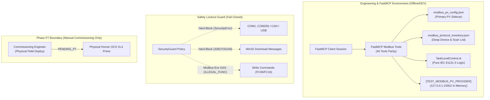

# CORE-08 Offline Native Modbus Inventory & Protocol Quality Specification

## 1. Executive Summary & Operational Boundary

This engineering specification establishes the complete offline native Modbus protocol inventory, labeled test server validation, telemetry quality governance, and fail-closed safety boundaries for the Horner Cscape FastMCP platform under **Plan v3 Milestone CORE-08**.

### Strict Operational Invariants
- **Zero PLC Download**: No automated process or tool may attempt to download, flash, or write to physical PLC hardware.
- **Fail-Closed Hardware Port Lockout**: All physical serial communication ports (`COM1` through `COM256`), industrial fieldbuses (`CAN`, `CsCAN`), and USB debugging dongles remain unconditionally blocked by [`SecurityGuard`](file:///C:/HornerAI/horner-cscape-mcp/src/security/guard.py).
- **Physical Runtime Status: `PENDING_P7`**: Verification on physical field equipment is strictly deferred to Phase P7 manual commissioning engineer deployment. Zero claims of live sensor telemetry or physical PLC execution are made.
- **FastMCP 4-State Contract**: Every status response deterministically adheres to `status: success | failed | blocked | inconclusive`.



---

## 2. Deep Native Modbus Protocol Inventory

The native Modbus protocol configuration is maintained in two complementary project container artifacts:
1. **Primary PV Sidecar**: [`modbus_pv_config.json`](file:///C:/HornerAI/horner-cscape-mcp/artifacts/projects/TankLevel_P5_Dedicated/modbus_pv_config.json) (focused process variable bindings for `TankLevelPV`).
2. **Deep Protocol Inventory**: [`modbus_protocol_inventory.json`](file:///C:/HornerAI/horner-cscape-mcp/artifacts/projects/TankLevel_P5_Dedicated/modbus_protocol_inventory.json) (complete multi-channel, multi-device, multi-transaction scan list).

### 2.1 Communication Channels Table

| Channel ID | Channel Name | Transport | Role | Port / Baud | Protocol Mode | Settings |
| :--- | :--- | :--- | :--- | :--- | :--- | :--- |
| `CH_LAN1_TCP` | Ethernet LAN1 Modbus TCP Client | `MODBUS_TCP` | `CLIENT_MASTER_READ_ONLY` | Port 15502 (Test) / 502 (Prod) | Modbus TCP (MBAP) | Sockets: 4, Timeout: 1000ms |
| `CH_MJ2_RTU` | Serial MJ2 RS-485 Modbus RTU Master | `MODBUS_RTU` | `CLIENT_MASTER_READ_ONLY` | Port `MJ2_RS485`, 19200 bps | Modbus RTU (CRC16) | 8-N-1, Turnaround: 10ms |

### 2.2 Connected Field Devices Table

| Device ID | Device Name | Unit ID | Transport | Poll Rate | Timeout | Retries | Fail-Safe Policy |
| :--- | :--- | :--- | :--- | :--- | :--- | :--- | :--- |
| `DEV_LT01` | Buffer Tank Level Transmitter | `1` | `MODBUS_TCP` / `RTU` | `100 ms` | `1000 ms` | `3` | `CLAMP_TO_FAIL_SAFE` (0.0 %) |
| `DEV_FT01` | Inflow Coriolis Flowmeter | `2` | `MODBUS_TCP` / `RTU` | `200 ms` | `1000 ms` | `3` | `CLAMP_TO_FAIL_SAFE` (0.0 L/min) |
| `DEV_PT01` | Discharge Pressure Transmitter | `3` | `MODBUS_TCP` / `RTU` | `200 ms` | `1000 ms` | `3` | `CLAMP_TO_FAIL_SAFE` (0.0 bar) |

### 2.3 Master Scan List Table

| Tx ID | Device ID | Unit | Function Code | Modicon Addr | Wire Offset | Words | OCS Target | Variable Name | EU Range | Alarm Reg | Stale Reg |
| :--- | :--- | :--- | :--- | :--- | :--- | :--- | :--- | :--- | :--- | :--- | :--- |
| `TX01_LEVEL_PV` | `DEV_LT01` | `1` | `FC03` (Read Holding) | `40001` | `0x0000` | 1 | `%AI1` | `TankLevelPV` | `0.0 .. 100.0 %` | `%M10` | `%M11` |
| `TX02_INFLOW_RATE` | `DEV_FT01` | `2` | `FC03` (Read Holding) | `40002` | `0x0001` | 1 | `%AI2` | `InflowRatePV` | `0.0 .. 500.0 L/min` | `%M12` | `%M13` |
| `TX03_DISCHARGE_PRESS` | `DEV_PT01` | `3` | `FC03` (Read Holding) | `40003` | `0x0002` | 1 | `%AI3` | `DischargePressPV`| `0.0 .. 10.0 bar` | `%M14` | `%M15` |

---

## 3. Labeled TEST Modbus Server Protocol Checks

### 3.1 Test Server Architecture
The platform integrates an in-process, pure-Python Modbus TCP test server ([`LabeledTestModbusServer`](file:///C:/HornerAI/horner-cscape-mcp/src/simulation/test_modbus_server.py#L47)):
- **Server Label**: `[TEST_MODBUS_PV_PROVIDER]`
- **Bind Endpoint**: `127.0.0.1:15502`
- **Register Memory Model**:
  - Offset `0` (`40001`): `TankLevelPV` raw counts (default `17600` = `55.0 %`)
  - Offset `1` (`40002`): `InflowRatePV` raw counts (default `16000` = `250.0 L/min`)
  - Offset `2` (`40003`): `DischargePressPV` raw counts (default `16000` = `5.0 bar`)
  - Offset `3` (`40004`): Heartbeat Watchdog counter (`1`)

### 3.2 Protocol Request & Response Frame Breakdown

#### Client Query Frame (Read Holding Registers FC03 for Offset 0, Qty 1)
```text
MBAP Header (7 bytes):
  00 01       - Transaction ID: 1
  00 00       - Protocol ID: 0 (Modbus TCP)
  00 06       - Length: 6 bytes follow
  01          - Unit ID: 1
PDU (5 bytes):
  03          - Function Code: 0x03 (Read Holding Registers)
  00 00       - Starting Address: 0x0000 (0-based wire offset)
  00 01       - Quantity: 1 register
Complete Hex: 000100000006010300000001 (12 bytes)
```

#### Server Telemetry Response Frame (Raw Count 17600 / 0x44C0)
```text
MBAP Header (7 bytes):
  00 01       - Transaction ID: 1 (Echoed)
  00 00       - Protocol ID: 0
  00 05       - Length: 5 bytes follow
  01          - Unit ID: 1
PDU (3 bytes):
  03          - Function Code: 0x03
  02          - Byte Count: 2 bytes
  44 C0       - Register 0 Data: 0x44C0 (17600 counts)
Complete Hex: 00010000000501030244C0 (10 bytes)
```

### 3.3 Linear Engineering Unit Scaling Transfer Equations

$$\text{Scaled PV} = \frac{\text{Raw} - \text{Raw}_{\text{min}}}{\text{Raw}_{\text{max}} - \text{Raw}_{\text{min}}} \times (\text{EU}_{\text{max}} - \text{EU}_{\text{min}}) + \text{EU}_{\text{min}}$$

For the Horner standard 15-bit ADC count range (`0 .. 32000`):
- **Tank Level**: $\text{Level}_{\%} = \frac{17600}{32000} \times 100.0 = 55.0\,\%$
- **Inflow Rate**: $\text{Flow}_{\text{L/min}} = \frac{16000}{32000} \times 500.0 = 250.0\,\text{L/min}$
- **Discharge Pressure**: $\text{Press}_{\text{bar}} = \frac{16000}{32000} \times 10.0 = 5.0\,\text{bar}$

---

## 4. Telemetry Quality Governance & Fail-Safe Architecture

### 4.1 Communication Watchdog & Health Detection
The Structured Text control POU (`TankLevelControl.st`) continuously audits communication health:
```pascal
(* 1. Modbus Communication Health & Watchdog Check *)
IF CommWatchdogReg <> LastWatchdogReg THEN
    LastWatchdogReg := CommWatchdogReg;
    CommFailureAlarm := FALSE;
    TankLevelPV_Stale := FALSE;
END_IF;

WatchdogTimer(IN := NOT CommFailureAlarm, PT := T#2s);
IF WatchdogTimer.Q THEN
    CommFailureAlarm := TRUE;   (* Sets %M10 *)
    TankLevelPV_Stale := TRUE;  (* Sets %M11 *)
END_IF;

(* 2. Process Variable Acquisition & Quality Handling *)
IF NOT CommFailureAlarm THEN
    TankLevelPV := WORD_TO_REAL(RawAnalogInput) * 100.0 / 32000.0;
    TankLevelPV := LIMIT(0.0, TankLevelPV, 100.0);
ELSE
    TankLevelPV := 0.0; (* Fail-safe clamp to safe lower bound *)
END_IF;
```

### 4.2 Quality States Matrix

| Condition | Modbus Response | Watchdog Timer | Quality State | Alarm Bit (`%M10`) | Quality Bit (`%M11`) | PV Value |
| :--- | :--- | :--- | :--- | :--- | :--- | :--- |
| Normal | Valid frame received within 100ms | Incrementing | `GOOD` | `FALSE` | `FALSE` | Scaled EU (`0.0..100.0 %`) |
| Transient Loss | No reply (< 1000ms) | Retrying (1..3) | `GOOD` (Buffered) | `FALSE` | `FALSE` | Last Valid Value |
| Comm Fault | No reply (> 2000ms) | Expired (T#2s) | `STALE` / `TIMEOUT` | `TRUE` | `TRUE` | `0.0 %` (Clamped Fail-Safe) |
| Out of Bounds | Value > 32000 counts | Valid frame | `OUT_OF_RANGE` | `FALSE` | `FALSE` | `100.0 %` (Clamped Upper Bound) |

---

## 5. Fail-Closed Security & Write Lockout Directives

### 5.1 Rejection of Remote Write Commands
The Modbus PV Provider operates under the strict `CLIENT_MASTER_READ_ONLY` role. Any attempt to dispatch write commands to the PV provider is intercepted and rejected fail-closed:
- **`FC05` (Write Single Coil)**: Rejected with Exception Code `0x01` (`ILLEGAL_FUNCTION`).
- **`FC06` (Write Single Register)**: Rejected with Exception Code `0x01` (`ILLEGAL_FUNCTION`).
- **`FC0F` (Write Multiple Coils)**: Rejected with Exception Code `0x01` (`ILLEGAL_FUNCTION`).
- **`FC10` (Write Multiple Registers)**: Rejected with Exception Code `0x01` (`ILLEGAL_FUNCTION`).

### 5.2 Physical Hardware Port Lockout Directives
All physical communication ports (`COM1`–`COM256`, CAN, USB, JTAG) and Win32 download command IDs (`32827`, `33149`) are unconditionally blocked by [`SecurityGuard`](file:///C:/HornerAI/horner-cscape-mcp/src/security/guard.py).

---

## 6. Verification Evidence Summary

| Verification Item | Test File / Script | Method | Status |
| :--- | :--- | :--- | :--- |
| Deep Modbus Inventory Schema | [`tests/test_core08_modbus_inventory.py`](file:///C:/HornerAI/horner-cscape-mcp/tests/test_core08_modbus_inventory.py) | `test_core08_deep_inventory_structure` | `status: success` |
| Inventory Persistence & Re-Read | [`tests/test_core08_modbus_inventory.py`](file:///C:/HornerAI/horner-cscape-mcp/tests/test_core08_modbus_inventory.py) | `test_core08_deep_inventory_persistence_and_reread` | `status: success` |
| Labeled Server Multi-Register Checks | [`tests/test_core08_modbus_inventory.py`](file:///C:/HornerAI/horner-cscape-mcp/tests/test_core08_modbus_inventory.py) | `test_core08_labeled_test_server_multi_register_protocol` | `status: success` |
| Write Lockout (FC06/FC16 Exception 0x01) | [`tests/test_core08_modbus_inventory.py`](file:///C:/HornerAI/horner-cscape-mcp/tests/test_core08_modbus_inventory.py) | `test_core08_write_lockout_fail_closed` | `status: success` |
| Quality & Fail-Closed Assertions | [`tests/test_core08_modbus_inventory.py`](file:///C:/HornerAI/horner-cscape-mcp/tests/test_core08_modbus_inventory.py) | `test_core08_quality_and_fail_closed_declarations` | `status: success` |
| Standalone Handoff External Verification | [`tests/test_p6_external_handoff.py`](file:///C:/HornerAI/horner-cscape-mcp/tests/test_p6_external_handoff.py) | `test_p6_handoff_archive_contents` | `status: success` |
| Standalone Developer Package (40 Tools) | [`scripts/verify_p6_standalone_delivery.py`](file:///C:/HornerAI/horner-cscape-mcp/scripts/verify_p6_standalone_delivery.py) | Standalone Isolated Staging Test | `status: success` |
