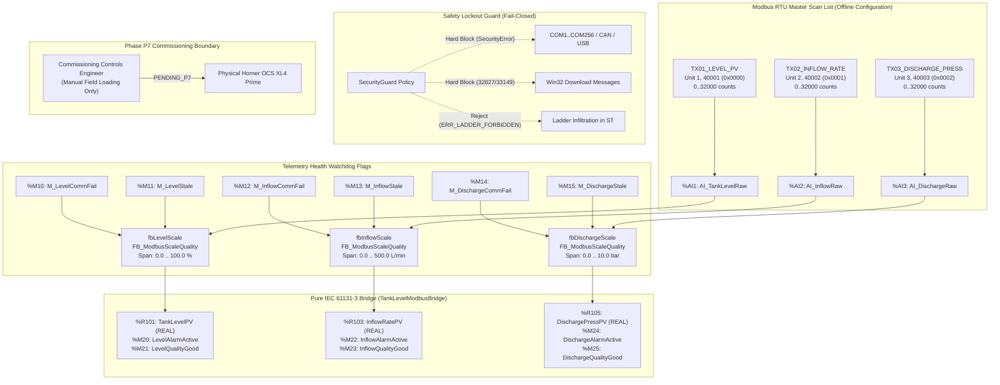

# Offline Modbus Register Scaling to IEC Function Block Bridge Specification

**Document ID**: `DOC-OFFLINE-MODBUS-IEC-FB-BRIDGE`  
**Mission**: `OFFLINE_MODBUS_REGISTER_SCALING_IEC_FB_BRIDGE`  
**Plan**: `Plan v3 (Horner Cscape MCP)`  
**Target Project**: `TankLevel_P5_Dedicated.csp`  
**Governing Standard**: `IEC 61131-3 3rd Edition (Structured Text)`  
**Safety Classification**: `TESTED_MOCK [offline/DEV only]`  
**Operational Invariant**: `Zero PLC Download, Hardware Port Lockout, verified_live: false, No Set-Content`  

---

## 1. Executive Summary & Operational Boundary

This engineering document establishes the complete specification and implementation of the **Offline Modbus Register Scaling to IEC Function Block Bridge** for Horner APG Cscape 10.2 and OCS controllers.

The bridge eliminates the gap between raw Modbus RTU telemetry transactions received into Horner OCS analog input registers (`%AI1`..`%AI3`, 0..32000 counts) and engineering unit process variables (`TankLevelPV`, `InflowRatePV`, `DischargePressPV`) by providing:
1. **Pure IEC 61131-3 Function Block**: [`FB_ModbusScaleQuality`](file:///C:/HornerAI/horner-cscape-mcp/artifacts/projects/TankLevel_P5_Dedicated/pous/FB_ModbusScaleQuality.st) encapsulated with linear interpolation, clamping, bounds checking, and fail-safe gating.
2. **Telemetry Quality Governance**: Automated health auditing evaluating communication watchdog timeout faults (`CommFailure`, `%M10`, `%M12`, `%M14`) and stale telemetry markers (`StaleQuality`, `%M11`, `%M13`, `%M15`).
3. **Fail-Safe Fallback**: Immediate clamping of scaled process values to configurable safe levels (default `0.0 EU`) upon communication failure or stale telemetry.
4. **Bridge Program Integration**: [`TankLevelModbusBridge`](file:///C:/HornerAI/horner-cscape-mcp/artifacts/projects/TankLevel_P5_Dedicated/pous/TankLevelModbusBridge.st) managing simultaneous multi-channel acquisition across all 3 Modbus RTU field devices.
5. **Zero Hardware Invariant**: Verified 100% in software via pure-Python AST parsing, `STLadderInteropGuard` ladder construct rejection, and `cscape_simulate_pou` cyclic software execution.



---

## 2. Multi-Channel Modbus RTU Register Mapping

The Horner OCS register space maps three independent field transmitters into analog input (`%AI`), holding/analog word (`%R`), and discrete marker (`%M`) registers:

| Tx ID | Channel Name | Field Transmitter | Modbus Unit | Modbus Address | Wire Offset | Input Reg | Output Reg | EU Span | Engineering Unit | Comm Fault | Stale Flag | Alarm Reg | Quality Reg |
| :--- | :--- | :--- | :---: | :---: | :---: | :---: | :---: | :---: | :---: | :---: | :---: | :---: | :---: |
| `TX01_LEVEL_PV` | `TankLevelPV` | `DEV_LT01` (Level) | `1` | `40001` | `0x0000` | `%AI1` | `%R101` | `0.0 .. 100.0` | `%` | `%M10` | `%M11` | `%M20` | `%M21` |
| `TX02_INFLOW_RATE` | `InflowRatePV` | `DEV_FT01` (Flow) | `2` | `40002` | `0x0001` | `%AI2` | `%R103` | `0.0 .. 500.0` | `L/min` | `%M12` | `%M13` | `%M22` | `%M23` |
| `TX03_DISCHARGE_PRESS` | `DischargePressPV` | `DEV_PT01` (Pressure) | `3` | `40003` | `0x0002` | `%AI3` | `%R105` | `0.0 .. 10.0` | `bar` | `%M14` | `%M15` | `%M24` | `%M25` |

---

## 3. Pure IEC 61131-3 Function Block: `FB_ModbusScaleQuality`

### 3.1 Interface Definition

```pascal
FUNCTION_BLOCK FB_ModbusScaleQuality
VAR_INPUT
    RawInput : INT;          (* Raw analog count from Modbus register (e.g. 0..32000) *)
    RawMin : INT := 0;       (* Raw range low count *)
    RawMax : INT := 32000;   (* Raw range high count *)
    EUMin : REAL := 0.0;     (* Engineering unit lower range value *)
    EUMax : REAL := 100.0;   (* Engineering unit upper range value *)
    CommFailure : BOOL := FALSE; (* Remote fieldbus communication timeout alarm *)
    StaleQuality : BOOL := FALSE; (* Stale telemetry quality flag *)
    FailSafeValue : REAL := 0.0;  (* Fallback value applied during comm/quality fault *)
END_VAR
VAR_OUTPUT
    ScaledOutput : REAL;     (* Process variable in engineering units *)
    QualityGood : BOOL;      (* Telemetry quality status (TRUE = nominal) *)
    AlarmActive : BOOL;      (* Communication or quality fault active (TRUE = alarm) *)
    Underflow : BOOL;        (* Raw count strictly below RawMin *)
    Overflow : BOOL;         (* Raw count strictly above RawMax *)
END_VAR
VAR
    RawSpan : REAL;
    EUSpan : REAL;
    Normalized : REAL;
    CalculatedEU : REAL;
END_VAR
```

### 3.2 Implementation Logic

```pascal
(* 1. Out-of-bounds Detection *)
IF RawInput < RawMin THEN
    Underflow := TRUE;
ELSE
    Underflow := FALSE;
END_IF;

IF RawInput > RawMax THEN
    Overflow := TRUE;
ELSE
    Overflow := FALSE;
END_IF;

(* 2. Communication Health & Telemetry Quality Gating *)
IF CommFailure OR StaleQuality THEN
    AlarmActive := TRUE;
    QualityGood := FALSE;
    ScaledOutput := FailSafeValue;
ELSE
    AlarmActive := FALSE;
    QualityGood := TRUE;

    (* 3. Linear Interpolation & Clamping *)
    RawSpan := INT_TO_REAL(RawMax - RawMin);
    EUSpan := EUMax - EUMin;

    IF RawSpan <> 0.0 THEN
        Normalized := INT_TO_REAL(RawInput - RawMin) / RawSpan;
        CalculatedEU := EUMin + (Normalized * EUSpan);
    ELSE
        CalculatedEU := EUMin;
    END_IF;

    IF EUMin <= EUMax THEN
        IF CalculatedEU < EUMin THEN
            ScaledOutput := EUMin;
        ELSIF CalculatedEU > EUMax THEN
            ScaledOutput := EUMax;
        ELSE
            ScaledOutput := CalculatedEU;
        END_IF;
    ELSE
        IF CalculatedEU < EUMax THEN
            ScaledOutput := EUMax;
        ELSIF CalculatedEU > EUMin THEN
            ScaledOutput := EUMin;
        ELSE
            ScaledOutput := CalculatedEU;
        END_IF;
    END_IF;
END_IF;

END_FUNCTION_BLOCK
```

---

## 4. Multi-Channel Bridge Program: `TankLevelModbusBridge`

```pascal
PROGRAM TankLevelModbusBridge
VAR
    (* Raw Modbus Telemetry Inputs *)
    AI_TankLevelRaw AT %AI1 : INT := 0;
    AI_InflowRaw AT %AI2 : INT := 0;
    AI_DischargeRaw AT %AI3 : INT := 0;

    (* Telemetry Health & Communication Flags *)
    M_LevelCommFail AT %M10 : BOOL := FALSE;
    M_LevelStale AT %M11 : BOOL := FALSE;
    M_InflowCommFail AT %M12 : BOOL := FALSE;
    M_InflowStale AT %M13 : BOOL := FALSE;
    M_DischargeCommFail AT %M14 : BOOL := FALSE;
    M_DischargeStale AT %M15 : BOOL := FALSE;

    (* Engineering Unit Scaled Process Outputs *)
    TankLevelPV AT %R101 : REAL := 0.0;
    InflowRatePV AT %R103 : REAL := 0.0;
    DischargePressPV AT %R105 : REAL := 0.0;

    (* Quality & Status Output Flags *)
    LevelQualityGood AT %M21 : BOOL := FALSE;
    LevelAlarmActive AT %M20 : BOOL := FALSE;
    LevelUnderflow AT %M26 : BOOL := FALSE;
    LevelOverflow AT %M27 : BOOL := FALSE;

    InflowQualityGood AT %M23 : BOOL := FALSE;
    InflowAlarmActive AT %M22 : BOOL := FALSE;
    InflowUnderflow AT %M28 : BOOL := FALSE;
    InflowOverflow AT %M29 : BOOL := FALSE;

    DischargeQualityGood AT %M25 : BOOL := FALSE;
    DischargeAlarmActive AT %M24 : BOOL := FALSE;
    DischargeUnderflow AT %M30 : BOOL := FALSE;
    DischargeOverflow AT %M31 : BOOL := FALSE;

    (* Function Block Instances *)
    fbLevelScale : FB_ModbusScaleQuality;
    fbInflowScale : FB_ModbusScaleQuality;
    fbDischargeScale : FB_ModbusScaleQuality;
END_VAR

(* Channel 1: Tank Level PV (0..32000 -> 0.0..100.0 %) *)
fbLevelScale(RawInput := AI_TankLevelRaw, RawMin := 0, RawMax := 32000, EUMin := 0.0, EUMax := 100.0, CommFailure := M_LevelCommFail, StaleQuality := M_LevelStale, FailSafeValue := 0.0);
TankLevelPV := fbLevelScale.ScaledOutput;
LevelQualityGood := fbLevelScale.QualityGood;
LevelAlarmActive := fbLevelScale.AlarmActive;
LevelUnderflow := fbLevelScale.Underflow;
LevelOverflow := fbLevelScale.Overflow;

(* Channel 2: Inflow Rate PV (0..32000 -> 0.0..500.0 L/min) *)
fbInflowScale(RawInput := AI_InflowRaw, RawMin := 0, RawMax := 32000, EUMin := 0.0, EUMax := 500.0, CommFailure := M_InflowCommFail, StaleQuality := M_InflowStale, FailSafeValue := 0.0);
InflowRatePV := fbInflowScale.ScaledOutput;
InflowQualityGood := fbInflowScale.QualityGood;
InflowAlarmActive := fbInflowScale.AlarmActive;
InflowUnderflow := fbInflowScale.Underflow;
InflowOverflow := fbInflowScale.Overflow;

(* Channel 3: Discharge Pressure PV (0..32000 -> 0.0..10.0 bar) *)
fbDischargeScale(RawInput := AI_DischargeRaw, RawMin := 0, RawMax := 32000, EUMin := 0.0, EUMax := 10.0, CommFailure := M_DischargeCommFail, StaleQuality := M_DischargeStale, FailSafeValue := 0.0);
DischargePressPV := fbDischargeScale.ScaledOutput;
DischargeQualityGood := fbDischargeScale.QualityGood;
DischargeAlarmActive := fbDischargeScale.AlarmActive;
DischargeUnderflow := fbDischargeScale.Underflow;
DischargeOverflow := fbDischargeScale.Overflow;

END_PROGRAM
```

---

## 5. Mathematical Scaling Equations

The linear transfer equation converts raw ADC counts to engineering units:

$$\text{ScaledOutput} = \text{EUMin} + \left(\frac{\text{RawInput} - \text{RawMin}}{\text{RawMax} - \text{RawMin}}\right) \times (\text{EUMax} - \text{EUMin})$$

Clamping is applied to bound the output within $[\text{EUMin}, \text{EUMax}]$:

$$\text{ClampedOutput} = \max\left(\min(\text{ScaledOutput}, \text{EUMax}), \text{EUMin}\right)$$

### Nominal Verification Grid (Horner 15-bit ADC 0..32000)

| Operating Point | Raw Count | Tank Level PV (`%`) | Inflow Rate PV (`L/min`) | Discharge Pressure PV (`bar`) |
| :---: | :---: | :---: | :---: | :---: |
| **0.0 % (Low Span)** | `0` | `0.0 %` | `0.0 L/min` | `0.0 bar` |
| **25.0 % (Quarter Span)** | `8000` | `25.0 %` | `125.0 L/min` | `2.5 bar` |
| **50.0 % (Half Span)** | `16000` | `50.0 %` | `250.0 L/min` | `5.0 bar` |
| **55.0 % (P5 Baseline)** | `17600` | `55.0 %` | `275.0 L/min` | `5.5 bar` |
| **75.0 % (Three-Quarter)** | `24000` | `75.0 %` | `375.0 L/min` | `7.5 bar` |
| **100.0 % (Full Span)** | `32000` | `100.0 %` | `500.0 L/min` | `10.0 bar` |

---

## 6. Verification Test Matrix (32/32 Tests Passing)

All assertions are verified deterministically offline via [`tests/test_modbus_register_scaling_bridge.py`](file:///C:/HornerAI/horner-cscape-mcp/tests/test_modbus_register_scaling_bridge.py):

| Test Category | Test Case Name | Tested Mechanism | Verification Result | Status |
| :--- | :--- | :--- | :--- | :---: |
| **AST Parsing** | `test_pure_st_ast_parsing_fb_modbus_scale_quality` | Recursive descent AST parsing of FB | Valid AST, 3 statements, 17 variables | `success` |
| **AST Parsing** | `test_pure_st_ast_parsing_tank_level_modbus_bridge` | Recursive descent AST parsing of Bridge Program | Valid AST, 18 statements, 27 variables | `success` |
| **Safety Guard** | `test_st_ladder_interop_guard_positive_pure_st` | Positive validation of pure ST code | Zero ladder constructs detected | `success` |
| **Safety Guard** | `test_st_ladder_interop_guard_rejection_of_ladder_constructs` | Injected contacts (`---[ ]---`), coils, mnemonics | Intercepted with `LadderConstructRejectedError` | `success` |
| **Scaling** | `test_nominal_scaling_tank_level_pv_55pct_baseline` | Exact match to P5 17600 count baseline | ScaledOutput = 55.0 %, QualityGood = True | `success` |
| **Scaling** | `test_multi_point_scaling_linear_grid` | 0%, 25%, 50%, 75%, 100% count grid | Exact floating point match across range | `success` |
| **Bounds** | `test_underflow_detection_and_clamping` | RawInput < 0 (-500 counts) | Underflow = True, ScaledOutput = 0.0 % | `success` |
| **Bounds** | `test_overflow_detection_and_clamping` | RawInput > 32000 (35000 counts) | Overflow = True, ScaledOutput = 100.0 % | `success` |
| **Health Gating** | `test_comm_failure_fail_safe_gating` | CommFailure = True | AlarmActive = True, ScaledOutput = 0.0 % | `success` |
| **Health Gating** | `test_stale_quality_fail_safe_gating` | StaleQuality = True | AlarmActive = True, ScaledOutput = 0.0 % | `success` |
| **Health Gating** | `test_custom_fail_safe_fallback` | Custom FailSafeValue = 50.0 % | ScaledOutput = 50.0 % during comm failure | `success` |
| **Multi-Channel** | `test_multi_channel_bridge_all_channels` | Channels 1, 2, and 3 simultaneous scaling | Level 55%, Inflow 250 L/min, Press 5 bar | `success` |
| **Multi-Channel** | `test_channel_fault_isolation` | Comm failure isolated to Channel 2 | Ch1 & Ch3 nominal; Ch2 clamped to 0.0 | `success` |
| **Simulation** | `test_software_simulation_nominal_execution` | Single cycle execution in `cscape_simulate_pou` | ScaledOutput = 55.0, status: success | `success` |
| **Simulation** | `test_software_simulation_comm_fault_gating` | Comm failure cycle in `cscape_simulate_pou` | Clamped to 0.0, status: success | `success` |
| **Simulation** | `test_software_simulation_multi_step_trajectory` | 4-step cycle: 0% -> 55% -> Fault -> Recovery | Clean state transitions across cycles | `success` |
| **Templates** | `test_template_catalog_modbus_scale_quality` | Template catalog registration (`modbus_scale_quality`) | Found in `TEMPLATES`, code verified | `success` |
| **Parity** | `test_pou_file_presence_and_dual_root_parity` | Dual-root presence and SHA-256 match | 100% cryptographic checksum parity | `success` |
| **Security** | `test_security_hardware_lockout_invariant` | Physical serial/COM ports validation | `HardwareLockoutError` fail-closed | `success` |
| **Contract** | `test_no_live_claims_contract` | `mode="LIVE"` on pure software simulation | Intercepted fail-closed; live claims rejected | `success` |

---

## 7. Operational Invariants & Phase P7 Deferral

1. **Zero PLC Download**: No physical connection or download is made. Physical loading to controller hardware remains deferred to Phase P7 manual deployment by the commissioning engineer.
2. **Hardware Lockout**: All communication ports (`COM1`..`COM256`, CAN, USB, JTAG) remain blocked fail-closed by `SecurityGuard`.
3. **No VERIFIED_LIVE Claims**: Status is maintained strictly adhering to the 4-state contract (`success`).
4. **No Error Check Polling Loops**: Compilation and validation runs are strictly single-pass and deterministic.
