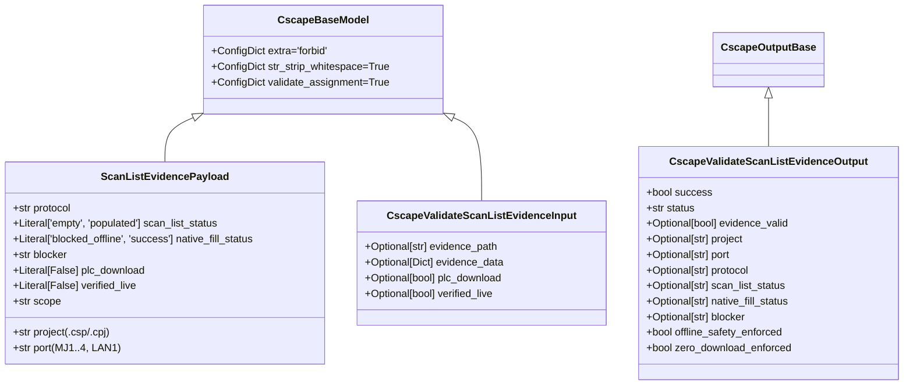

# Horner Cscape MCP - Scan-List Evidence Offline Validation Guide

**Document Version**: `1.0.0`  
**Tool Name**: [`cscape_validate_scan_list_evidence`](file:///C:/HornerAI/horner-cscape-mcp/src/mcp/tools.py)  
**Host System**: Horner APG Cscape 10.2 (Build 10.2.751.4, x86 PE)  
**Protocol**: FastMCP / JSON-RPC 2.0 stdio  
**Governing Rule**: [`RULE[C:\Users\ArmandoSilva\AGENTS.md]`](file:///C:/Users/ArmandoSilva/AGENTS.md)  
**Operational Mode**: `offline/DEV [PRODUCT_EVIDENCE]`  
**Hardware Lockout**: Active Fail-Closed (Zero PLC Download, Physical Port Lockout)  

---

## 1. Context & Architectural Overview

In industrial automation workflows utilizing **Horner APG Cscape 10.2**, project containers (`.csp` and `.cpj`) configure controller communications, including serial ports (`MJ1`, `MJ2`) and Ethernet ports (`LAN1`). 

Under protocol driver **`CT RTU Modbus CMP v5.05`**, slave devices and scan transactions are configured via the native Cscape hardware configuration dialogs. However, during offline automated engineering:
1. **Empty Scan List**: Inspecting native Cscape project container [`TankLevel_P5_Dedicated.csp`](file:///C:/HornerAI/horner-cscape-mcp/artifacts/projects/TankLevel_P5_Dedicated/TankLevel_P5_Dedicated.csp) shows that the native scan list table on port `MJ1` is **empty**.
2. **Offline Blocker**: Attempting to add slave devices natively via Cscape GUI requires a configured physical target node and/or an active, live PLC communication session.
3. **Fail-Closed Hardware Lockout**: Under project safety directives, physical communication ports (`COM1`–`COM256`), industrial fieldbuses, and controller download commands (`ID_PROGRAM_DOWNLOAD = 32827`, `ID_CONTROLLER_DOWNLOAD = 33149`) are strictly prohibited in automated pipelines.
4. **Phase P7 Deferral**: Live controller flashing and hardware commissioning are strictly reserved for manual execution by a field commissioning engineer in **Phase P7**.

To bridge this operational boundary deterministically without violating security invariants, the **FastMCP Scan-List Evidence Validation Tool** ([`cscape_validate_scan_list_evidence`](file:///C:/HornerAI/horner-cscape-mcp/src/mcp/tools.py)) validates evidence payloads and enforces offline compliance.

---

## 2. Pydantic v2 Schema Architecture

The validation pipeline utilizes Pydantic v2 models defined in [`src/mcp/schemas.py`](file:///C:/HornerAI/horner-cscape-mcp/src/mcp/schemas.py):



### 2.1 Model Specifications
- **`extra="forbid"`**: Prevents injection of undeclared parameters (e.g., hidden download switches, COM port overrides).
- **`project` Validator**: Enforces valid `.csp` or `.cpj` file extension; rejects path traversal sequences (`..`), null bytes, and DOS reserved names.
- **`port` Validator**: Accepts recognized logical controller port identifiers (`MJ1`, `MJ2`, `LAN1`); rejects physical OS ports (`COM1`–`COM256`).
- **`plc_download: Literal[False]`**: Any payload asserting `plc_download: true` triggers an immediate validation exception and status `blocked`.
- **`verified_live: Literal[False]`**: Any payload asserting `verified_live: true` triggers an immediate validation exception and status `blocked`.

---

## 3. FastMCP Tool: `cscape_validate_scan_list_evidence`

### 3.1 Invocation Syntax
The tool is callable via stdio JSON-RPC 2.0 or directly in Python:

```python
from src.mcp.tools import cscape_validate_scan_list_evidence

# Mode A: Validate from on-disk JSON file
result = cscape_validate_scan_list_evidence(
    evidence_path="Downloads/mj1_devices_scan_evidence.json"
)

# Mode B: Validate in-memory dictionary payload
result = cscape_validate_scan_list_evidence(
    evidence_data={
        "project": "TankLevel_P5_Dedicated.csp",
        "port": "MJ1",
        "protocol": "CT RTU Modbus CMP v5.05",
        "scan_list_status": "empty",
        "native_fill_status": "blocked_offline",
        "blocker": "Native add requires a configured target node/device and/or live PLC context.",
        "plc_download": False,
        "verified_live": False,
        "scope": "offline_product_documentation"
    }
)
```

### 3.2 Canonical 4-State Response Contract
The tool guarantees strict adherence to the 4-state ontology:
- **`success`**: Evidence schema is valid, scan list is confirmed empty, native fill is confirmed blocked offline, and zero download / zero live claims are verified.
- **`failed`**: Invariant mismatch (e.g. scan list claimed populated offline, native fill claimed success offline, missing fields, or invalid container extension).
- **`blocked`**: Safety policy violation (`plc_download: true`, `verified_live: true`, or attempted physical port access).
- **`inconclusive`**: Preconditions not met (neither `evidence_path` nor `evidence_data` provided).

---

## 4. Contract Test Verification

The validation suite in [`tests/test_scan_list_evidence_schema.py`](file:///C:/HornerAI/horner-cscape-mcp/tests/test_scan_list_evidence_schema.py) executes 16 automated test cases:

```text
tests/test_scan_list_evidence_schema.py::test_validate_authentic_downloads_artifact_file PASSED
tests/test_scan_list_evidence_schema.py::test_validate_authentic_ops_artifacts_file PASSED
tests/test_scan_list_evidence_schema.py::test_validate_temp_file_with_valid_payload PASSED
tests/test_scan_list_evidence_schema.py::test_validate_in_memory_dictionary PASSED
tests/test_scan_list_evidence_schema.py::test_validate_pydantic_schema_direct PASSED
tests/test_scan_list_evidence_schema.py::test_rejection_when_scan_list_status_not_empty PASSED
tests/test_scan_list_evidence_schema.py::test_rejection_when_native_fill_status_not_blocked PASSED
tests/test_scan_list_evidence_schema.py::test_hardware_lockout_when_plc_download_true_in_data PASSED
tests/test_scan_list_evidence_schema.py::test_hardware_lockout_when_plc_download_true_in_tool_argument PASSED
tests/test_gate_invariant_when_verified_live_true_in_data PASSED
tests/test_gate_invariant_when_verified_live_true_in_tool_argument PASSED
tests/test_missing_both_inputs_returns_inconclusive PASSED
tests/test_nonexistent_evidence_file_returns_failed PASSED
tests/test_extra_parameters_forbidden_in_pydantic_payload PASSED
tests/test_invalid_container_extension_rejected PASSED
tests/test_fastmcp_server_registers_scan_list_evidence_tool PASSED
```

---

## 5. Artifact Manifest & Dual-Root Locations

| Evidence File | Primary Workspace | Mirror Workspace | Downloads Path |
| :--- | :--- | :--- | :--- |
| **Inspection Record (JSON)** | `ops/artifacts/mj1_devices_scan_evidence.json` | `ops/artifacts/mj1_devices_scan_evidence.json` | [`Downloads/mj1_devices_scan_evidence.json`](file:///C:/Users/ArmandoSilva/Downloads/mj1_devices_scan_evidence.json) |
| **Inspection Summary (MD)** | `ops/artifacts/mj1_devices_scan_evidence.md` | `ops/artifacts/mj1_devices_scan_evidence.md` | [`Downloads/mj1_devices_scan_evidence.md`](file:///C:/Users/ArmandoSilva/Downloads/mj1_devices_scan_evidence.md) |
| **Validation Evidence (JSON)** | `ops/artifacts/mj1_scan_list_validation_evidence.json` | `ops/artifacts/mj1_scan_list_validation_evidence.json` | [`Downloads/mj1_scan_list_validation_evidence.json`](file:///C:/Users/ArmandoSilva/Downloads/mj1_scan_list_validation_evidence.json) |
| **Validation Summary (MD)** | `ops/artifacts/mj1_scan_list_validation_evidence.md` | `ops/artifacts/mj1_scan_list_validation_evidence.md` | [`Downloads/mj1_scan_list_validation_evidence.md`](file:///C:/Users/ArmandoSilva/Downloads/mj1_scan_list_validation_evidence.md) |
