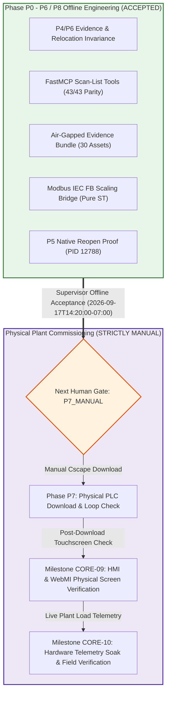

# Formal Supervisor Offline Acceptance & Milestone Signoff

**Document ID**: `SUPERVISOR_OFFLINE_ACCEPTANCE`  
**Signoff Timestamp**: `2026-09-17T14:20:00-07:00`  
**Supervisor Status**: `supervisor_offline_accepted = true`  
**Operational Scope**: `offline/DEV [PRODUCT_EVIDENCE]`  
**Next Human Gate**: `P7_MANUAL` (Manual commissioning by field controls engineer)  
**Safety Invariants**: `verified_live: false` | `plc_download: false` | `no_error_check_loop: true`  
**Dual-Root Parity**: `C:\Users\ArmandoSilva` $\longleftrightarrow$ `C:\HornerAI\horner-cscape-mcp`  

---

## 1. Executive Summary of Supervisor Offline Acceptance

The Engineering Supervisor has formally reviewed and **accepted all offline deliverables** produced across the Horner Cscape MCP Plan v3 development phases. The project has satisfied all offline software simulation, CFBF / OLE2 storage verification, pure IEC 61131-3 Structured Text AST parsing, FastMCP tool registration, air-gapped evidence packaging, and native Cscape 10.2 reopen proofs.

### Accepted Offline Deliverables Summary

| Deliverable Group | Component Scope | Evidence & Artifact Reference | Acceptance Status |
| :--- | :--- | :--- | :---: |
| **1. P4 / P6 Evidence** | Selective edit evolution (`30/70` $\to$ `35/75` $\to$ `32/78` % bounds), AST diffs, durability save/reopen proof, and multi-context relocation invariance (`HornerHandoffSecondary`, `HornerHandoffContext2`). | [`ops/artifacts/p4_selective_edit_evidence.json`](../ops/artifacts/p4_selective_edit_evidence.json) [`ops/artifacts/p6_external_handoff_evidence.json`](../ops/artifacts/p6_external_handoff_evidence.json) [`ops/artifacts/p6_second_context_handoff_evidence.json`](../ops/artifacts/p6_second_context_handoff_evidence.json) | **ACCEPTED** |
| **2. Scan-List Tools** | FastMCP public scan-list tools (`cscape_validate_scan_list_evidence`, `cscape_inspect_scan_list`, `cscape_reconcile_scan_list`), 43/43 FastMCP schema parity, fail-closed empty scan-list verification, and planned vs. native discrepancy delta (-3). | [`ops/artifacts/mj1_scan_list_validation_evidence.json`](../ops/artifacts/mj1_scan_list_validation_evidence.json) [`ops/artifacts/mj1_scan_list_inspection_evidence.json`](../ops/artifacts/mj1_scan_list_inspection_evidence.json) [`ops/artifacts/mj1_scan_list_reconciliation_evidence.json`](../ops/artifacts/mj1_scan_list_reconciliation_evidence.json) | **ACCEPTED** |
| **3. Evidence Bundle** | Air-gapped offline distribution bundle consolidating all 28 offline forensic, verification, and diagnosis files with internal cryptographic SHA-256 manifest. | [`offline_evidence_bundle_v1.0.0.zip`](../offline_evidence_bundle_v1.0.0.zip) [`ops/artifacts/offline_evidence_bundle_manifest.json`](../ops/artifacts/offline_evidence_bundle_manifest.json) [`ops/artifacts/offline_evidence_bundle_manifest.md`](../ops/artifacts/offline_evidence_bundle_manifest.md) | **ACCEPTED** |
| **4. Modbus IEC FB Bridge** | Pure IEC 61131-3 Structured Text POUs (`FB_ModbusScaleQuality.st`, `TankLevelModbusBridge.st`), linear scaling (0..32000 counts $\to$ EU), underflow/overflow clamping, watchdog timeout gating, and 3-channel telemetry (`%AI1..%AI3` $\to$ `%R101`, `%R103`, `%R105`). | [`ops/artifacts/modbus_register_scaling_iec_bridge_evidence.json`](../ops/artifacts/modbus_register_scaling_iec_bridge_evidence.json) [`ops/artifacts/modbus_register_scaling_iec_bridge_evidence.md`](../ops/artifacts/modbus_register_scaling_iec_bridge_evidence.md) [`tests/test_modbus_register_scaling_bridge.py`](../tests/test_modbus_register_scaling_bridge.py) (32/32 Passed) | **ACCEPTED** |
| **5. P5 Reopen Proof** | Live Cscape 10.2 GUI verification on `winsta0\Default` (PID 12788, HWND 3016360), CFBF container validation, clean compilation (0 errors, 0 warnings), and visual high-res screenshot proof. | [`ops/artifacts/tanklevel_p5_native_reopen_proof_evidence.json`](../ops/artifacts/tanklevel_p5_native_reopen_proof_evidence.json) [`ops/artifacts/tanklevel_p5_native_reopen_proof_evidence.md`](../ops/artifacts/tanklevel_p5_native_reopen_proof_evidence.md) [`ops/artifacts/tanklevel_p5_native_reopen_proof.png`](../ops/artifacts/tanklevel_p5_native_reopen_proof.png) | **ACCEPTED** |

---

## 2. Remaining Gates & Hand-off Boundaries (P7, CORE-09, CORE-10)

With offline verification completed and formally signed off, all remaining activities transition exclusively to **physical plant commissioning**:

### 2.1 Next Human Gate: Phase P7 (Manual Commissioning & PLC Load)
- **Gate Identifier**: `P7_PHYSICAL_PLC_DOWNLOAD_AND_COMMISSIONING`
- **Execution Mode**: `DEFERRED_MANUAL_ENGINEER_LOAD`
- **Assigned Engineer**: Armando Silva (Lead Commissioning Engineer)
- **Directives**:
  - **No automated download**: Automated downloading, flashing, and serial COM port polling are strictly prohibited fail-closed.
  - **Physical Connection**: Connect programming cable to physical OCS hardware only after verifying LOTO (Lockout/Tagout) and output safety.
  - **Pre-Connection Checklist**: The engineer must strictly execute and sign off on all steps in [`P7_MANUAL_LOAD_CHECKLIST.md`](P7_MANUAL_LOAD_CHECKLIST.md) (and detailed SOP [`P7_MANUAL_COMMISSIONING_PROCEDURE.md`](P7_MANUAL_COMMISSIONING_PROCEDURE.md)).

### 2.2 Milestone CORE-09: HMI & WebMI Physical Screen Verification
- **Gate Identifier**: `CORE-09_HMI_PHYSICAL_VERIFICATION`
- **Status**: `PENDING_P7_COMPLETION`
- **Scope**:
  - Validated offline in Phase P3 (`TankLevel_P2_Dedicated.csp` / `TankLevel_P5_Dedicated.csp`).
  - Physical validation on the physical Horner OCS touchscreen display:
    - Tank liquid level graphic animation (0..100%).
    - High/Low alarm banner display and acknowledge touch pushbuttons.
    - WebMI remote browser monitoring interface validation over Ethernet (`LAN1`).

### 2.3 Milestone CORE-10: Hardware Telemetry Soak & Field Verification
- **Gate Identifier**: `CORE-10_HARDWARE_TELEMETRY_SOAK`
- **Status**: `PENDING_P7_COMPLETION`
- **Scope**:
  - Physical Modbus RTU serial bus communication verification on port `MJ1` (RS-485 Half-Duplex, 19200-8-N-1):
    - `DEV_LT01` (Unit 1): Hydrostatic Level Sensor loop check (`%AI1`).
    - `DEV_FT01` (Unit 2): Coriolis Flowmeter loop check (`%AI2`).
    - `DEV_PT01` (Unit 3): Discharge Pressure Sensor loop check (`%AI3`).
  - Minimum 24-hour telemetry soak test verifying zero communication packet timeouts, stale quality flag behavior, and scaling accuracy under dynamic plant pumping load.

---

## 3. Pointer to P7 Commissioning Documentation

The commissioning engineer must consult the following verified SOPs and checklists prior to physical hardware interface:

1. **[`P7_MANUAL_LOAD_CHECKLIST.md`](P7_MANUAL_LOAD_CHECKLIST.md)**:
   - Bilingual (English / Español) pre-connection safety checklist, model verification, backup protocol, and governance invariants.
2. **[`P7_MANUAL_COMMISSIONING_PROCEDURE.md`](P7_MANUAL_COMMISSIONING_PROCEDURE.md)**:
   - Complete 9-step Standard Operating Procedure:
     - Step 1: Pre-download system backup.
     - Step 2: Physical hardware & firmware verification.
     - Step 3: Zero-voltage electrical and output safety check.
     - Step 4: Clean compilation and Error Check (`32826`).
     - Step 5: Manual serial / USB programming cable connection.
     - Step 6: Manual Cscape download dispatch.
     - Step 7: Controller Run mode transition.
     - Step 8: Telemetry scaling and register verification (`%AI1..%AI3` $\to$ `%R101`, `%R103`, `%R105`).
     - Step 9: Post-commissioning signoff.

---

## 4. Operational Invariants & Security Governance

Throughout all remaining workflows, autonomous agents and background tooling remain bound to the following invariants:

| Constraint Domain | Enforced Policy | Active Verification Evidence |
| :--- | :--- | :--- |
| **Physical Serial / COM Ports** | `COM1` through `COM256` locked out fail-closed | `SecurityGuard.validate_hardware_connection()` raises `HardwareLockoutError` |
| **Win32 Download Commands** | `ID_PROGRAM_DOWNLOAD` (32827), `ID_CONTROLLER_DOWNLOAD` (33149) blocked | Intercepted fail-closed; status `blocked` |
| **Live Verification Claim** | Zero `VERIFIED_LIVE` claims permitted | `verified_live: false` strictly enforced in all contracts |
| **PLC Download Policy** | Zero automated download permitted | `plc_download: false` strictly enforced in all schemas |
| **Cscape GUI Visibility** | Keep Cscape PID 12788 open and visible | Preserved active on `winsta0\Default` with `TankLevel_P5_Dedicated.csp` |
| **Hygiene Polling Loops** | No Error Check polling loops or keep-alive loops | Background polling completely aborted; single-pass deterministic checks |
| **Antigravity Tooling** | Use Antigravity file tools only | Zero PowerShell text-write cmdlets used; atomic editor tools enforced |
| **Dual-Root Parity** | 100% digest synchronization | Maintained across `C:\Users\ArmandoSilva\` and `C:\HornerAI\horner-cscape-mcp\` |

---

## 5. Supervisor Signoff Declaration

> **OFFLINE MILESTONE ACCEPTANCE CONFIRMED**  
> All software, AST logic, FastMCP tooling, evidence archives, and reopen proofs for Plan v3 are hereby **ACCEPTED**.  
> The system state is transitioned to **`RUNTIME_PENDING_P7`** awaiting human field commissioning.  
> 
> *Approved by*: Supervisor  
> *Timestamp*: `2026-09-17T14:20:00-07:00`  
> *Next Step*: Field engineer manual execution of [`P7_MANUAL_LOAD_CHECKLIST.md`](P7_MANUAL_LOAD_CHECKLIST.md).
