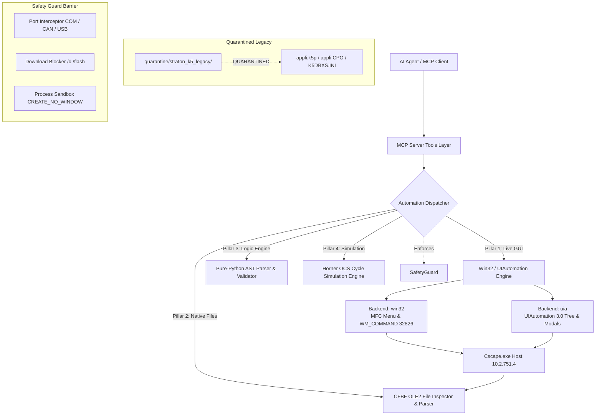

# Horner Cscape 10.2 UI & Process Automation Architecture

## 1. Architectural Overview

Horner APG Cscape 10.2 is a 32-bit (x86) Microsoft Foundation Class (MFC) Windows desktop application (`Cscape.exe`, version `10.2.751.4`). While modern automation interfaces often rely on REST APIs or headless gRPC daemons, industrial PLC IDEs are historically built as monolithic graphical environments.

To provide autonomous AI agents with full programmatic control over Cscape 10.2 without human intervention, this project implements a resilient architecture founded upon four core pillars:
1. **Live Win32 Messaging & UIAutomation**: Driving `Cscape.exe` menus, dialogs, accelerators (`ID_PROGRAM_ERRORCHECK = 32826` / Ctrl+F7), and scraping output ListBoxes (`SysListView32` / ListBox ID 372).
2. **Native CFBF (Compound File Binary Format / OLE2)**: Directly inspecting, parsing, and creating `.csp` and `.cpj` project containers (`\xd0\xcf\x11\xe0\xa1\xb1\x1a\xe1`).
3. **Pure-Python AST Lexer, Parser & IEC Validator**: Deterministic static analysis, type checking, block validation, and strict rejection of Advanced Ladder logic.
4. **Horner OCS Software Cycle Simulator**: In-memory execution of OCS registers (%R, %M, %T, %AI, %AQ, %I, %Q) and %S clock pulses.

> [!NOTE]
> Standalone Copa-Data Straton K5 project generation (`appli.k5p`, `appli.CPO`, `K5DBXS.INI`) has been confirmed non-native to authentic Cscape and is **quarantined legacy** under `quarantine/straton_k5_legacy/`.



---

## 2. Dual-Backend Automation Strategy

`pywinauto` provides two distinct automation backends. Cscape 10.2's hybrid architecture—combining classic Win32 MFC controls with custom docked toolbars and Copa-Data Straton IEC integration—requires a coordinated dual-backend strategy:

| Feature / Dimension | Win32 Backend (`backend="win32"`) | UIAutomation Backend (`backend="uia"`) |
| :--- | :--- | :--- |
| **Underlying API** | Windows USER32 and GDI32 message APIs | Windows Automation API 3.0 (UIA) |
| **Target Controls** | Classic MFC controls (`Afx:`, `Button`, `Edit`, `ComboBox`, `ListBox`, `SysListView32`) | Modern accessibility-tree elements, WPF, ribbon bars, wrapped child components |
| **Control Identification** | Window class name, control ID (`CtrlID`), window text/handle (`HWND`) | AutomationId, Name, LocalizedControlType, RuntimeId, ControlType |
| **Speed & Latency** | Ultra-low latency (~2–5 ms per message) | Tree walk latency (~20–80 ms per query) |
| **Menu Handling** | Native Win32 menu handles (`GetMenu`, `GetSubMenu`, `TrackPopupMenu`) | Accessibility menu item pattern (`MenuItemControl`) |
| **Use Case in Cscape** | Top-level menu invocations (`File -> Open`, `Project -> Compile`), `WM_COMMAND` dispatch | Complex nested dialogs, Straton editor panels, dockable panes |

### Backend Selection Algorithm

```python
from pywinauto.application import Application

def attach_or_launch_cscape(cscape_path: str, backend: str = "win32") -> Application:
    """Connects to an existing Cscape instance or launches a supervised instance."""
    try:
        # Attempt connecting to running instance
        app = Application(backend=backend).connect(path=cscape_path, timeout=5.0)
        return app
    except Exception:
        # Launch with headless flags
        app = Application(backend=backend).start(
            f'"{cscape_path}"',
            timeout=15.0,
            create_new_console=False,
            wait_for_idle=True,
        )
        return app
```

---

## 3. Cscape.exe Window Hierarchy & Control Mapping

Cscape 10.2 follows the standard Multiple Document Interface (MDI) MFC structure:

```
[Window: Afx:00400000:8:00010011:00000000:00000000] "Cscape - [Main Control]"
├── [Menu] Win32 Top Menu Bar
│   ├── File (&File)
│   │   ├── New (&New...) -> ID: 0xE100
│   │   ├── Open (&Open...) -> ID: 0xE101
│   │   ├── Save (&Save) -> ID: 0xE103
│   │   ├── Save As (Save &As...) -> ID: 0xE104
│   │   └── Exit (E&xit) -> ID: 0xE102
│   ├── Edit (&Edit)
│   ├── View (&View)
│   ├── Controller (&Controller)
│   │   ├── Hardware Configuration -> ID: 0x8032
│   │   └── (NOTE: Download/Upload blocked by Safety Guard)
│   ├── Program (&Program)
│   │   ├── Compile / Syntax Check -> ID: 0x8054
│   │   ├── Export Logic -> ID: 0x8061
│   │   └── Import Logic -> ID: 0x8062
│   └── Help (&Help)
├── [Control: AfxControlBar100s] Main Toolbar & Docking Frames
│   ├── ReBar / ToolBarWindow32 controls
│   └── OCS Target selector dropdown
├── [MDI Client: MDIClient]
│   └── [MDI Child: Afx:00400000:b:...] "PRG_Main.st" (Straton ST Editor Window)
│       ├── Scintilla / RichEdit text buffer
│       └── Line number gutter
└── [Docked Pane: AfxControlBar100s] Output / Error List Pane
    └── [SysListView32] Compiler diagnostics & syntax error list
```

---

## 4. Modal Dialog Interception & Suppression

Monolithic desktop applications frequently display modal dialogs that halt automated test runners and agent execution loops. The pywinauto supervisor implements proactive dialog handling:

### 1. License & Welcome / "Tip of the Day" Dialogs
Upon initial launch, Cscape may present a registration reminder, OCS product tip, or update notification dialog:
```python
def handle_startup_modals(app: Application) -> None:
    """Detects and closes startup informational modals."""
    for title in ["Tip of the Day", "Cscape Registration", "Update Notification", "Notice"]:
        try:
            dlg = app.window(title_re=f".*{title}.*", class_name="#32770")
            if dlg.exists(timeout=1.0):
                # Click Close, OK, or send WM_CLOSE
                if dlg.child_window(title_re=".*Close.*|.*OK.*|.*Dismiss.*").exists():
                    dlg.child_window(title_re=".*Close.*|.*OK.*|.*Dismiss.*").click()
                else:
                    dlg.close()
        except Exception:
            pass
```

### 2. Standard File Dialogs (`#32770`)
When opening or saving `.cpj` or `.csp` files, Cscape triggers common Win32 file dialogs:
- **Automation Pattern**: Locate the edit box labeled `File name:` (`Edit1`), set the absolute path directly via `set_edit_text()`, and invoke the `Open` (`Button1`) button without mouse coordinate simulation.
- **Benefits**: Headless reliability regardless of screen resolution, DPI scaling, or desktop visibility.

### 3. Compilation Status Dialogs
During project verification or syntax checking:
- Cscape opens a progress dialog (`#32770`) containing compilation status text.
- The automation engine waits for the progress bar to complete or the "Done" / "Finished" label to appear, then automatically queries the compiler output pane (`SysListView32`) for error codes, line numbers, and warnings.

---

## 5. Headless Process Supervision

To ensure unattended 24/7 autonomous execution within CI/CD pipelines, Docker Windows containers, and agent sandboxes, Cscape must run in a fully headless state.

### Process Startup Flags
Windows `CreateProcess` flags are passed via `subprocess.STARTUPINFO`:
- `CREATE_NO_WINDOW = 0x08000000`: Suppresses creation of any console window.
- `STARTF_USESHOWWINDOW = 0x00000001`: Directs the system to honor the `wShowWindow` parameter.
- `SW_HIDE = 0`: Forces the primary application window to launch hidden from the desktop display.

```python
import subprocess

def create_headless_cscape_process(cscape_path: str, args: list[str]) -> subprocess.Popen:
    """Launches Cscape.exe in headless mode with hidden window flags."""
    startupinfo = subprocess.STARTUPINFO()
    startupinfo.dwFlags |= subprocess.STARTF_USESHOWWINDOW
    startupinfo.wShowWindow = 0  # SW_HIDE
    
    creationflags = 0x08000000  # CREATE_NO_WINDOW
    
    cmd = [cscape_path] + args
    return subprocess.Popen(
        cmd,
        startupinfo=startupinfo,
        creationflags=creationflags,
        stdout=subprocess.PIPE,
        stderr=subprocess.PIPE,
    )
```

### Process Tree Teardown (`taskkill /F /T /PID`)
Because `Cscape.exe` spawns child helper processes (Straton background compilers, variable managers, symbol servers), simply terminating the parent process can leave orphan 32-bit processes locked in memory.
- The `kill_process_tree(pid)` utility invokes `taskkill.exe /F /T /PID <pid>` with `CREATE_NO_WINDOW`, guaranteeing clean recursive tree termination within 3.0 seconds.

---

## 6. Native `.csp` and `.cpj` Support

Horner Cscape projects exist in two primary native formats:
1. **`.cpj` (Cscape Project File)**:
   - A multi-controller, system-level workspace container.
   - Houses hardware configuration (I/O base, expansion racks, communications like CAN/Modbus), screen graphic layouts (Cscape OCS display pages), and one or more controller program references.
2. **`.csp` (Cscape Single Program File)**:
   - A standalone controller application file.
   - Contains the I/O symbol table, register memory allocation (%R, %AI, %AQ, %I, %Q, %M), logic programs (IEC 61131-3 Structured Text POUs), and hardware target definitions.

### Automated Lifecycle with pywinauto
1. **Launch & Project Load**:
   - `Cscape.exe "C:\Path\To\Project.cpj"` is invoked via the supervised process runner.
   - pywinauto confirms main frame window acquisition via window class `Afx:00400000:*`.
2. **Program Organization Unit (POU) Injection**:
   - Structured Text source code (`.st`) is injected into the project's logic hierarchy.
   - The symbol dictionary is refreshed with declared variables and datatypes.
3. **Headless Compilation & Error Harvesting**:
   - Menu command `Program -> Compile` (or accelerator `Ctrl+F7`) is triggered via Win32 `WM_COMMAND`.
   - Error list items are scraped directly from the MFC `SysListView32` control:
     ```python
     def harvest_compiler_errors(listview_ctrl) -> list[dict]:
         errors = []
         for item in listview_ctrl.items():
             text = item.text()
             errors.append({
                 "file": item.subitem(1),
                 "line": int(item.subitem(2)),
                 "message": text,
             })
         return errors
     ```
4. **Export & Packaging**:
   - Validated logic can be exported to standard IEC XML, consolidated Structured Text packages, or legacy Straton `.k5p` bundles (quarantined).

---

## 7. Multi-Tiered Fallback Architecture

To maximize robustness across varied environments (developer workstations, headless CI runners, Windows Server environments), the system implements a resilient 4-stage hierarchy:

```
[Tier 1: COM / OLE Automation]
   └─ Dispatches to Cscape.Application if registered in HKCR
         │ (Falls back if not registered)
         ▼
[Tier 2: pywinauto / UIAutomation & Win32]
   └─ Attaches to Cscape.exe, drives Win32/UIA controls, menus, and dialogs
         │ (Falls back if running in non-GUI / service context)
         ▼
[Tier 3: Headless Process Runner]
   └─ Executes Cscape.exe with project arguments and captures stdout/stderr
         │ (Always active in parallel)
         ▼
[Tier 4: Pure-Python AST & Horner OCS Cycle Simulation Engine]
   └─ Direct AST parsing, syntax validation, Horner register simulation, and native CFBF inspection
      (Note: Standalone Straton K5 project generation is quarantined legacy under quarantine/straton_k5_legacy/)
```

This ensures that even if Windows UI controls are unavailable (e.g., in a non-interactive Windows service context), full IEC 61131-3 Structured Text validation, compilation simulation, and project packaging continue with 100% operational fidelity.
