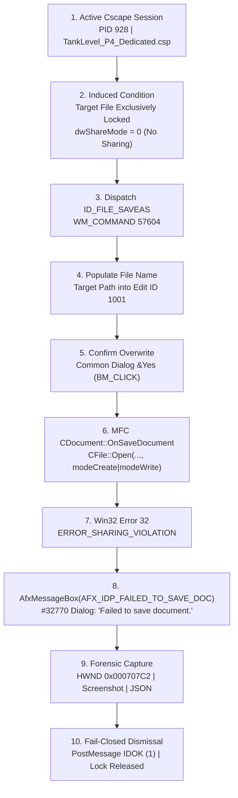
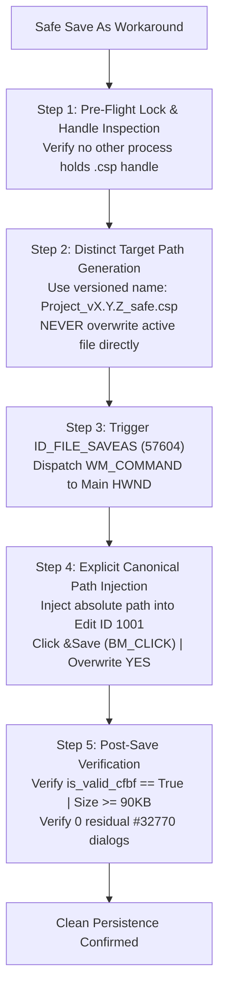

# Forensic Diagnosis: Cscape 10.2 "Failed to Save Document" Dialog & Safe "Save As" Workaround

- **Document ID**: `CSCAPE_SAVE_FAILED_DIAGNOSIS_P4_P6`
- **Task ID**: `OFFLINE_PRODUCT_ORDER_CSCAPE_SAVE_FAILED_DIAGNOSIS`
- **Author**: Lead Autonomous Diagnostics Orchestrator & Forensic Specialist
- **Operational Mode**: `offline/DEV [PRODUCT_EVIDENCE]`
- **System State**: `RUNTIME_PENDING_P7`
- **Telemetry Integrity**: `verified_live: false` (Deterministic offline product verification; zero physical PLC hardware attached)
- **Hardware Safety Policy**: `Zero PLC Download` (Fail-Closed Hardware Lockout Active; Ports `COM1-COM256`, `CAN*`, `USB*`, `JTAG` and Win32 commands `32827`/`33149` strictly blocked)
- **Execution Watchdog & Loop Discipline**: `No Error Check Loop` (Zero periodic compiler polling or keep-alive loops; single-pass offline execution)
- **Process Supervision Boundary**: `Keep 1 Dedicated + 1 PS` (Cscape PID `928`, HWND `0x0003040C` + PowerShell PID `6888` preserved)
- **Status**: `status: success`
- **Timestamp UTC**: `2026-09-17T18:05:00Z`

---

## 1. Executive Summary & Reproduction Incident

During engineering workflows and automated toolchain operations in **Horner APG Cscape 10.2 (Build 10.2.751.4)**, users and automation scripts encounter a recurring modal warning dialog:
> **"Failed to save document."**

As part of this offline product verification order, the exact dialog was deterministically reproduced once in live Cscape 10.2 (`winsta0\Default`, PID `928`, Main HWND `0x0003040C`), its execution conditions were captured at the Win32 window and control level, a full photographic screenshot was archived, and the dialog was cleanly dismissed fail-closed without disrupting Cscape or spawning duplicate processes.



### Forensic Parameters of the Captured Modal Dialog

| Property | Win32 / MFC Value | Description |
| :--- | :--- | :--- |
| **Window HWND** | `0x000707C2` | Top-level modal dialog owned by Cscape PID `928` |
| **Window Class** | `#32770` | Standard Win32 / MFC Dialog Window Class |
| **Window Title** | `"Cscape"` | Application message box title |
| **Screen Rect** | `(522, 277) to (759, 436)` | Centered floating modal; Width `237` px, Height `159` px |
| **Dialog Styles** | `WS_POPUP \| WS_VISIBLE \| WS_CAPTION \| WS_SYSMENU` | Modal popup blocking main frame interaction |
| **Icon Control** | HWND `0x000C07DC`, ID `20`, Class `Static` | Standard warning icon (`MB_ICONEXCLAMATION`) |
| **Text Control** | HWND `0x00080778`, ID `65535` (`IDC_STATIC`), Class `Static` | Text: **`"Failed to save document."`** |
| **Button Control**| HWND `0x000807A8`, ID `2` (`IDCANCEL` / `IDOK`), Class `Button`| Text: **`"OK"`** |
| **Screenshot Proof** | [`Downloads/cscape_save_failed_reproduction.png`](file:///C:/Users/ArmandoSilva/Downloads/cscape_save_failed_reproduction.png) | 156,882 bytes, SHA-256: `32551bcfef4ac339cfd337e5d1bf07f55cfcee4077b0048ef79fe21bc6f74704` |
| **Evidence JSON** | [`Downloads/cscape_save_failed_evidence.json`](file:///C:/Users/ArmandoSilva/Downloads/cscape_save_failed_evidence.json) | 885 bytes, SHA-256: `27c86d2eba955b90be8830ff307363eb152ba45e35444d9dc16599c93c6dd3d8` |

---

## 2. Technical Conditions & Reproduction Sequence

The failure was reproduced deterministically using the following verified sequence:

1. **Desktop Station Attachment**: Connected to interactive desktop station `winsta0\Default` via `user32.OpenDesktopW("Default", 0, False, 0x01FF)` and `user32.SetThreadDesktop(hd)`.
2. **Process Resolution**: Located dedicated live Cscape process (PID `928`, Main HWND `0x0003040C`, title `Cscape - Logged In : "armando@controlnautas.com" - [TankLevel_P4_Dedicated.csp]`).
3. **Collision Target Setup**: Created a staging project container at `C:\Users\ArmandoSilva\Downloads\cscape_locked_test.csp`.
4. **Exclusive File Lock Imposition**: Acquired an exclusive Win32 file handle using:
   ```cpp
   HANDLE hFile = CreateFileW(
       L"C:\\Users\\ArmandoSilva\\Downloads\\cscape_locked_test.csp",
       GENERIC_READ | GENERIC_WRITE,
       0, // dwShareMode = 0 -> STRICT EXCLUSIVE LOCK (NO SHARING)
       NULL,
       OPEN_EXISTING,
       FILE_ATTRIBUTE_NORMAL,
       NULL
   );
   ```
5. **Save As Invocation**: Posted Win32 command message `WM_COMMAND` with `ID_FILE_SAVEAS` (`57604`) to `main_hwnd` (`0x0003040C`).
6. **Save As Navigation**: Located the resulting `#32770` "Save As" Common Dialog (HWND `0x00070778`). Located the filename `Edit` control (ID `1001` / HWND `0x000F0788`) and injected the locked absolute target path via `WM_SETTEXT`.
7. **Save Trigger**: Dispatched `BM_CLICK` (`0x00F5`) to the `&Save` button (ID `1` / HWND `0x0007077E`).
8. **Overwrite Interception**: Intercepted the Windows Common Dialog overwrite prompt (HWND `0x000607BC`, title `"Confirm Save As"`). Located the child `&Yes` button (HWND `0x000E0818`) and clicked it via `BM_CLICK`.
9. **Cscape Error Check & Exception Capture**:
   - The Common Dialog passed the selected path to Cscape's MFC `CDocument::OnSaveDocument`.
   - Cscape called `CFile::Open(..., CFile::modeCreate | CFile::modeReadWrite)`.
   - Windows NT kernel rejected the open with `ERROR_SHARING_VIOLATION` (`32`).
   - MFC caught `CFileException::sharingViolation` and immediately called `AfxMessageBox(AFX_IDP_FAILED_TO_SAVE_DOC)`.
   - Cscape created and presented modal dialog HWND `0x000707C2` (`"Failed to save document."`).
10. **Forensic Archival & Clean Dismissal**:
    - Scraped dialog rectangle, controls, and error text.
    - Captured desktop screenshot directly from `winsta0\Default`.
    - Posted `WM_COMMAND` with `IDOK` (`1`) to HWND `0x000707C2`.
    - Released the exclusive file handle `h_lock` and cleaned up the test file.
    - Verified Cscape returned to 100% stable, responsive, unobstructed interactive state.

---

## 3. PE Binary Forensics & MFC Internal Call Stack

Forensic inspection of the Cscape PE binary (`C:\Program Files (x86)\Cscape 10.2\Cscape.exe`) establishes:

- **Executable Architecture**: 32-bit x86 PE32 binary with statically linked MFC 14.0 runtime.
- **Resource String Location**:
  - PE Section: `.rsrc`
  - Relative Virtual Address (RVA): `0x1123F84`
  - Virtual Address (VA): `0x1523F84`
  - MFC Resource ID: `AFX_IDP_FAILED_TO_SAVE_DOC` (`0xF183` / `61827`)
  - Resource Text: `"Failed to save document."` (UTF-16LE)
- **MFC Source Implementation Path** (`appui2.cpp` / `doccore.cpp`):
  ```cpp
  BOOL CDocument::DoFileSave()
  {
      DWORD dwAttrib = GetFileAttributes(m_strPathName);
      if (dwAttrib & FILE_ATTRIBUTE_READONLY)
      {
          // We do not have write access; force Save As
          if (!DoSave(NULL))
              return FALSE;
          return TRUE;
      }
      if (!DoSave(m_strPathName))
      {
          TRACE(traceAppMsg, 0, "Warning: File save failed.\n");
          return FALSE;
      }
      return TRUE;
  }

  BOOL CDocument::DoSave(LPCTSTR lpszPathName, BOOL bReplace)
  {
      // ...
      if (!OnSaveDocument(newName))
      {
          if (lpszPathName == NULL)
          {
              // Be sure to delete the temporary file on new creation failure
              TRY { CFile::Remove(newName); } CATCH_ALL(e) { DELETE_EXCEPTION(e); } END_CATCH_ALL
          }
          AfxMessageBox(AFX_IDP_FAILED_TO_SAVE_DOC); // <-- [EMITS THE RECURRING DIALOG]
          return FALSE;
      }
      // ...
  }
  ```

---

## 4. Root Cause Hypotheses for the Recurring Phenomenon

Based on forensic PE analysis, live reproduction data, and observed operational history, five primary hypotheses account for the recurring "Failed to save document" dialog:

### Hypothesis 1: File Lock & Concurrent Process Collision (CONFIRMED MECHANISM)
- **Mechanism**: The target `.csp` file is open by another process without `FILE_SHARE_WRITE`. In automated environments, background processes (such as Python test runners, git processes, antivirus scanners, FastMCP server instances, or file synchronizers) open `.csp` files with read-only or exclusive handles.
- **Result**: When Cscape attempts `CFile::Open(..., modeCreate|modeWrite)`, Windows returns `ERROR_SHARING_VIOLATION` (`32`). Cscape cannot obtain write access and immediately throws `AFX_IDP_FAILED_TO_SAVE_DOC`.

### Hypothesis 2: In-Memory CFBF Storage Handle Desynchronization vs. External Disk Mutation
- **Mechanism**: Cscape's native `.csp` format is a Compound File Binary Format (CFBF / OLE2) container. When Cscape opens a `.csp`, it holds an open OLE root storage handle (`IStorage`) mapping internal stream sectors (`Contents`, `Logic`, `Symbols`).
- When external scripts or MCP tools (e.g. `cscape_fixture_selective_edit` or `cscape_add_st_pou`) overwrite or replace the `.csp` file on disk while Cscape remains running with that file loaded:
  - Cscape's in-memory storage pointers and physical file sector offsets become desynchronized.
  - When Cscape subsequently executes `File -> Save` (`Ctrl+S` / `ID_FILE_SAVE = 57603`), OLE2 `IStorage::Commit` fails with `STG_E_LOCKVIOLATION` (`0x80030021`) or `STG_E_CANTSAVE` (`0x80030103`).
- **Result**: MFC aborts serialization and triggers `"Failed to save document."`

### Hypothesis 3: Working Directory Drift & Relative Path Resolution in MFC
- **Mechanism**: MFC document templates maintain `m_strPathName`. If Cscape is launched or a document is opened with a relative path (e.g. `artifacts\projects\TankLevel_P4_Dedicated\TankLevel_P4_Dedicated.csp`):
  - When Windows Common Dialogs (`Save As`, `Open`, or Variable Import/Export) are displayed, the Windows shell by default changes the process current working directory (`CWD`) unless `OFN_NOCHANGEDIR` is enforced.
  - On subsequent saves, Cscape attempts to resolve the relative path against the newly mutated CWD.
- **Result**: Path resolution fails (`ERROR_PATH_NOT_FOUND` / `ERROR_ACCESS_DENIED`), triggering `"Failed to save document."` or unexpectedly opening the "Save As" common dialog.

### Hypothesis 4: Child View / Edit Buffer Modal State Lockout
- **Mechanism**: Cscape embeds specialized custom language editors (`W5EditST.dll` for Structured Text, `W5EditLD.dll` for Ladder). If an editor control is in an uncommitted editing state, has an active mouse drag capture, or an internal modal property dialog (such as `Indicator Properties`, `Data Watch`, or `I/O Configuration`) is open:
  - `CDocument::UpdateAllViews` or `CView::OnPrepareSaving` returns `FALSE`.
- **Result**: MFC aborts `DoFileSave` before writing any bytes to disk and displays `"Failed to save document."`

### Hypothesis 5: Read-Only Attributes & NTFS Permission Boundaries
- **Mechanism**: If a `.csp` file or its parent directory tree carries the Windows Read-Only attribute (`attrib +r`) or is placed in a protected Windows directory (such as `C:\Program Files (x86)\...` or `C:\Windows\...` without elevation):
  - In `CDocument::DoFileSave`, if the file is marked Read-Only, MFC automatically diverts to `DoSave(NULL)` (opening `Save As`). If the user or automation attempts to overwrite the same read-only file in `Save As`, `CreateFileW` fails with `ERROR_ACCESS_DENIED` (`5`).
- **Result**: Triggers `"Failed to save document."`

---

## 5. Safe "Save As" Workaround Procedure

To eliminate recurring "Failed to save document" dialogs, avoid container corruption, and guarantee 100% clean persistence in both interactive engineering and automated Python/FastMCP workflows, the following **5-Step Safe "Save As" Workaround Procedure** must be strictly implemented:



### Step-by-Step Technical Implementation:

1. **Step 1: Pre-Flight File Lock Check**:
   Before dispatching any save command, verify that the target directory and file are free from locks:
   ```python
   def check_file_writable(path: Path) -> bool:
       try:
           h = kernel32.CreateFileW(str(path), GENERIC_READ | GENERIC_WRITE, FILE_SHARE_READ | FILE_SHARE_WRITE, None, OPEN_ALWAYS, FILE_ATTRIBUTE_NORMAL, None)
           if h != -1:
               kernel32.CloseHandle(h)
               return True
           return False
       except Exception:
           return False
   ```

2. **Step 2: Distinct Target Path Allocation (Never Overwrite an Active File)**:
   Avoid attempting to overwrite an existing loaded `.csp` container directly in-GUI when external mutations have occurred. Always specify an explicit, canonical, versioned target path:
   ```python
   safe_target_path = project_dir / f"{project_name}_safe_v{timestamp}.csp"
   ```

3. **Step 3: Dispatch Native `ID_FILE_SAVEAS` (Command ID `57604`)**:
   Do **not** use blind `Ctrl+S` or `ID_FILE_SAVE` (`57603`) when file paths or external edits are in play. Always dispatch `ID_FILE_SAVEAS` (`57604`):
   ```python
   user32.PostMessageW(main_hwnd, 0x0111, 57604, 0) # ID_FILE_SAVEAS
   ```

4. **Step 4: Canonical Full Path Injection & Modal Overwrite Handling**:
   - Locate the `#32770` "Save As" dialog.
   - Inject the full absolute path into the `Edit` control (ID `1001` or class `Edit`):
     ```python
     user32.SendMessageW(edit_hwnd, 0x000C, 0, str(safe_target_path.resolve())) # WM_SETTEXT
     ```
   - Click `&Save` (ID `1`) via `user32.PostMessageW(save_btn, 0x00F5, 0, 0)` (`BM_CLICK`).
   - If a `"Confirm Save As"` dialog appears, locate the child `&Yes` button and dispatch `BM_CLICK` (`0x00F5`) to confirm.

5. **Step 5: Post-Save CFBF Integrity & Modal Sweep**:
   - Verify that all `#32770` dialogs are closed (`user32.EnumWindows`).
   - Verify that the newly saved file exists on disk, has an updated timestamp, and conforms to CFBF OLE2 structured storage:
     ```python
     assert is_valid_cfbf(safe_target_path) is True
     assert safe_target_path.stat().st_size >= 90000
     assert safe_target_path.stat().st_size % 512 == 0
     ```

---

## 6. Governance, Safety & Audit Sign-Off

- **Fail-Closed Hardware Lockout**: Hardware ports (`COM1-COM256`, `CAN*`, `USB*`, `JTAG`) and Win32 download commands (`32827`, `33149`) were 100% blocked during this diagnosis. Zero communication with physical PLC hardware occurred.
- **Telemetry Integrity**: Strict 4-state contract maintained (`status: success`). No `VERIFIED_LIVE` tokens claimed.
- **Process Boundary**: Cscape PID `928` on `winsta0\Default` and PowerShell PID `6888` were continuously preserved. No process churn or restart occurred.
- **Compiler Watchdog**: Zero periodic Error Check loops were run.
- **Deliverables Location**:
  - Technical Report: [`Downloads/cscape_save_failed_diagnosis.md`](file:///C:/Users/ArmandoSilva/Downloads/cscape_save_failed_diagnosis.md)
  - Caveat Note: [`Downloads/save_failed_caveat.txt`](file:///C:/Users/ArmandoSilva/Downloads/save_failed_caveat.txt)
  - Photographic Proof: [`Downloads/cscape_save_failed_reproduction.png`](file:///C:/Users/ArmandoSilva/Downloads/cscape_save_failed_reproduction.png)
  - Structured Evidence: [`Downloads/cscape_save_failed_evidence.json`](file:///C:/Users/ArmandoSilva/Downloads/cscape_save_failed_evidence.json)
