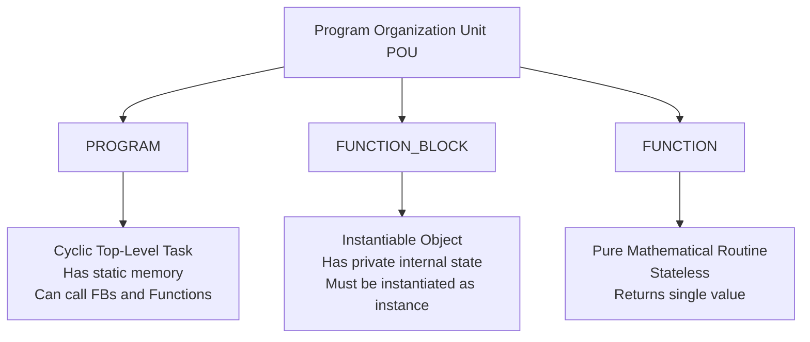

# IEC 61131-3 Structured Text (ST) Engineering Guide

## 1. Architectural Mandate: Structured Text Only

In industrial automation engineering with autonomous AI agents, determinism, readability, mathematical verifiability, and version-control compatibility are mandatory.

**Project Standard**: This project standardizes 100% on **IEC 61131-3 Structured Text (ST)**. The **Horner Cscape MCP Server** enforces this mandate across all four architectural pillars: Win32 live Cscape 10.2 automation, native CFBF (`.csp`/`.cpj`) project containers, pure-Python AST parsing and validation, and deterministic Horner OCS software cycle simulation. Standalone Straton K5 project generation is quarantined legacy under `quarantine/straton_k5_legacy/`.

### Why Advanced Ladder is Strictly Forbidden
Historical programmable logic controllers relied heavily on Relay Ladder Logic (LD). In Horner Cscape, this exists as "Advanced Ladder". The automation engine strictly detects and rejects Advanced Ladder rungs and constructs due to fundamental architectural flaws:

1. **Lack of Text-Based Determinism**: Advanced Ladder logic is encoded in non-standard binary blobs or graphical coordinate grids. It cannot be parsed cleanly by abstract syntax tree (AST) tooling without GUI rendering.
2. **Brittle Diffing & Merge Conflicts**: Git-based collaborative workflows cannot diff graphical wire junctions, coil contacts, or rung branches, leading to silent overwrites or corrupt project states.
3. **Safety Verification Obstacles**: Advanced Ladder cannot be statically checked for loop boundaries, recursion limits, or mathematical invariant safety as effectively as Structured Text.
4. **AST-Level Rejection**: Any code block containing ladder artifacts (`---[ ]---`, `---( )---`, `---[/]---`, `NETWORK`, `RUNG`, `LADDER`) is immediately rejected by the parser with a `ValidationError`.

---

## 2. Program Organization Units (POUs)

IEC 61131-3 programs are organized into three distinct POU categories:



### 2.1 `PROGRAM`
A cyclic execution unit bound to a task scheduler rate (e.g., 10 ms, 50 ms):
```iecst
PROGRAM PRG_Main
VAR
    fbMotor : FB_MotorStarter;
    bStartCommand : BOOL;
    bStopCommand : BOOL;
    bMotorRunning : BOOL;
END_VAR

fbMotor(
    bStart := bStartCommand,
    bStop := bStopCommand,
    bRunning => bMotorRunning
);
END_PROGRAM
```

### 2.2 `FUNCTION_BLOCK`
An instantiable component retaining state across scan cycles:
```iecst
FUNCTION_BLOCK FB_MotorStarter
VAR_INPUT
    bStart : BOOL;
    bStop : BOOL;
    bOverloadTrip : BOOL;
END_VAR
VAR_OUTPUT
    bRunning : BOOL;
    bFault : BOOL;
END_VAR
VAR
    tonOverloadFilter : TON;
END_VAR

// Control Logic
IF bStop OR bOverloadTrip THEN
    bRunning := FALSE;
ELSIF bStart AND NOT bFault THEN
    bRunning := TRUE;
END_IF;

// Overload timing evaluation
tonOverloadFilter(IN := bOverloadTrip, PT := T#2S);
IF tonOverloadFilter.Q THEN
    bFault := TRUE;
END_IF;
END_FUNCTION_BLOCK
```

### 2.3 `FUNCTION`
A stateless pure function returning a single value:
```iecst
FUNCTION ScaleAnalog : REAL
VAR_INPUT
    nRawInput : INT;
    rMinRaw : REAL;
    rMaxRaw : REAL;
    rMinEU : REAL;
    rMaxEU : REAL;
END_VAR
VAR
    rNormalized : REAL;
END_VAR

IF (rMaxRaw - rMinRaw) = 0.0 THEN
    ScaleAnalog := rMinEU;
    RETURN;
END_IF;

rNormalized := (INT_TO_REAL(nRawInput) - rMinRaw) / (rMaxRaw - rMinRaw);
ScaleAnalog := rMinEU + rNormalized * (rMaxEU - rMinEU);
END_FUNCTION
```

---

## 3. Data Type System

The system implements strict static type checking across all 16 standard IEC 61131-3 elementary data types:

| Data Type | Width (Bits) | Range / Description | Classification |
| :--- | :--- | :--- | :--- |
| `BOOL` | 1 | `FALSE` (0) or `TRUE` (1) | Discrete Bit |
| `SINT` | 8 | -128 to 127 | Signed 8-bit Integer |
| `INT` | 16 | -32,768 to 32,767 | Signed 16-bit Integer |
| `DINT` | 32 | -2,147,483,648 to 2,147,483,647 | Signed 32-bit Integer |
| `LINT` | 64 | -9,223,372,036,854,775,808 to 9,223,372,036,854,775,807 | Signed 64-bit Integer |
| `USINT` | 8 | 0 to 255 | Unsigned 8-bit Integer |
| `UINT` | 16 | 0 to 65,535 | Unsigned 16-bit Integer |
| `UDINT` | 32 | 0 to 4,294,967,295 | Unsigned 32-bit Integer |
| `ULINT` | 64 | 0 to 18,446,744,073,709,551,615 | Unsigned 64-bit Integer |
| `BYTE` | 8 | 16#00 to 16#FF (Bit string) | Bit String 8-bit |
| `WORD` | 16 | 16#0000 to 16#FFFF (Bit string) | Bit String 16-bit |
| `DWORD` | 32 | 16#00000000 to 16#FFFFFFFF | Bit String 32-bit |
| `REAL` | 32 | IEEE 754 Single-Precision Floating Point (~1.18e-38 to 3.40e+38) | Float 32-bit |
| `LREAL` | 64 | IEEE 754 Double-Precision Floating Point (~2.23e-308 to 1.79e+308) | Float 64-bit |
| `TIME` | 32 | Durations: `T#0ms` to `T#24d20h31m23s647ms` | Duration / Period |
| `STRING` | Variable | ASCII character sequence (Default 80 characters) | Text String |

---

## 4. Variable Declaration Scopes

Variables must be declared in formal declaration blocks prior to logic statements:

- `VAR_INPUT ... END_VAR`: External input parameters passed into the POU.
- `VAR_OUTPUT ... END_VAR`: Output values emitted by the POU.
- `VAR_IN_OUT ... END_VAR`: By-reference parameters modified directly in place.
- `VAR ... END_VAR`: Private local variables maintaining state between cycles (in FBs/Programs).
- `VAR_TEMP ... END_VAR`: Scratch variables re-initialized to default values every cycle.
- `VAR_GLOBAL ... END_VAR`: Project-wide symbols accessible across all POUs.
- `VAR_EXTERNAL ... END_VAR`: References to project-wide global symbols used locally.

---

## 5. Standard Function Blocks Library

The offline simulator and compiler include standard IEC 61131-3 function blocks:

### Timers
- **`TON` (Timer On-Delay)**:
  - Activates output `Q` after input `IN` remains `TRUE` for duration `PT`.
  - Resets elapsed time `ET` to 0 when `IN` is `FALSE`.
- **`TOF` (Timer Off-Delay)**:
  - Keeps output `Q` `TRUE` for duration `PT` after input `IN` falls from `TRUE` to `FALSE`.
- **`TP` (Pulse Timer)**:
  - Generates a fixed-duration pulse of length `PT` on output `Q` upon rising edge of `IN`.

### Counters
- **`CTU` (Count Up)**: Increments current value `CV` on rising edge of `CU` until preset `PV` is reached (`Q := TRUE`).
- **`CTD` (Count Down)**: Decrements current value `CV` on rising edge of `CD` until 0 is reached.
- **`CTUD` (Count Up/Down)**: Bidirectional counter combining `CTU` and `CTD`.

### Mathematical & Selection Functions
- `ABS(x)`: Absolute value.
- `SQRT(x)`: Square root.
- `MIN(x, y)`: Returns lesser value.
- `MAX(x, y)`: Returns greater value.
- `LIMIT(min, val, max)`: Clamps `val` between `min` and `max`.
- `MOD(x, y)`: Modulo arithmetic remainder.
- `SEL(g, in0, in1)`: Selects `in0` if boolean `g` is `FALSE`, `in1` if `TRUE`.

---

## 6. Control Flow & State Machine Patterns

### Deterministic Finite State Machine (FSM)
Industrial logic states are modeled cleanly using `CASE ... OF`:

```iecst
CASE eProcessState OF
    0: // Idle State
        bValveOpen := FALSE;
        bPumpRun := FALSE;
        IF bStartCycle THEN
            eProcessState := 10;
        END_IF;

    10: // Filling Tank
        bValveOpen := TRUE;
        bPumpRun := FALSE;
        IF rTankLevel >= 100.0 THEN
            bValveOpen := FALSE;
            eProcessState := 20;
        END_IF;

    20: // Agitation & Heating
        bPumpRun := TRUE;
        IF tonAgitationTimer.Q THEN
            bPumpRun := FALSE;
            eProcessState := 30;
        END_IF;

    30: // Draining
        bDrainValveOpen := TRUE;
        IF rTankLevel <= 1.0 THEN
            bDrainValveOpen := FALSE;
            eProcessState := 0; // Return to Idle
        END_IF;

ELSE
    // Safety Catch: Unrecognized state defaults to safe shutdown
    bValveOpen := FALSE;
    bPumpRun := FALSE;
    bDrainValveOpen := FALSE;
    eProcessState := 0;
END_CASE;
```

---

## 7. Migration Guidelines: Refactoring Ladder to ST

When modernizing legacy Horner Cscape programs:

| Legacy Ladder Construct | Modern IEC 61131-3 Structured Text Equivalent |
| :--- | :--- |
| Normally Open Contact `---[ ]---` | Boolean condition: `IF bContact THEN` |
| Normally Closed Contact `---[/]---` | Inverted boolean: `IF NOT bContact THEN` |
| Output Coil `---( )---` | Direct assignment: `bCoil := (bCond1 AND bCond2);` |
| Set / Latch Coil `---(S)---` | Conditional latch: `IF bSetCondition THEN bLatch := TRUE; END_IF;` |
| Reset / Unlatch Coil `---(R)---` | Conditional unlatch: `IF bResetCondition THEN bLatch := FALSE; END_IF;` |
| Timer Coil `[TON 10.0s]` | Function block call: `fbTimer(IN := bRun, PT := T#10S);` |
| Subroutine Jump `---[JMP]---` | Modular POU or structured conditional blocks: `IF bCondition THEN ... END_IF;` |
