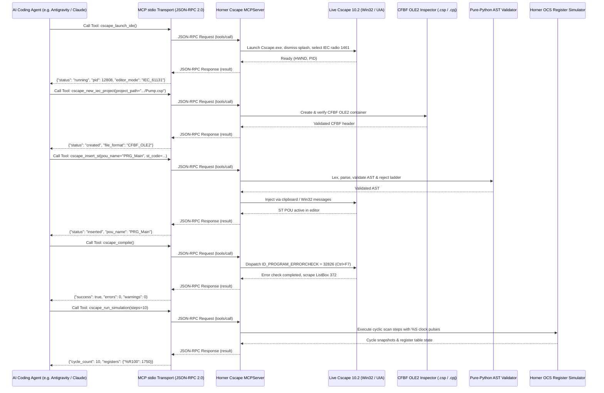

# Model Context Protocol (MCP) Server Reference

## 1. Overview & Transport Protocol

The Horner Cscape MCP Server implements the **Model Context Protocol (MCP)** specification over standard I/O (`stdio`) using JSON-RPC 2.0. It exposes high-level industrial automation capabilities to AI engineering agents, automating **real Horner Cscape 10.2** (`Cscape.exe`) via **Win32 UI/accelerators**, native Compound File Binary Format (**CFBF** / `.csp` & `.cpj`), pure-Python **AST** parsing and validation, and deterministic software **simulation**.

> [!NOTE]
> Standalone Copa-Data Straton K5 project generation (`appli.k5p`, `appli.CPO`, `K5DBXS.INI`) has been audited and confirmed non-native to authentic Cscape 10.2; it is **quarantined legacy** under `quarantine/straton_k5_legacy/`.

### Architecture


---

## 2. Exposed MCP Tools

The server exposes 9 primary native Cscape 10.2 tools along with offline AST validation and software simulation tools:

### 2.1 Native Horner Cscape 10.2 Tools (Primary)

#### 1. `cscape_launch_ide`
Supervises live `Cscape.exe` launch, automatically dismisses splash screen dialogs (`#32770`), and enforces IEC 61131 editor mode (Radio button 1461).
- **Parameters**: `timeout_seconds` (integer, optional, default: `30`).
- **Response**: `{"status": "launched", "pid": 12808, "hwnd": 4458042, "editor_mode": "IEC_61131"}`.

#### 2. `cscape_new_iec_project`
Provisions an authentic native Cscape `.csp` or `.cpj` project container configured strictly for IEC 61131-3 Structured Text.
- **Parameters**:
  - `project_path` (string, required): Full filesystem path to create `.csp` or `.cpj` file.
  - `project_name` (string, optional): Project display name.
- **Response**: `{"status": "created", "project_path": "...", "format": "CFBF_OLE2", "is_valid_cfbf": true}`.

#### 3. `cscape_open_project`
Validates CFBF header magic bytes (`\xd0\xcf\x11\xe0\xa1\xb1\x1a\xe1`) and opens an existing native `.csp` or `.cpj` file in Cscape 10.2.
- **Parameters**: `project_path` (string, required): Path to existing `.csp` or `.cpj` project file.
- **Response**: `{"status": "opened", "project_path": "...", "format": "CFBF_OLE2"}`.

#### 4. `cscape_insert_st`
Injects validated IEC 61131-3 Structured Text source code into the active Cscape project editor with AST pre-validation and ladder rejection.
- **Parameters**:
  - `pou_name` (string, required): Unique POU name.
  - `st_code` (string, required): Structured Text source code.
  - `pou_type` (string, optional, default: `"PROGRAM"`): `"PROGRAM"`, `"FUNCTION_BLOCK"`, or `"FUNCTION"`.
- **Response**: `{"status": "inserted", "pou_name": "PRG_Main", "sha256": "...", "ast_valid": true}`.

#### 5. `cscape_compile`
Dispatches the native Cscape Error Check command (`ID_PROGRAM_ERRORCHECK = 32826` / Ctrl+F7) to `Cscape.exe` and captures build completion.
- **Parameters**: `timeout_seconds` (integer, optional, default: `60`).
- **Response**: `{"success": true, "status": "SUCCESS", "error_count": 0, "warning_count": 0, "diagnostics": []}`.

#### 6. `cscape_get_build_output`
Scrapes the Cscape MFC output list box (`ListBox ID 372` / `Frame 45011`), parsing errors, warnings, line numbers, and error codes.
- **Parameters**: *(none)*.
- **Response**: `{"error_count": 0, "warning_count": 0, "diagnostics": [], "raw_log": "..."}`.

#### 7. `cscape_read_variables` (alias: `cscape_import_variables`)
Reads and validates Horner OCS variables and register mappings (%R, %M, %T, %AI, %AQ, %I, %Q, %S, %SR, %D, %K, %IG, %QG) from CSV or XML database files (`variables.csv`, `variables.xml`). Enforces register limits, bit-of-word indexing (%R1.1..%R1.16), and memory overlap detection.
- **Parameters**: `file_path` (string, required), `merge_strategy` (string, optional, default: `"MERGE"`), `delimiter` (string, optional).
- **Response**: `{"success": true, "format": "CSV", "count": 12, "variables": [...], "conflicts_detected": 0, "validation_status": "VALID"}`.

#### 8. `cscape_write_variables` (alias: `cscape_export_variables`)
Writes Horner OCS variables to CSV or XML format (`variables.csv`, `variables.xml`) with full validation of data types, register boundaries, bit-of-word indexing, and collision checking. Guarantees bidirectional roundtrip consistency.
- **Parameters**: `output_path` (string, required), `variables` (list of dicts, optional), `format_type` (string, optional, default: `"CSV"`), `delimiter` (string, optional, default: `";"`), `source_file` (string, optional).
- **Response**: `{"success": true, "output_path": "...", "format_type": "CSV", "written_count": 12, "validation_status": "VALID"}`.

#### 9. `cscape_run_simulation`
Executes offline Horner OCS cycle stepping with %S system clock flags (%S1 first scan, %S7 10ms, %S8 100ms, %S9 1000ms).
- **Parameters**:
  - `steps` (integer, optional, default: `10`): Scan cycles to execute.
  - `inputs` (object, optional): Input bit/register overrides.
- **Response**: `{"cycles_executed": 10, "state": "RUNNING", "system_bits": {"%S1": false, "%S7": true}}`.

---

### 2.2 Offline AST, Simulation & Project Management Tools

#### 1. `cscape_validate_st`
Static AST analysis, lexing, parsing, block closure verification, and safety auditing on Structured Text source code. Rejects Advanced Ladder artifacts.
- **Parameters**: `code` (string, required).

#### 2. `cscape_simulate_pou`
Executes multi-cycle pure-software simulation of Structured Text logic without physical PLC hardware.
- **Parameters**:
  - `code` (string, required).
  - `inputs` (dictionary of string to any, optional).
  - `steps` (integer, optional, default: `5`).

#### 3. `cscape_create_project` (Offline Project Workspace)
Initializes an offline project workspace structure with manifest.
- **Parameters**: `name` (string, required), `description` (string, optional).

#### 4. `cscape_add_st_pou`
Validates and injects an IEC 61131-3 Structured Text POU into the offline project workspace.
- **Parameters**: `project_name` (string, required), `pou_name` (string, required), `code` (string, required), `pou_type` (string, required).

#### 5. `cscape_inspect_variables`
Enumerates and categorizes variables across project POUs and global scopes.
- **Parameters**: `project_name` (string, required).

#### 6. `cscape_compile_project`
Headless compilation pass or live Cscape GUI compile, memory segment estimation, and error diagnostics generation.
- **Parameters**: `project_name` (string, required), `clean_build` (boolean, optional, default: `true`), `cscape_hwnd` (integer, optional).
- **Response**: `{"success": true, "errors": [], "warnings": [], "build_log": "...", "status": "success", "pous_compiled": ["Main"]}`.
- **Guarantees**: Fail-closed error diagnostics response `{success: bool, errors: list, warnings: list, build_log: str}` on syntax failure, hang, or Cscape crash.

#### 7. `cscape_get_diagnostics`
Retrieves compilation diagnostics and project health indicators.
- **Parameters**: `project_name` (string, required).

#### 8. `cscape_export_project`
Packages and exports the project into distributable archives.
- **Parameters**: `project_name` (string, required), `output_format` (string, optional, default: `"json"`): `"xml"`, `"st"`, `"json"`, or legacy `"k5p"` (quarantined).

---

## 3. MCP Resources

Clients can read static and dynamic project resources via standard MCP resource URIs:

| Resource URI | Description |
| :--- | :--- |
| `cscape://projects` | Lists all active and archived projects in the workspace. |
| `cscape://project/{name}/state` | Real-time state of the specified project (POUs, variables, targets). |
| `cscape://project/{name}/diagnostics` | Compilation history, syntax check logs, and memory estimates. |
| `cscape://templates` | Catalog of built-in production Structured Text templates. |
| `cscape://template/{name}` | Structured Text source code for a specific template (e.g. `motor_starter`). |
| `cscape://safety/status` | Current hardware lockout state, blocked ports, and prohibited commands. |

---

## 4. MCP AI Engineering Prompts

The server pre-configures specialized prompts to guide AI assistants during logic synthesis:

1. **`generate_iec_st_controller`**:
   - Directs the agent to generate compliant, verified IEC 61131-3 Structured Text for a user-described industrial process (e.g., pump station, packaging conveyor).
2. **`refactor_ladder_to_st`**:
   - Guides the agent in translating legacy ladder logic rungs into modern, deterministic Structured Text with equivalent safety interlocks.
3. **`debug_st_diagnostics`**:
   - Takes compiler error logs or simulation traces and guides the agent in identifying syntax errors, unclosed blocks, or type mismatches.
4. **`simulate_st_logic`**:
   - Formulates a test bench matrix of input vectors across time steps to verify edge cases in state machines.

---

## 5. Client Configuration Guide

### Claude Desktop (`claude_desktop_config.json`)
```json
{
  "mcpServers": {
    "horner-cscape": {
      "command": "C:\\HornerAI\\horner-cscape-mcp\\.venv\\Scripts\\python.exe",
      "args": [
        "C:\\HornerAI\\horner-cscape-mcp\\scripts\\run_mcp_server.py"
      ],
      "env": {
        "CSCAPE_BIN_PATH": "C:\\Program Files (x86)\\Cscape 10.2\\Cscape.exe"
      }
    }
  }
}
```

### Antigravity CLI / AGY Configuration
Add to `.gemini/settings.json` or MCP server configuration:
```json
{
  "mcpServers": {
    "cscape": {
      "command": "C:/HornerAI/horner-cscape-mcp/.venv/Scripts/python.exe",
      "args": ["C:/HornerAI/horner-cscape-mcp/scripts/run_mcp_server.py"]
    }
  }
}
```
