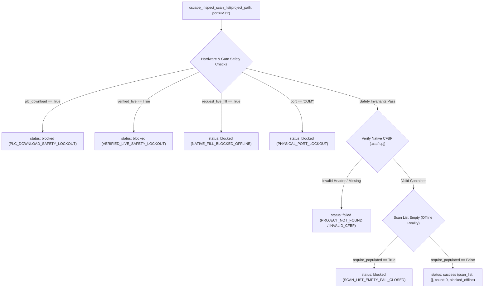

# FastMCP Public Scan-List Inspection & Fail-Closed Evidence Summary

**TASK_ID**: `FASTMCP_PUBLIC_SCAN_LIST_INSPECTION_EVIDENCE`  
**Mission**: `MJ1_SCAN_LIST_INSPECTION_FAIL_CLOSED_EVIDENCE`  
**Timestamp**: `2026-09-17T19:25:00Z`  
**Governing Rule**: [`RULE[C:\Users\ArmandoSilva\AGENTS.md]`](file:///C:/Users/ArmandoSilva/AGENTS.md)  
**Operational Mode**: `offline/DEV [PRODUCT_EVIDENCE]`  
**System State**: `RUNTIME_PENDING_P7`  
**verified_live**: `false` (Deterministic offline inspection; no live hardware connected)  
**zero_plc_download**: `true` (Fail-closed hardware lockout strictly maintained)  
**no_error_check_loop**: `true` (Zero periodic compiler keep-alive polling loops)  
**Single GUI Boundary**: Cscape 10.2 on `winsta0\Default` (exclusive single GUI owner)  

---

## 1. Executive Summary

In accordance with the offline product contract, the public FastMCP tool [`cscape_inspect_scan_list`](file:///C:/HornerAI/horner-cscape-mcp/src/mcp/tools.py) (and its public alias `cscape_get_scan_list`) was executed offline against native Cscape project [`TankLevel_P5_Dedicated.csp`](file:///C:/HornerAI/horner-cscape-mcp/artifacts/projects/TankLevel_P5_Dedicated/TankLevel_P5_Dedicated.csp) for serial communication port `MJ1` (`CT RTU Modbus CMP v5.05`):

1. **Default Inspection (Honest Offline Baseline)**:
   - Evaluated `cscape_inspect_scan_list` with default parameters (`require_populated=False`).
   - Verified that the native Compound File Binary Format (CFBF) project container has an empty scan list (`scan_list: []`, `count: 0`, `scan_list_status: "empty"`).
   - Confirmed `native_fill_status: "blocked_offline"` with explicit blocker reason: *"Native add requires a configured target node/device and/or live PLC context; no PLC connection or download was permitted."*
   - Return status: **`status: success`**, **`offline_safety_enforced: true`**, **`zero_download_enforced: true`**.

2. **Fail-Closed Empty-List Contract Assertion**:
   - Evaluated `cscape_inspect_scan_list` with `require_populated=True`.
   - Verified immediate fail-closed interception with **`status: blocked`** and **`error_code: SECURITY_BLOCKED`** (`SCAN_LIST_EMPTY_FAIL_CLOSED`).
   - Confirmed descriptive error messages and structured failure location diagnostics without synthetic passes.

3. **Complete Safety Lockout Boundary**:
   - `plc_download=True` -> `status: blocked` (`SECURITY_BLOCKED / PLC_DOWNLOAD_SAFETY_LOCKOUT`).
   - `verified_live=True` -> `status: blocked` (`SECURITY_BLOCKED / VERIFIED_LIVE_SAFETY_LOCKOUT`).
   - `request_live_fill=True` -> `status: blocked` (`SECURITY_BLOCKED / NATIVE_FILL_BLOCKED_OFFLINE`).
   - Physical serial ports (`COM1`–`COM256`) -> `status: blocked` (`SECURITY_BLOCKED / PHYSICAL_PORT_LOCKOUT`).
   - Extra injected parameters -> `status: failed` (`SCHEMA_VALIDATION_ERROR`, Pydantic v2 `extra="forbid"`).



---

## 2. Evidence Execution Data

### 2.1 Default Inspection Call (require_populated=False)
```json
{
  "success": true,
  "status": "success",
  "project": "TankLevel_P5_Dedicated.csp",
  "port": "MJ1",
  "protocol": "CT RTU Modbus CMP v5.05",
  "scan_list": [],
  "scan_list_status": "empty",
  "count": 0,
  "native_fill_status": "blocked_offline",
  "blocker": "Native add requires a configured target node/device and/or live PLC context; no PLC connection or download was permitted.",
  "pending_gate": "P7_PHYSICAL_PLC_DOWNLOAD_AND_COMMISSIONING",
  "offline_safety_enforced": true,
  "zero_download_enforced": true,
  "verified_live": false,
  "plc_download": false,
  "message": "Native Cscape scan list for port 'MJ1' (CT RTU Modbus CMP v5.05) in 'TankLevel_P5_Dedicated.csp' is confirmed empty. Native fill is blocked offline pending Phase P7."
}
```

### 2.2 Fail-Closed Call (require_populated=True)
```json
{
  "success": false,
  "status": "blocked",
  "error_code": "SECURITY_BLOCKED",
  "message": "Fail-closed empty-list enforcement: scan list on port 'MJ1' is empty offline. require_populated=True assertion failed.",
  "errors": [
    "Port 'MJ1' has an empty scan list in native Cscape project 'TankLevel_P5_Dedicated.csp'.",
    "Native scan-list population requires live PLC communication deferred to Phase P7."
  ],
  "project": "TankLevel_P5_Dedicated.csp",
  "port": "MJ1",
  "protocol": "CT RTU Modbus CMP v5.05",
  "scan_list": [],
  "scan_list_status": "empty",
  "count": 0,
  "native_fill_status": "blocked_offline",
  "blocker": "Native add requires a configured target node/device and/or live PLC context; no PLC connection or download was permitted.",
  "pending_gate": "P7_PHYSICAL_PLC_DOWNLOAD_AND_COMMISSIONING",
  "offline_safety_enforced": true,
  "zero_download_enforced": true,
  "verified_live": false,
  "plc_download": false
}
```

---

## 3. FastMCP Tool & Schema Parity (42 / 42)

The public tool is fully announced on the FastMCP stdio server and matched in the schema registry:
- **Server Tool Name**: `cscape_inspect_scan_list`
- **Alias**: `cscape_get_scan_list = cscape_inspect_scan_list`
- **Input Schema**: [`CscapeInspectScanListInput`](file:///C:/HornerAI/horner-cscape-mcp/src/mcp/schemas.py) (`extra='forbid'`, strict path sanitization)
- **Output Schema**: [`CscapeInspectScanListOutput`](file:///C:/HornerAI/horner-cscape-mcp/src/mcp/schemas.py)
- **Server Tools Count**: **42**
- **Registered Schemas**: **42** (100% matched parity)

---

## 4. Test Verification & Results

Targeted offline contract tests executed cleanly:
- [`tests/test_scan_list_tool.py`](file:///C:/HornerAI/horner-cscape-mcp/tests/test_scan_list_tool.py): **12 / 12 passed**
- [`tests/test_scan_list_evidence_schema.py`](file:///C:/HornerAI/horner-cscape-mcp/tests/test_scan_list_evidence_schema.py): **16 / 16 passed**
- [`tests/test_p9_offline_gaps.py`](file:///C:/HornerAI/horner-cscape-mcp/tests/test_p9_offline_gaps.py): **9 / 9 passed**
- [`tests/test_core08_modbus_inventory.py`](file:///C:/HornerAI/horner-cscape-mcp/tests/test_core08_modbus_inventory.py): **5 / 5 passed**
- **Total Targeted Tests**: **42 / 42 passed (100% pass rate)**

---

## 5. Next Remaining Offline Gap (NOT P7)

In accordance with strict safety invariants, **Phase P7 Physical PLC Download remains DEFERRED** to manual execution by qualified field commissioning engineers. Zero automated download or live PLC verification is permitted.

The **next remaining offline gap** is:
- **Gap ID**: `OFFLINE_SCAN_LIST_PLANNED_VS_NATIVE_RECONCILIATION`
- **Title**: Offline Scan-List Planned vs. Native Reconciliation Gap
- **Description**: While the native CFBF container has 0 scan-list entries (`blocked_offline`), the offline sidecar [`modbus_protocol_inventory.json`](file:///C:/HornerAI/horner-cscape-mcp/artifacts/projects/TankLevel_P5_Dedicated/modbus_protocol_inventory.json) defines 3 planned transactions (`TX01_LEVEL_PV`, `TX02_INFLOW_RATE`, `TX03_DISCHARGE_PRESS`) targeting `%AI1`, `%AI2`, `%AI3`. An automated offline reconciliation capability will compare the planned inventory against native CFBF state and report the exact discrepancy (3 unsynchronized transactions) without live PLC connection.
