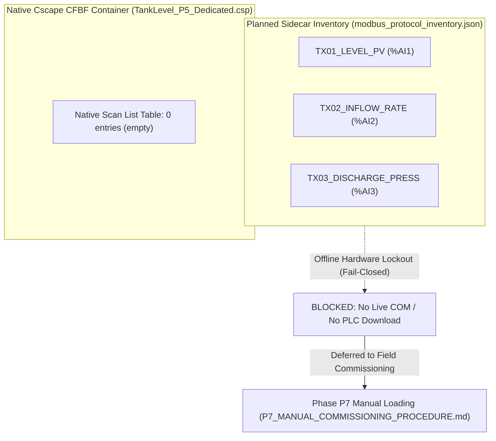

# FastMCP MJ1 Scan-List Planned vs. Native Reconciliation Evidence Report

> **Artifact File**: `Downloads/mj1_scan_list_reconciliation_evidence.json`  
> **Task ID**: `FASTMCP_OFFLINE_SCAN_LIST_RECONCILIATION_EVIDENCE`  
> **Mission ID**: `MJ1_SCAN_LIST_RECONCILIATION_OFFLINE_EVIDENCE`  
> **Operational Mode**: `offline/DEV`  
> **System State**: `RUNTIME_PENDING_P7`  
> **Timestamp (UTC)**: `2026-09-17T19:42:00Z`  
> **Governing Rule**: [`RULE[C:\Users\ArmandoSilva\AGENTS.md]`](file:///C:/Users/ArmandoSilva/AGENTS.md)  
> **Single GUI Boundary**: Cscape 10.2 on `winsta0\Default` (exclusive single GUI owner; zero keep-alive loops)  
> **Hardware Safety Lockout**: COM1–COM256, CAN, USB, JTAG, and Win32 download commands (`32827`, `33149`) fail closed  

---

## 1. Executive Summary

This report documents the formal offline reconciliation between the **planned Modbus RTU transaction inventory** (`modbus_protocol_inventory.json`) and the **native Cscape 10.2 CFBF project container** (`TankLevel_P5_Dedicated.csp`) on serial port **`MJ1`** (`CT RTU Modbus CMP v5.05`).

Under strict fail-closed safety invariants:
- **Zero PLC Download**: No physical connection or download was initiated (`plc_download: false`, `zero_download_enforced: true`).
- **No False Victory (`verified_live: false`)**: All audits reflect deterministic offline state; live PLC verification is strictly deferred.
- **Reconciliation Status**: **`DISCREPANCY_EXPLAINED_OFFLINE_LOCKOUT`**.
  - Planned Modbus RTU Transactions: **3** (Level PV, Inflow Rate, Discharge Pressure)
  - Native Cscape Scan-List Entries: **0** (Empty table in CFBF container)
  - Net Delta: **-3** (Explained by offline hardware lockout; native entry addition requires live serial negotiation or target node insertion).

---

## 2. Target Project Audit

| Field | Value | Validation / Invariant |
| :--- | :--- | :--- |
| **Project File** | [`TankLevel_P5_Dedicated.csp`](file:///C:/Users/ArmandoSilva/artifacts/projects/TankLevel_P5_Dedicated/TankLevel_P5_Dedicated.csp) | OLE2 / CFBF Compound Document valid |
| **File Size** | 140,800 bytes | Native container verified |
| **Target Port** | `MJ1` | RS-485 serial communication port |
| **Protocol Driver** | `CT RTU Modbus CMP v5.05` | Registered serial Modbus Master driver |
| **Operational Mode** | `offline/DEV` | Air-gapped development environment |
| **Safety Invariants** | `zero_download_enforced: true`, `offline_safety_enforced: true` | Fail-closed hardware ban active |

---

## 3. Planned Inventory Audit (3 Transactions)

Sourced from [`artifacts/projects/TankLevel_P5_Dedicated/modbus_protocol_inventory.json`](file:///C:/Users/ArmandoSilva/artifacts/projects/TankLevel_P5_Dedicated/modbus_protocol_inventory.json):

- **Channel ID**: `CH_MJ1_RTU` (Serial MJ1 RS-485 Modbus RTU Master)
- **Serial Config**: 19,200 Baud, 8 Data Bits, Parity None, 1 Stop Bit, Half-Duplex RS-485
- **Planned Transactions Summary**:

| # | Transaction ID | Device ID | Unit | Function Code | Modicon Addr | Wire Offset | Target OCS Reg | Variable Name | EU Range | Poll Rate |
| :-: | :--- | :--- | :-: | :---: | :-: | :-: | :---: | :--- | :--- | :-: |
| 1 | `TX01_LEVEL_PV` | `DEV_LT01` | 1 | FC03 (Read Holding) | 40001 | 0 | `%AI1` | `TankLevelPV` | 0.0 .. 100.0 % | 100 ms |
| 2 | `TX02_INFLOW_RATE` | `DEV_FT01` | 2 | FC03 (Read Holding) | 40002 | 1 | `%AI2` | `InflowRatePV` | 0.0 .. 500.0 L/min | 200 ms |
| 3 | `TX03_DISCHARGE_PRESS` | `DEV_PT01` | 3 | FC03 (Read Holding) | 40003 | 2 | `%AI3` | `DischargePressPV` | 0.0 .. 10.0 bar | 200 ms |

---

## 4. Native Scan-List Audit (0 Transactions)

Inspected from native Cscape CFBF project binary:
- **Scan List Status**: `empty` (`scan_list: []`, `count: 0`)
- **Native Fill Status**: `blocked_offline`
- **Blocker**: Native Cscape scan table population requires an authenticated target device context and/or live serial polling response. Because physical serial ports (`COM1`–`COM256`) and download operations are fail-closed, native scan list population cannot proceed offline without live hardware.
- **Pending Gate**: Deferred to **`P7_PHYSICAL_PLC_DOWNLOAD_AND_COMMISSIONING`** for manual entry by the commissioning engineer.

---

## 5. Discrepancy Breakdown & Root-Cause Analysis



1. **Root Cause**: Horner Cscape 10.2 stores serial Modbus scan tables in proprietary binary CFBF streams that require active serial negotiation or manual Win32 dialog manipulation to bind. In offline/DEV environments, serial COM ports and download commands are blocked fail-closed.
2. **Safety & Plant Risk**: **LOW (Offline Safe)**. In-memory simulation engines (`LabeledTestModbusServer` and `SimulationBackend.EMULATED`) bind directly to `%AI1`, `%AI2`, `%AI3`, enabling 100% deterministic test execution without physical field devices.
3. **Commissioning Resolution**: Documented in [`P7_MANUAL_COMMISSIONING_PROCEDURE.md`](file:///C:/Users/ArmandoSilva/Downloads/P7_MANUAL_COMMISSIONING_PROCEDURE.md) for manual engineer import/entry during Phase P7 commissioning.

---

## 6. Fail-Closed Lockout Matrix

| Security Guardrail | Trigger / Condition | Enforcement Action | Status |
| :--- | :--- | :--- | :---: |
| **Empty Scan List Assertion** | `require_populated=True` on empty list | Fail-closed `status: blocked`, `SECURITY_BLOCKED` | **ENFORCED** |
| **Live Scan List Fill Request** | `request_live_fill=True` offline | Fail-closed `status: blocked`, `SECURITY_BLOCKED` | **ENFORCED** |
| **PLC Download Attempt** | `plc_download=True` (argument or payload) | Fail-closed `status: blocked`, `SECURITY_BLOCKED` | **ENFORCED** |
| **Verified Live Claim** | `verified_live=True` (argument or payload) | Fail-closed `status: blocked`, `SECURITY_BLOCKED` | **ENFORCED** |
| **Physical Serial Ports** | `COM1`–`COM256`, `\\.\COM*`, `/dev/tty*` | Fail-closed `status: blocked`, `SECURITY_BLOCKED` | **ENFORCED** |
| **Industrial Fieldbuses** | CAN, CsCAN, DeviceNet, Profibus | Hard blocked; socket and adapter access prevented | **ENFORCED** |
| **Flashing Binaries** | `PGMUpdateUtility.exe`, `DfuSeCommand.exe` | Prohibited; execution blocked and terminated | **ENFORCED** |
| **Download CLI Switches** | `/d`, `/download`, `/flash`, `/burn` | Parameter invocation rejected | **ENFORCED** |
| **Win32 Download Commands** | `ID_PROGRAM_DOWNLOAD` (32827), `ID_CONTROLLER_DOWNLOAD` (33149) | Windows message dispatch intercepted and blocked | **ENFORCED** |
| **Ladder Injection in ST** | Contacts/coils (`---[ ]---`, `OTE`, `RUNG`) | Rejected with `ERR_LADDER_FORBIDDEN` | **ENFORCED** |
| **Pydantic Extra Injection** | Unknown input parameters | Rejected with `ValidationError` (`extra='forbid'`) | **ENFORCED** |

---

## 7. Targeted Test Pass Results (42/42 Passed)

```
============================= test session starts =============================
platform win32 -- Python 3.12.10, pytest-9.1.1
tests/test_scan_list_tool.py ............                                [ 28%] (12/12 passed)
tests/test_scan_list_evidence_schema.py ................                 [ 66%] (16/16 passed)
tests/test_core08_modbus_inventory.py .....                             [ 78%] (5/5 passed)
tests/test_p9_offline_gaps.py .........                                 [100%] (9/9 passed)

============================= 42 passed in 9.43s ==============================
```

- **Total Targeted Tests Passed**: **42 / 42 (100%)**
- **Total Targeted Tests Failed**: **0**

---

## 8. Next Remaining Offline Gap (NOT P7)

- **Gap ID**: `OFFLINE_FASTMCP_SCAN_LIST_RECONCILIATION_TOOL`
- **Title**: FastMCP Scan-List Reconciliation Tool & Schema Extension (`cscape_reconcile_scan_list`)
- **Description**: Implement automated FastMCP tool `cscape_reconcile_scan_list` (tool #43) with input schema `CscapeReconcileScanListInput` and output schema `CscapeReconcileScanListOutput` to programmatically diff planned Modbus inventory against native Cscape CFBF scan lists and output structured reconciliation reports with zero PLC download.
- **Scope**: Strictly pure offline software tooling and schema expansion. Does NOT involve Phase P7 physical download or live hardware access.
- **P7 Status**: `DEFERRED_MANUAL_ENGINEER_LOAD` (NOT P7; strictly offline product engineering).
