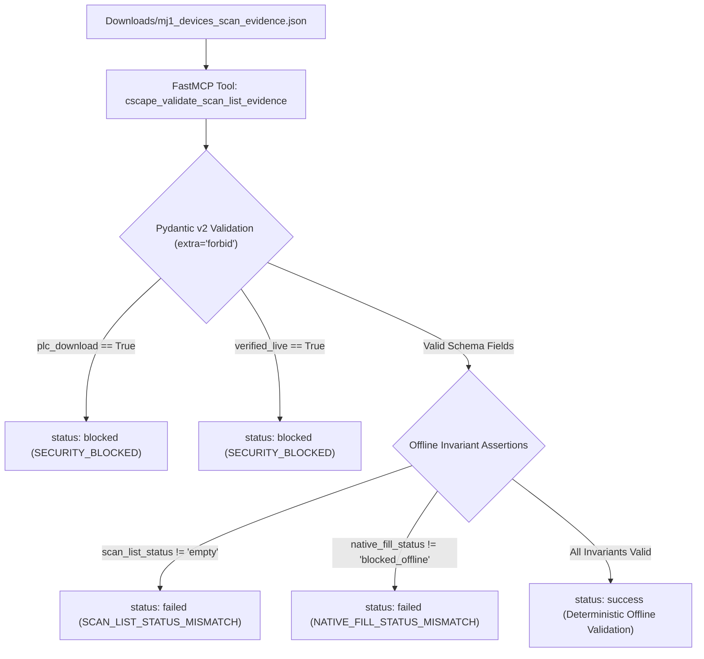

# FastMCP MJ1 Scan-List Evidence Schema Validation Evidence Summary

**TASK_ID**: `FASTMCP_SCAN_LIST_SCHEMA_VALIDATION`  
**Mission**: `MJ1_SCAN_LIST_FASTMCP_VALIDATION_EVIDENCE`  
**Timestamp**: `2026-09-17T18:50:00Z`  
**Governing Rule**: [`RULE[C:\Users\ArmandoSilva\AGENTS.md]`](file:///C:/Users/ArmandoSilva/AGENTS.md)  
**Operational Mode**: `offline/DEV [PRODUCT_EVIDENCE]`  
**System State**: `RUNTIME_PENDING_P7`  
**verified_live**: `false` (Deterministic offline verification; no live PLC connected)  
**zero_plc_download**: `true` (Fail-closed hardware lockout active)  
**no_error_check_loop**: `true` (Periodic keep-alive compiler polling loops permanently eliminated)  
**Single GUI Boundary**: Cscape 10.2 on `winsta0\Default` (exclusive single GUI owner)  

---

## 1. Executive Summary

In response to native Cscape 10.2 inspection showing serial port `MJ1` (`CT RTU Modbus CMP v5.05`) with an empty scan list on project container [`TankLevel_P5_Dedicated.csp`](file:///C:/HornerAI/horner-cscape-mcp/artifacts/projects/TankLevel_P5_Dedicated/TankLevel_P5_Dedicated.csp) and native device add blocked offline, offline FastMCP validation has been implemented and verified:

1. **FastMCP Validation Tool**: Implemented [`cscape_validate_scan_list_evidence`](file:///C:/HornerAI/horner-cscape-mcp/src/mcp/tools.py) as tool **#41** on the stdio FastMCP server.
2. **Pydantic v2 Contract Models**: Defined [`ScanListEvidencePayload`](file:///C:/HornerAI/horner-cscape-mcp/src/mcp/schemas.py), [`CscapeValidateScanListEvidenceInput`](file:///C:/HornerAI/horner-cscape-mcp/src/mcp/schemas.py), and [`CscapeValidateScanListEvidenceOutput`](file:///C:/HornerAI/horner-cscape-mcp/src/mcp/schemas.py) with `extra='forbid'`, strict path sanitization, and fail-closed validators.
3. **Registry & Schema Parity (41 / 41)**: 41 tools registered on FastMCP server, 41 schemas in `TOOL_SCHEMAS`, **100% matched parity**.
4. **Contract Test Execution**: Created and ran [`tests/test_scan_list_evidence_schema.py`](file:///C:/HornerAI/horner-cscape-mcp/tests/test_scan_list_evidence_schema.py) with **16 / 16 tests passing** (plus 9/9 in `test_p9_offline_gaps.py` and 5/5 in `test_core08_modbus_inventory.py` = 30 targeted tests passing).
5. **Zero PLC Download & Zero VERIFIED_LIVE**: Strict fail-closed policy maintained. Any attempt to set `plc_download: true` or `verified_live: true` in payload or tool arguments is immediately blocked (`status: blocked`, `error_code: SECURITY_BLOCKED`).



---

## 2. FastMCP Tool & Schema Architecture

### Tool Specification
- **Name**: `cscape_validate_scan_list_evidence`
- **Transport**: JSON-RPC 2.0 over `stdio`
- **Input Schema**: [`CscapeValidateScanListEvidenceInput`](file:///C:/HornerAI/horner-cscape-mcp/src/mcp/schemas.py)
  - `evidence_path` (Optional[str]): Filesystem path to evidence JSON file (e.g. `Downloads/mj1_devices_scan_evidence.json`).
  - `evidence_data` (Optional[Dict[str, Any]]): Direct dictionary payload of evidence.
  - `plc_download` (Optional[bool]): Prohibited download parameter (fails closed if `True`).
  - `verified_live` (Optional[bool]): Prohibited live parameter (fails closed if `True`).
- **Output Schema**: [`CscapeValidateScanListEvidenceOutput`](file:///C:/HornerAI/horner-cscape-mcp/src/mcp/schemas.py)
  - Standard 4-state contract fields: `success`, `status` (`success | failed | blocked | inconclusive`), `error_code`, `message`, `errors`, `diagnostics`.
  - Evidence-specific fields: `evidence_valid`, `project`, `port`, `protocol`, `scan_list_status`, `native_fill_status`, `blocker`, `offline_safety_enforced`, `zero_download_enforced`, `validated_evidence`.

### Fail-Closed Error Code Mapping
| Violation Scenario | Status | Error Code | Enforcement Layer |
| :--- | :---: | :---: | :--- |
| `plc_download: true` in payload or tool argument | `blocked` | `SECURITY_BLOCKED` | Offline safety guard & Pydantic validator |
| `verified_live: true` in payload or tool argument | `blocked` | `SECURITY_BLOCKED` | Offline safety guard & Pydantic validator |
| `scan_list_status != "empty"` | `failed` | `SCAN_LIST_STATUS_MISMATCH` | Model invariant assertion |
| `native_fill_status != "blocked_offline"` | `failed` | `NATIVE_FILL_STATUS_MISMATCH` | Model invariant assertion |
| Unknown injected argument | `failed` | `SCHEMA_VALIDATION_ERROR` | Pydantic v2 `extra="forbid"` |
| Neither `evidence_path` nor `evidence_data` provided | `inconclusive` | `MISSING_EVIDENCE_INPUT` | Input precondition check |
| File does not exist on disk | `failed` | `EVIDENCE_FILE_NOT_FOUND` | Filesystem existence check |

---

## 3. Target Evidence File Validation Audit

The tool was evaluated against the authentic evidence file [`Downloads/mj1_devices_scan_evidence.json`](file:///C:/Users/ArmandoSilva/Downloads/mj1_devices_scan_evidence.json):

```json
{
  "project": "TankLevel_P5_Dedicated.csp",
  "port": "MJ1",
  "protocol": "CT RTU Modbus CMP v5.05",
  "scan_list_status": "empty",
  "native_fill_status": "blocked_offline",
  "blocker": "Native add requires a configured target node/device and/or live PLC context.",
  "plc_download": false,
  "verified_live": false,
  "scope": "offline_product_documentation"
}
```

### Audit Findings
| Field | Value | Expected Invariant | Status |
| :--- | :--- | :--- | :---: |
| `project` | `"TankLevel_P5_Dedicated.csp"` | Valid `.csp` / `.cpj` project container | `success` |
| `port` | `"MJ1"` | Logical serial port identifier | `success` |
| `protocol` | `"CT RTU Modbus CMP v5.05"` | Supported Modbus serial driver | `success` |
| `scan_list_status` | `"empty"` | Must be `"empty"` in offline baseline | `success` |
| `native_fill_status` | `"blocked_offline"` | Must be `"blocked_offline"` without live hardware | `success` |
| `blocker` | Non-empty rationale | Rationale explaining offline boundary | `success` |
| `plc_download` | `false` | Must strictly be `false` (zero PLC download) | `success` |
| `verified_live` | `false` | Must strictly be `false` (no live claim) | `success` |
| `scope` | `"offline_product_documentation"` | Offline product documentation scope | `success` |

Tool execution outcome: **`status: success`**, **`evidence_valid: true`**, **`offline_safety_enforced: true`**, **`zero_download_enforced: true`**.

---

## 4. Contract Test Suite Results

Test suite [`tests/test_scan_list_evidence_schema.py`](file:///C:/HornerAI/horner-cscape-mcp/tests/test_scan_list_evidence_schema.py) was executed with `pytest 9.1.1`:

| # | Test Case Function | Scope / Assertion | Outcome |
| :- | :--- | :--- | :---: |
| 1 | `test_validate_authentic_downloads_artifact_file` | Validates authentic `Downloads/mj1_devices_scan_evidence.json` | `PASSED` |
| 2 | `test_validate_authentic_ops_artifacts_file` | Validates mirrored `ops/artifacts/mj1_devices_scan_evidence.json` | `PASSED` |
| 3 | `test_validate_temp_file_with_valid_payload` | Validates dynamically generated temp JSON evidence | `PASSED` |
| 4 | `test_validate_in_memory_dictionary` | Direct dictionary input without disk I/O | `PASSED` |
| 5 | `test_validate_pydantic_schema_direct` | Direct Pydantic model parsing and attribute access | `PASSED` |
| 6 | `test_rejection_when_scan_list_status_not_empty` | Rejects `scan_list_status: 'populated'` fail-closed | `PASSED` |
| 7 | `test_rejection_when_native_fill_status_not_blocked` | Rejects `native_fill_status: 'success'` fail-closed | `PASSED` |
| 8 | `test_hardware_lockout_when_plc_download_true_in_data` | Rejects `plc_download: true` with `status: blocked` | `PASSED` |
| 9 | `test_hardware_lockout_when_plc_download_true_in_tool_argument` | Rejects `plc_download=True` argument with `status: blocked` | `PASSED` |
| 10 | `test_gate_invariant_when_verified_live_true_in_data` | Rejects `verified_live: true` with `status: blocked` | `PASSED` |
| 11 | `test_gate_invariant_when_verified_live_true_in_tool_argument` | Rejects `verified_live=True` argument with `status: blocked` | `PASSED` |
| 12 | `test_missing_both_inputs_returns_inconclusive` | Returns `status: inconclusive` on empty inputs | `PASSED` |
| 13 | `test_nonexistent_evidence_file_returns_failed` | Returns `status: failed` on missing file | `PASSED` |
| 14 | `test_extra_parameters_forbidden_in_pydantic_payload` | Rejects extra injected parameters under `extra='forbid'` | `PASSED` |
| 15 | `test_invalid_container_extension_rejected` | Rejects non-.csp/.cpj container files | `PASSED` |
| 16 | `test_fastmcp_server_registers_scan_list_evidence_tool` | Asserts 41 tools registered on server and 41 in `TOOL_SCHEMAS` | `PASSED` |

Targeted Test Suite Summary:
- `tests/test_scan_list_evidence_schema.py`: **16 passed** in 5.61s
- `tests/test_p9_offline_gaps.py`: **9 passed** in 2.66s (updated to assert 41 tools)
- `tests/test_core08_modbus_inventory.py`: **5 passed** in 0.97s
- **Total**: **30 passed, 0 failed, 0 warnings**.

---

## 5. Offline Handoff Continuation & Governance

1. **Phase P4 & P6 Preservation**:
   - Phase P4 selective edit continuation revisions (`1.0.0` -> `1.1.0` -> `1.2.0`) and idempotency guarantees are fully preserved on [`TankLevel_P4_Dedicated.csp`](file:///C:/HornerAI/horner-cscape-mcp/artifacts/projects/TankLevel_P4_Dedicated/TankLevel_P4_Dedicated.csp).
   - Phase P6 standalone delivery packages and isolated extraction in `C:\Users\Public\HornerHandoffContext2` remain 100% matched against manifest.
2. **Phase P7 Commissioning Boundary**:
   - Native scan-list population and physical device binding on port `MJ1` require a physical target node and live communication context.
   - Under the fail-closed hardware lockout policy, physical downloads (`32827`, `33149`) and serial transfers are strictly forbidden in automated execution.
   - Population and field transfer are strictly deferred to **Phase P7 (`P7_PHYSICAL_PLC_DOWNLOAD_AND_COMMISSIONING`)** for manual execution by a commissioning engineer.
3. **Downloads Evidence Deliverables**:
   - [**`mj1_devices_scan_evidence.json`**](file:///C:/Users/ArmandoSilva/Downloads/mj1_devices_scan_evidence.json): Original Cscape inspection record (empty scan list, blocked offline).
   - [**`mj1_devices_scan_evidence.md`**](file:///C:/Users/ArmandoSilva/Downloads/mj1_devices_scan_evidence.md): Original companion markdown summary.
   - [**`mj1_scan_list_validation_evidence.json`**](file:///C:/Users/ArmandoSilva/Downloads/mj1_scan_list_validation_evidence.json): Machine-readable FastMCP validation execution results.
   - [**`mj1_scan_list_validation_evidence.md`**](file:///C:/Users/ArmandoSilva/Downloads/mj1_scan_list_validation_evidence.md): This comprehensive audit and signoff report.
