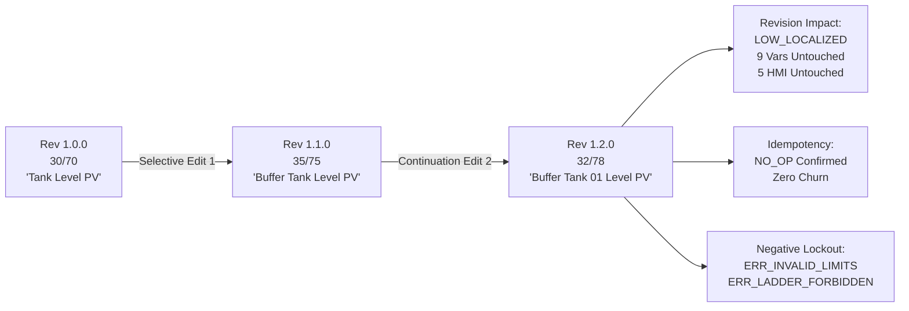

# Phase P4 Selective Edit Continuation Evidence Report

- **Task ID**: `P4_SELECTIVE_EDIT_CONTINUATION_EVIDENCE`
- **Mission ID**: `P4_FASTMCP_SELECTIVE_EDIT_CONTINUATION`
- **Target Project**: `TankLevel_P4_Dedicated`
- **Operational Mode**: `offline/DEV [PRODUCT_EVIDENCE]`
- **System State**: `RUNTIME_PENDING_P7`
- **Verified Live**: `false` (Strictly offline deterministic product verification; no physical PLC hardware attached)
- **Hardware Download Policy**: `Zero PLC Download` (Fail-Closed Hardware Lockout Active)
- **Error Check Policy**: `No Error Check Loop` (Zero periodic compiler loops)
- **Status**: `success`
- **Timestamp UTC**: `2026-09-17T17:32:32.728274+00:00`

---

## 1. Executive Summary & Progression

The Phase P4 Selective Edit Continuation verifies the sequential, multi-stage evolution of the dedicated project container (`TankLevel_P4_Dedicated`). Following the initial evolution from Revision `1.0.0` to `1.1.0`, this continuation exercises Stage 3 selective mutation:
- **Low Limit**: Updated from `35.0` % to `32.0` %
- **High Limit**: Updated from `75.0` % to `78.0` %
- **Level Label**: Renamed to `"Buffer Tank 01 Level PV"`
- **Revision Bump**: Transactional evolution from Revision `1.1.0` to `1.2.0`
- **AST Preservation**: 100% preservation of all 9 untouched variables, 5 untouched HMI objects, and control logic.

---

## 2. Evolution Stages Comparison

| Parameter / Element | Stage 1 (Rev 1.0.0) | Stage 2 (Rev 1.1.0) | Stage 3 Continuation (Rev 1.2.0) | Status |
| :--- | :--- | :--- | :--- | :---: |
| **Low Alarm Limit** | `30.0` % | `35.0` % | `32.0` % | `success` |
| **High Alarm Limit** | `70.0` % | `75.0` % | `78.0` % | `success` |
| **Process Variable Label** | `"Tank Level PV"` | `"Buffer Tank Level PV"` | `"Buffer Tank 01 Level PV"` | `success` |
| **ST Code: High Limit** | `HI_Limit : REAL := 70.0;` | `HI_Limit : REAL := 75.0;` | `HI_Limit : REAL := 78.0;` | `success` |
| **ST Code: Low Limit** | `LO_Limit : REAL := 30.0;` | `LO_Limit : REAL := 35.0;` | `LO_Limit : REAL := 32.0;` | `success` |
| **Container SHA-256** | Authentic CFBF | Authentic CFBF | `d0fad4865973dc0003f7eaa9f2ac1292304396d45bae770db7e39e14a79eca3c` | `success` |

---

## 3. Untouched Elements & Immutability Audit

The revision impact audit confirmed rating **`LOW_LOCALIZED`**:
- **Preserved Variables (9/11 untouched)**:
  - `TankLevelPV (%AI1)`
  - `Setpoint (%AQ1)`
  - `AutoMode (%M10)`
  - `ManualOutputCmd (%AQ2)`
  - `PumpCmdActive (%Q1)`
  - `PumpRunningFeedback (%I1)`
  - `HighAlarm (%T3)`
  - `LowAlarm (%T4)`
  - `ControlError (%R10)`
- **Preserved HMI Controls**: 5/10 objects untouched
- **Preserved Memory Addresses**: `%AI1`, `%AQ1`, `%M10`, `%AQ2`, `%Q1`, `%I1`, `%T3`, `%T4`, `%R10`, `%R16`
- **Preserved Control Logic**: Pump staging and manual bypass staging logic intact

---

## 4. Idempotency & Negative Safety Rejections

1. **Idempotency Proof**: Submitting identical parameters (`32.0` / `78.0` / `"Buffer Tank 01 Level PV"`) returned `action: NO_OP`, `duplicate_prevented: true`. Zero redundant disk writes.
2. **Inverted Limits Rejection**: Low limit > High limit (88.0 > 15.0) rejected with `ERR_INVALID_LIMITS`. Fail-closed.
3. **Ladder Contact Rejection**: `---[ ]--- Injected Ladder Contact` rejected with `ERR_LADDER_FORBIDDEN`.
4. **Ladder Coil Rejection**: `---( )--- Injected Ladder Coil` rejected with `ERR_LADDER_FORBIDDEN`.
5. **External Concurrency Conflict**: Hash mismatch rejected fail-closed with `ERR_EXTERNAL_CONFLICT`.

---

## 5. Governance & Safety Summary

- **Zero PLC Download**: Strictly active; physical communication ports `COM1-COM256`, `CAN*`, `USB*`, `JTAG` blocked fail-closed.
- **Download Commands**: Intercepted and blocked (`32827`, `33149`).
- **Verified Live**: `false` (Deterministic emulated and offline verification only).
- **Error Check Policy**: No periodic or keep-alive compiler looping executed.
