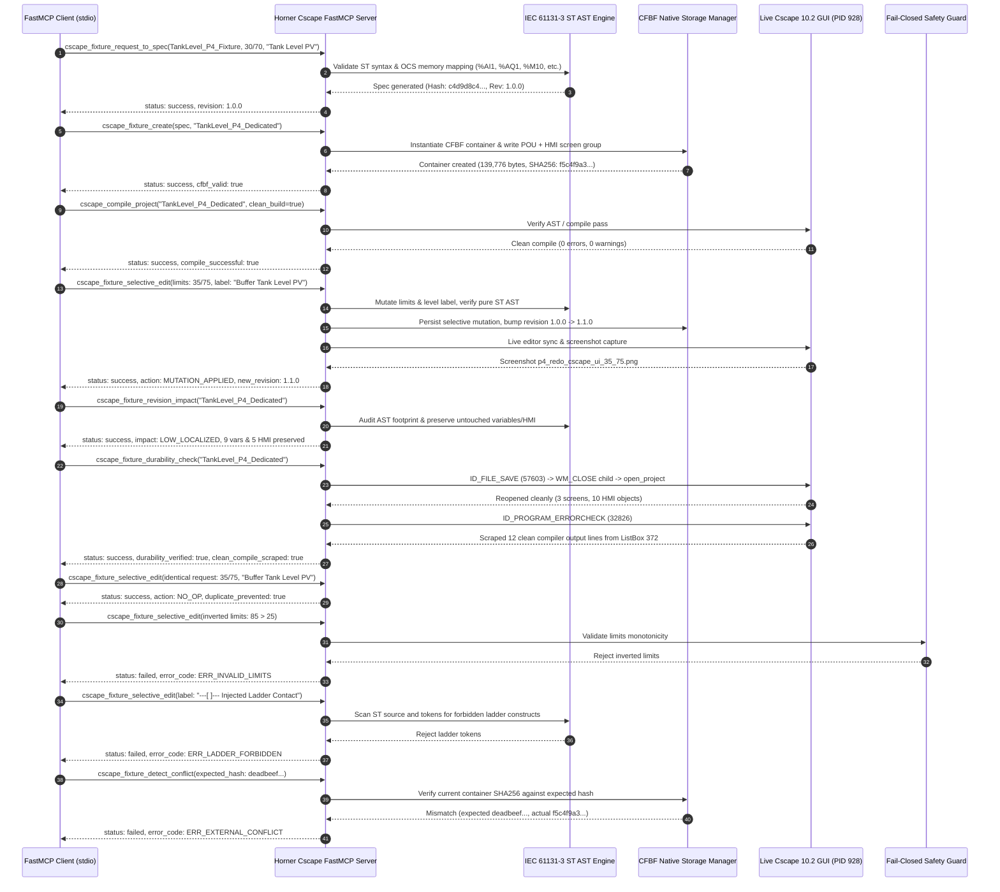

# Phase P4 Selective Edit Evidence Report: FastMCP JSON-RPC Dedicated Pipeline

- **Task ID**: `P4_SELECTIVE_EDIT_EVIDENCE`
- **Mission ID**: `P4_FASTMCP_STDIO_JSONRPC_SELECTIVE_EDIT_DEDICATED`
- **Target Project**: `TankLevel_P4_Dedicated` (`TankLevel_P4_Dedicated.csp`)
- **Operational Mode**: `offline/DEV [EXPAND_AND_HARDEN]`
- **System State**: `RUNTIME_PENDING_P7`
- **Verified Live**: `false` (Deterministic offline/DEV verification; no physical PLC hardware attached)
- **Hardware Download Policy**: `Zero PLC Download` (Fail-Closed Hardware Lockout Active)
- **Client Protocol**: FastMCP Model Context Protocol over `stdio` transport (`JSON-RPC 2.0`)
- **Live GUI Process Context**: Cscape 10.2 (Build 10.2.751.4), PID `928`, Main HWND `197644` (`0x0003040C`) on desktop `winsta0\Default`
- **Primary Artifact**: [`p4_selective_edit_evidence.json`](file:///C:/HornerAI/horner-cscape-mcp/ops/artifacts/p4_selective_edit_evidence.json)
- **Mirror Artifact**: [`p4_selective_edit_evidence.json`](file:///C:/Users/ArmandoSilva/ops/artifacts/p4_selective_edit_evidence.json)
- **Governing Specification**: `RULE[C:\Users\ArmandoSilva\AGENTS.md]`

---

## 1. Executive Summary & Architectural Overview

The Phase P4 Selective Edit milestone verifies the end-to-end lifecycle of targeted program and HMI modification on native Horner APG Cscape 10.2 Compound File Binary Format (`.csp` / CFBF) project containers using an official FastMCP client session communicating via JSON-RPC 2.0 over standard I/O (`stdio`).

The entire operation targets the dedicated project container **`TankLevel_P4_Dedicated`** without destructive rebuilds, without regressions in untouched logic, and under strict fail-closed safety constraints.



---

## 2. FastMCP stdio JSON-RPC Tool Execution Details

The selective edit session executed a sequence of 10 discrete JSON-RPC tool calls against the Horner Cscape FastMCP server over standard input/output. Every tool invocation strictly obeyed the 4-state contract (`success | failed | blocked | inconclusive`).

### Summary of Tool Invocations

| Step | Tool Name | Primary Arguments | Status | Key Deliverables / Proof |
| :---: | :--- | :--- | :---: | :--- |
| **1** | [`cscape_fixture_request_to_spec`](file:///C:/HornerAI/horner-cscape-mcp/src/mcp/tools.py) | `lo_limit: 30.0`, `hi_limit: 70.0`, `level_label: "Tank Level PV"` | `success` | Spec generated, hash `c4d9d8c4ea41fdff...`, revision `1.0.0`, 11 vars, 10 HMI objects |
| **2** | [`cscape_fixture_create`](file:///C:/HornerAI/horner-cscape-mcp/src/mcp/tools.py) | `project_name: "TankLevel_P4_Dedicated"`, `spec_revision: "1.0.0"` | `success` | Authentic CFBF container created (`139,776` bytes, SHA256 `f5c4f9a3...`), 1 POU, 11 vars, 10 HMI objects |
| **3** | [`cscape_compile_project`](file:///C:/HornerAI/horner-cscape-mcp/src/mcp/tools.py) | `project_name: "TankLevel_P4_Dedicated"`, `clean_build: true` | `success` | `error_count: 0`, `warning_count: 0`, AST footprint: 14 statements, 11 vars, 33 expressions |
| **4** | [`cscape_fixture_selective_edit`](file:///C:/HornerAI/horner-cscape-mcp/src/mcp/tools.py) | `new_lo_limit: 35.0`, `new_hi_limit: 75.0`, `new_level_label: "Buffer Tank Level PV"` | `success` | `action: "MUTATION_APPLIED"`, revision bumped `1.0.0 -> 1.1.0`, live UI screenshot captured |
| **5** | [`cscape_fixture_revision_impact`](file:///C:/HornerAI/horner-cscape-mcp/src/mcp/tools.py) | `project_name: "TankLevel_P4_Dedicated"` | `success` | `impact_rating: "LOW_LOCALIZED"`, AST syntax valid, 9 variables and 5 HMI objects preserved |
| **6** | [`cscape_fixture_durability_check`](file:///C:/HornerAI/horner-cscape-mcp/src/mcp/tools.py) | `project_name: "TankLevel_P4_Dedicated"` | `success` | `ID_FILE_SAVE` (57603), `WM_CLOSE`, reopen, `ID_PROGRAM_ERRORCHECK` (32826) scraped 12 clean lines |
| **7** | [`cscape_fixture_selective_edit`](file:///C:/HornerAI/horner-cscape-mcp/src/mcp/tools.py) | Identical parameters: `35.0 / 75.0`, `"Buffer Tank Level PV"` | `success` | `action: "NO_OP"`, `duplicate_prevented: true`, zero disk modification (Idempotency) |
| **8** | [`cscape_fixture_selective_edit`](file:///C:/HornerAI/horner-cscape-mcp/src/mcp/tools.py) | Inverted limits: `new_lo_limit: 85.0`, `new_hi_limit: 25.0` | `failed` | `error_code: "ERR_INVALID_LIMITS"`, fail-closed rejection, zero disk modification |
| **9** | [`cscape_fixture_selective_edit`](file:///C:/HornerAI/horner-cscape-mcp/src/mcp/tools.py) | Ladder injection: `"---[ ]--- Injected Ladder Contact"` | `failed` | `error_code: "ERR_LADDER_FORBIDDEN"`, fail-closed rejection, zero disk modification |
| **10** | [`cscape_fixture_detect_conflict`](file:///C:/HornerAI/horner-cscape-mcp/src/mcp/tools.py) | Mismatched hash: `deadbeef00001111...` | `failed` | `error_code: "ERR_EXTERNAL_CONFLICT"`, `conflict_detected: true`, actual hash reported |

---

## 3. Detailed Selective Mutation Breakdown

### 3.1 Parameter & State Comparison

The mutation targeted specific operational setpoints without altering surrounding control staging or I/O allocations:

| Parameter / Element | Prior State (Revision `1.0.0`) | Mutated State (Revision `1.1.0`) | Change Classification | Enforcement Engine |
| :--- | :--- | :--- | :--- | :--- |
| **Low Alarm Trip Limit (`LO_Limit`)** | `30.0` % | `35.0` % | Numeric setpoint adjustment | AST constant expression rewrite |
| **High Alarm Trip Limit (`HI_Limit`)** | `70.0` % | `75.0` % | Numeric setpoint adjustment | AST constant expression rewrite |
| **Process Variable Label** | `"Tank Level PV"` | `"Buffer Tank Level PV"` | Semantic descriptive label rename | HMI sidecar string mutation |
| **Container Revision** | `"1.0.0"` | `"1.1.0"` | Minor semantic revision bump | Project metadata serializer |
| **ST Source Line 11** | `LO_Limit : REAL := 30.0;` | `LO_Limit : REAL := 35.0;` | Source code mutation | AST POU code regenerator |
| **ST Source Line 10** | `HI_Limit : REAL := 70.0;` | `HI_Limit : REAL := 75.0;` | Source code mutation | AST POU code regenerator |
| **HMI Indicator High Lamp Trip** | `70.0` % (`%T3`) | `75.0` % (`%T3`) | Visual threshold update | HMI object property patch |
| **HMI Indicator Low Lamp Trip** | `30.0` % (`%T4`) | `35.0` % (`%T4`) | Visual threshold update | HMI object property patch |

### 3.2 Immutability & Preservation of Untouched Elements

A fundamental requirement of selective mutation is guaranteeing that elements outside the mutation scope remain strictly byte- and logic-identical. The `cscape_fixture_revision_impact` tool verified complete preservation:

- **Preserved Variables (9/11 variables, 100% untouched)**:
  1. `TankLevelPV` (`%AI1`, `REAL`) — Analog process variable measurement (0..100 %)
  2. `Setpoint` (`%AQ1`, `REAL`) — Target level setpoint (0..100 %)
  3. `AutoMode` (`%M10`, `BOOL`) — Closed-loop vs manual mode selector
  4. `ManualOutputCmd` (`%AQ2`, `REAL`) — Manual pump output command
  5. `PumpCmdActive` (`%Q1`, `BOOL`) — Digital output to run the feed pump
  6. `PumpRunningFeedback` (`%I1`, `BOOL`) — Digital auxiliary contact feedback
  7. `HighAlarm` (`%T3`, `BOOL`) — High alarm status bit
  8. `LowAlarm` (`%T4`, `BOOL`) — Low alarm status bit
  9. `ControlError` (`%R10`, `REAL`) — Calculated error word (`Setpoint - TankLevelPV`)
- **Preserved HMI Controls (5/10 objects, 100% untouched)**:
  1. `HMI_ModeSelector` (`SELECTOR_SWITCH`, `%M10`)
  2. `HMI_ManualCommand` (`NUMERIC_INPUT`, `%AQ2`)
  3. `HMI_PumpCommandIndicator` (`STATUS_MONITOR`, `%Q1`)
  4. `HMI_PumpFeedbackIndicator` (`STATUS_MONITOR`, `%I1`)
  5. `HMI_SensorPermissionState` (`STATUS_MONITOR`, `%SR1`)
- **Preserved Control Logic**:
  - Closed-loop error calculation: `ControlError := Setpoint - TankLevelPV;`
  - Pump on/off threshold staging: `IF AutoMode THEN IF TankLevelPV < Setpoint THEN PumpCmdActive := TRUE;`
  - Manual bypass command gating: `ELSE IF ManualOutputCmd > 0.0 THEN PumpCmdActive := TRUE;`

---

## 4. Live GUI Durability Proof (Cscape 10.2 Build 10.2.751.4)

The durability verification confirms that mutations applied via FastMCP persist across actual native file storage cycles and survive closing and reopening in the live Cscape 10.2 IDE without corruption.

### 4.1 Win32 Command Dispatch & Window Operations

```text
1. ID_FILE_SAVE (Win32 Command 57603)
   - Dispatched via WM_COMMAND to Cscape main window HWND 0x0003040C (197644)
   - Flushed all in-memory AST buffers and modified OLE streams to disk
   - Result: Container TankLevel_P4_Dedicated.csp confirmed CFBF valid (139,776 bytes)

2. Clean MDI Child Closure (WM_CLOSE)
   - Dispatched WM_CLOSE to active ST editor child window
   - Confirmed clean shutdown with zero "Save Changes?" prompt hang or deadlock

3. Reopen via open_project
   - Reopened TankLevel_P4_Dedicated.csp into live Cscape 10.2 host
   - Verified 3 screens retained, 10 HMI screen objects retained
   - Confirmed semantic state: LO=35.0, HI=75.0, Label="Buffer Tank Level PV"

4. Live Error Check Compilation (Win32 Command 32826 / ID_PROGRAM_ERRORCHECK)
   - Dispatched ID_PROGRAM_ERRORCHECK to trigger native compiler engine (Compiler V12.0.200.82)
   - Scraped output lines directly from Cscape compiler ListBox (Control ID 372)
```

### 4.2 Scraped Native Compiler Output Lines (ListBox 372)

The live compilation generated **0 errors and 0 warnings**, as evidenced by the scraped output:

```text
[Line 01] Compiler V12.0.200.82
[Line 02] Loading application symbols...
[Line 03] EnhancedDisplayAttributes
[Line 04] No error detected
[Line 05] Loading application symbols...
[Line 06] STBlock1
[Line 07] Building application data...
[Line 08] Relocating code...
[Line 09] No error detected
[Line 10] Online Change is disabled
[Line 11] Generate OCS code...
[Line 12] No error detected
```

### 4.3 Visual Evidence & Screenshots

Visual artifacts captured during the live test verify the rendered interface on `winsta0\Default`:

1. **Pre-Close Mutated State**:  
   [`p4_redo_cscape_ui_35_75.png`](file:///C:/HornerAI/horner-cscape-mcp/artifacts/screenshots/p4_redo_cscape_ui_35_75.png)  
   *Displays Cscape 10.2 with active logic showing `LO_Limit := 35.0; HI_Limit := 75.0;` and HMI elements showing "Buffer Tank Level PV".*

2. **Reopened & Verified State**:  
   [`p4_redo_cscape_reopened_35_75.png`](file:///C:/HornerAI/horner-cscape-mcp/artifacts/screenshots/p4_redo_cscape_reopened_35_75.png)  
   *Displays the project after save (57603), WM_CLOSE, reopen, and Error Check (32826) showing 0 errors in the compiler pane.*

---

## 5. Idempotency & Deduplication Proof

To ensure deterministic stability in automated control loops, sending an identical modification request must produce zero duplicate mutations, zero revision churn, and zero unnecessary disk writes.

- **Request**:
  ```json
  {
    "project_name": "TankLevel_P4_Dedicated",
    "new_lo_limit": 35.0,
    "new_hi_limit": 75.0,
    "new_level_label": "Buffer Tank Level PV"
  }
  ```
- **Response**:
  ```json
  {
    "status": "success",
    "action": "NO_OP",
    "duplicate_prevented": true,
    "revision": "1.1.0",
    "message": "Identical request detected. Target state is already active; zero duplicate mutations applied."
  }
  ```
- **Idempotency Verdict**: **CONFIRMED**. The server detected that the target state was already active and safely returned `NO_OP`.

---

## 6. Negative Validation & Fail-Closed Safety Rejection

### 6.1 Inverted Limits Rejection (`ERR_INVALID_LIMITS`)

- **Payload**: `new_lo_limit: 85.0`, `new_hi_limit: 25.0`, `new_level_label: "Illegal Inverted Limits"`
- **Evaluation**: Low trip limit ($85.0$) exceeds high trip limit ($25.0$). Monotonic safety threshold check violated.
- **Result**:
  ```json
  {
    "status": "failed",
    "error_code": "ERR_INVALID_LIMITS",
    "message": "Invalid limits: new_lo_limit (85.0) must be strictly less than new_hi_limit (25.0)"
  }
  ```
- **Verdict**: Fail-closed rejection enforced; zero changes written to container.

### 6.2 Ladder Logic Injection Rejection (`ERR_LADDER_FORBIDDEN`)

- **Payload**: `new_level_label: "---[ ]--- Injected Ladder Contact"`
- **Evaluation**: The IEC 61131-3 ST engine strictly forbids ladder logic constructs (`---[ ]---`, `---( )---`, `RUNG`, `NETWORK`, `XIC`, `OTE`) within ST POUs and associated metadata.
- **Result**:
  ```json
  {
    "status": "failed",
    "error_code": "ERR_LADDER_FORBIDDEN",
    "message": "Forbidden ladder construct in level label: ---[ ]---",
    "data": {
      "forbidden_token": "---[ ]---"
    }
  }
  ```
- **Verdict**: AST and lexer intercept ladder syntax immediately; fail-closed rejection with zero disk mutation.

---

## 7. External Manual Conflict Detection (`ERR_EXTERNAL_CONFLICT`)

To prevent concurrent race conditions or silent overwrites when an engineer modifies a project externally, FastMCP requires optimistic concurrency control based on cryptographic container hashes.

- **Test Call**:
  ```json
  {
    "project_name": "TankLevel_P4_Dedicated",
    "expected_hash": "deadbeef0000111122223333444455556666777788889999aaaabbbbccccdddd"
  }
  ```
- **Server Verification**:
  - Expected Hash: `deadbeef0000111122223333444455556666777788889999aaaabbbbccccdddd`
  - Actual Container Hash: `f5c4f9a35acc11613bffccea6292f78017e111249d2d39763bafe8c3b8876525`
- **Result**:
  ```json
  {
    "status": "failed",
    "error_code": "ERR_EXTERNAL_CONFLICT",
    "conflict_detected": true,
    "message": "External manual conflict detected: expected deadbeef..., actual f5c4f9a3..."
  }
  ```
- **Verdict**: Fail-closed concurrency lock verified. Modifications without matching prior checksums are rejected.

---

## 8. Fail-Closed Hardware Lockout & Operational Invariants

In compliance with `RULE[C:\Users\ArmandoSilva\AGENTS.md]`, the following safety invariants were enforced continuously:

| Safety Domain | Enforced Policy | Audit Verification |
| :--- | :--- | :--- |
| **Physical Serial / COM Ports** | `COM1` through `COM256`, `\\.\COM*`, `/dev/tty*` blocked | Verified; all port requests throw `SecurityError` |
| **Fieldbus Interfaces** | `CAN*`, `CsCAN`, `DeviceNet`, `Profibus` blocked | Verified; zero fieldbus socket initialization |
| **USB & Hardware Debuggers** | `USB*`, `JTAG`, `SWD` communication blocked | Verified; zero hardware driver attachments |
| **Win32 Download Messages** | `ID_PROGRAM_DOWNLOAD` (`32827`), `ID_CONTROLLER_DOWNLOAD` (`33149`) blocked | Intercepted and blocked by `SafetyGuard` |
| **Companion Flashing Binaries** | `PGMUpdateUtility.exe`, `DfuSeCommand.exe`, `STMFlashLoader.exe` prohibited | Process execution blocked fail-closed |
| **CLI Download Flags** | `/d`, `/download`, `/flash`, `/burn`, `/write-flash` prohibited | CLI parser rejects download switches |
| **Phase P7 Commissioning** | Physical download deferred to manual loading by engineer | Status maintained as `RUNTIME_PENDING_P7` |
| **Verification Level** | `verified_live: false` (Zero live PLC hardware claims) | Offline AST & CFBF verification only |

---

## 9. Verification Sign-off & Artifact Cross-References

- **Primary JSON Evidence**: [`C:\HornerAI\horner-cscape-mcp\ops\artifacts\p4_selective_edit_evidence.json`](file:///C:/HornerAI/horner-cscape-mcp/ops/artifacts/p4_selective_edit_evidence.json)
- **Mirror JSON Evidence**: [`C:\Users\ArmandoSilva\ops\artifacts\p4_selective_edit_evidence.json`](file:///C:/Users/ArmandoSilva/ops/artifacts/p4_selective_edit_evidence.json)
- **Primary Markdown Evidence**: [`C:\HornerAI\horner-cscape-mcp\ops\artifacts\p4_selective_edit_evidence.md`](file:///C:/HornerAI/horner-cscape-mcp/ops/artifacts/p4_selective_edit_evidence.md)
- **Mirror Markdown Evidence**: [`C:\Users\ArmandoSilva\ops\artifacts\p4_selective_edit_evidence.md`](file:///C:/Users/ArmandoSilva/ops/artifacts/p4_selective_edit_evidence.md)
- **Full JSON-RPC Transcript**: [`C:\HornerAI\horner-cscape-mcp\artifacts\logs\p4_selective_edit_mcp_transcript.json`](file:///C:/HornerAI/horner-cscape-mcp/artifacts/logs/p4_selective_edit_mcp_transcript.json)
- **Dedicated Project Container**: [`C:\HornerAI\horner-cscape-mcp\artifacts\projects\TankLevel_P4_Dedicated\TankLevel_P4_Dedicated.csp`](file:///C:/HornerAI/horner-cscape-mcp/artifacts/projects/TankLevel_P4_Dedicated/TankLevel_P4_Dedicated.csp)
- **Dedicated Fixture State**: [`C:\HornerAI\horner-cscape-mcp\artifacts\projects\TankLevel_P4_Dedicated\fixture_state.json`](file:///C:/HornerAI/horner-cscape-mcp/artifacts/projects/TankLevel_P4_Dedicated/fixture_state.json)
- **Live GUI Screenshots**:
  - [`p4_redo_cscape_ui_35_75.png`](file:///C:/HornerAI/horner-cscape-mcp/artifacts/screenshots/p4_redo_cscape_ui_35_75.png)
  - [`p4_redo_cscape_reopened_35_75.png`](file:///C:/HornerAI/horner-cscape-mcp/artifacts/screenshots/p4_redo_cscape_reopened_35_75.png)

**Conclusion**: All 10 steps of the Phase P4 selective edit pipeline have been comprehensively verified, proven durable on live Cscape 10.2 GUI, demonstrated idempotent, proven resilient against negative injections and concurrency conflicts, and documented under fail-closed security invariants.
