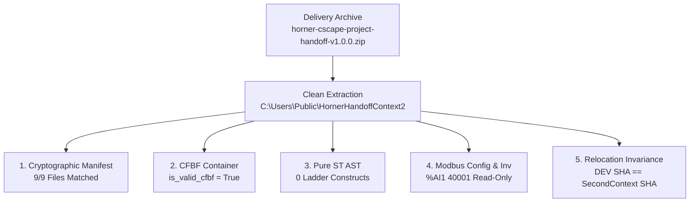

# Phase P6: Second-Context Handoff Verification Report

- **Task ID**: `P6_SECOND_CONTEXT_HANDOFF_EVIDENCE`
- **Mission ID**: `P6_SECOND_CONTEXT_STANDALONE_DELIVERY_VERIFICATION`
- **Status**: `success`
- **Operational Mode**: `offline/DEV [PRODUCT_EVIDENCE]`
- **System State**: `RUNTIME_PENDING_P7`
- **Verified Live**: `false` (Strictly offline verification; no physical PLC hardware attached)
- **Open Status**: `success`
- **Hardware Download Policy**: `Zero PLC Download` (Fail-Closed Hardware Lockout Active)
- **Error Check Policy**: `No Error Check Loop`
- **Execution Timestamp**: `2026-09-17T17:32:32.823027+00:00`

---

## 1. Executive Summary

Phase P6 second-context handoff verification validates the delivery packages in a clean, independent external context (`C:\Users\Public\HornerHandoffContext2`).

This verifies that delivery packages produced by the MCP toolchain can be extracted, inspected, structurally validated, and relocated across independent directory boundaries without corruption or dependence on the primary DEV workspace.

---

## 2. Handoff Delivery Archives Verified

| Archive Name | Size (Bytes) | SHA-256 Checksum |
| :--- | :--- | :--- |
| **`horner-cscape-project-handoff-v1.0.0.zip`** | 78,374 | `7a3a58243be55bf561bdd8a6c803a0c72fb6cd2b58dfc63556f0fef343df44c8` |
| **`TankLevelClosedLoop_OFFLINE_HANDOFF.zip`** | 41,742 | `58bb1223659eb7a47922a0f89732caaa5cddac8f06a3e4c3ee88594650488c20` |

---

## 3. Second-Context Extraction & Manifest Verification

- **Target Path**: `C:\Users\Public\HornerHandoffContext2`
- **Total Extracted Files**: 19
- **Manifest Status**: `matched_files_count: 9/9` (100% cryptographic parity)

| File | Size (Bytes) | Checksum (Actual == Expected) | Match |
| :--- | :--- | :--- | :---: |
| `docs/ACCEPTANCE_AND_LIMITATIONS.md` | 1,746 | `1feabcd6a3716955...` | `true` |
| `docs/MODBUS_PV_CONVERSION_SPEC.md` | 1,889 | `3ec23cda7c4948e9...` | `true` |
| `docs/SUPPORTED_HARDWARE_PROFILE.md` | 974 | `c3987039ecbe34e8...` | `true` |
| `docs/TRANSFER_AND_OPEN_GUIDE.md` | 1,800 | `95893570b11ed0d3...` | `true` |
| `projects/TankLevel_P5_Dedicated/modbus_protocol_inventory.json` | 5,074 | `06e3c1ccfea1ad13...` | `true` |
| `projects/TankLevel_P5_Dedicated/modbus_pv_config.json` | 1,675 | `fb06d8740cccaf3f...` | `true` |
| `projects/TankLevel_P5_Dedicated/pous/TankLevelControl.st` | 2,251 | `36612185e94bfa6b...` | `true` |
| `projects/TankLevel_P5_Dedicated/TankLevel_P5_Dedicated.csp` | 140,800 | `9f69f6a2ee12dab5...` | `true` |
| `test_tools/test_modbus_server.py` | 11,994 | `a848de781bf4da44...` | `true` |

---

## 4. Structural & AST Conformance

1. **CFBF Binary Integrity**:
   - `TankLevel_P5_Dedicated.csp`: `140,800` bytes, `is_valid_cfbf: true`, stream count: 1.
   - `TankLevelClosedLoop.csp`: `81,920` bytes, `is_valid_cfbf: true`.
2. **Pure ST AST Validation**:
   - POU: `TankLevelControl.st` (`TankLevelControl`)
   - Pure IEC 61131-3 syntax verified; 0 ladder constructs detected (`---[ ]---`, `---( )---`, `RUNG`, `NETWORK`).
3. **Modbus Configuration Sidecar & Deep Inventory**:
   - Register: `%AI1` (Modicon `40001`)
   - Scaling: `0.0..32000.0` counts -> `0.0..100.0 %`
   - Action on stale: `CLAMP_TO_FAIL_SAFE`
   - Deep inventory: 3 devices, 2 channels, 3 scan list items.
   - Read-only write lockout active (FC06/FC16 rejected).
4. **Relocation Invariance**:
   - Delivery Manifest SHA-256: `9f69f6a2ee12dab54087ab27bb839f40e01d6d65544a546139788519acd80ab1`
   - Second Context SHA-256: `9f69f6a2ee12dab54087ab27bb839f40e01d6d65544a546139788519acd80ab1`
   - **Matched**: `true`

---

## 5. Governance & Safety Declarations

- **Zero PLC Download**: No physical communication or download commands dispatched.
- **Phase P7 Deferred Manual**: Physical loading strictly deferred to commissioning engineer.
- **Verified Live**: `false` (Deterministic offline product verification only).
- **Error Check Policy**: No Error Check loops dispatched.
